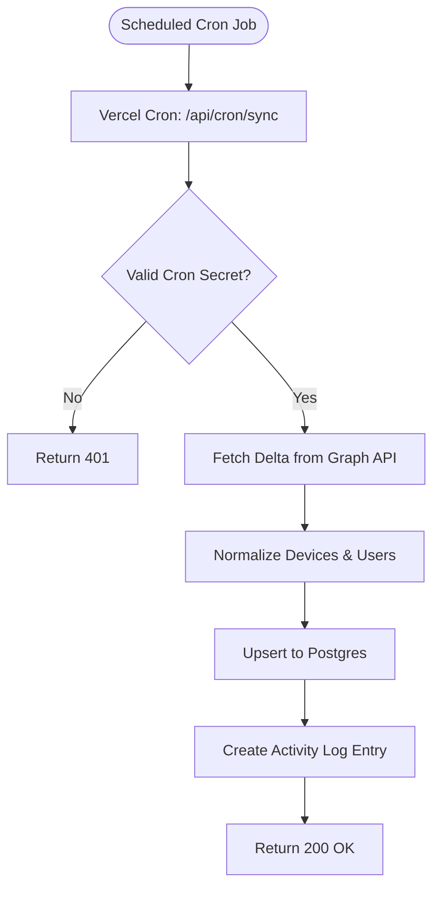
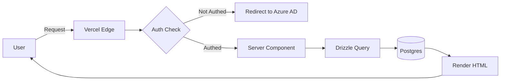

# Product Requirements Document: Device Inventory System v2

**Version:** 2.0  
**Date:** February 5, 2026  
**Status:** Active Development  
**Project Lead:** Engineering Team  
**Template:** Next.js SaaS Starter (Vercel Ecosystem)

---

## Executive Summary

The **Device Inventory System v2** is a complete rewrite of the legacy OpenSearch-based device management platform, migrating to a modern **Next.js monolith** with **Postgres**, **Drizzle ORM**, and **Azure AD authentication**. This project aims to provide IT administrators with real-time visibility into organizational hardware assets, compliance status, and user assignments through a fast, maintainable, and production-ready web application.

**Core Value Proposition:**
- **Unified Dashboard:** Single interface for managing 10,000+ devices across the enterprise
- **Compliance Monitoring:** Real-time tracking of BitLocker encryption, OS patches, and security policies
- **User Correlation:** Connect device assets to employee records for asset tracking and license management
- **Simplified Architecture:** Replace complex Docker microservices with a Vercel-native monolith

---

## 1. Vision & Strategic Goals

### 1.1 The Problem We're Solving

**Current Pain Points (Legacy System):**
1. **Operational Complexity:** Docker Compose orchestration with 5+ containers (OpenSearch, Redis, Caddy, API, Frontend, Fetcher)
2. **Data Silos:** OpenSearch document model makes relational queries difficult (e.g., "devices by user by department")
3. **Missing Source Code:** Frontend and Fetcher source code lost, limiting maintainability
4. **Authentication Burden:** Custom OIDC implementation increases security risk
5. **DevOps Overhead:** Manual certificate management, Redis pub/sub coordination, and volume backups

**Why Now:**
- Template availability: Next.js SaaS Starter provides 80% of required features (auth, DB, CRUD)
- Team velocity: Monolith reduces cognitive load and deployment complexity
- Vercel maturity: Platform now supports enterprise auth, cron jobs, and Postgres at scale

### 1.2 Success Metrics

| Metric | Current (Legacy) | Target (v2) | Measurement |
|--------|------------------|-------------|-------------|
| **Time to First Value** | 2 hours (Docker setup) | 5 minutes (Vercel deploy) | Deploy time from `git clone` |
| **Query Response Time** | 500-800ms (OpenSearch) | <100ms (Postgres indexed queries) | P95 latency for device list |
| **Auth Integration Time** | 4 hours (manual OIDC) | 15 minutes (NextAuth config) | Engineer setup time |
| **Sync Reliability** | 85% success rate | 99.5% success rate | Cron job success ratio |
| **Maintenance Hours/Month** | 20 hours | 4 hours | Team time on infra issues |

### 1.3 Non-Goals (Out of Scope for v1)

- ❌ **Mobile App:** Web-only for v1 (PWA consideration for v2)
- ❌ **Multi-Tenancy:** Single organization deployment (can be added later using Platforms pattern)
- ❌ **Intune Policy Management:** Read-only compliance monitoring (no write operations to Intune)
- ❌ **Advanced Analytics:** Basic compliance metrics only (no predictive ML or trend analysis)
- ❌ **Audit Log Exports:** Activity logging only (no PDF/CSV export in v1)

---

## 2. User Personas & Stories

### Persona 1: IT Administrator (Primary User)

**Profile:**
- **Name:** Sarah Johnson
- **Role:** Senior IT Administrator
- **Tech Literacy:** High (comfortable with PowerShell, Azure Portal)
- **Goals:** Maintain 99% compliance, reduce security incidents, minimize manual reporting
- **Pain Points:** Too much time in Azure Portal clicking through device details, manual Excel reports for leadership

**User Stories:**

**Epic 1: Device Monitoring**
```gherkin
Story 1.1: View All Devices
  As an IT Administrator
  I want to see a paginated table of all managed devices
  So that I can quickly assess fleet status

  Acceptance Criteria:
  - Table shows: Device Name, User, OS Version, Compliance Status, Last Sync
  - Pagination: 50 devices per page with page navigation
  - Search: Filter by device name, user email, or serial number
  - Response time: <100ms for query with 10K devices
```

```gherkin
Story 1.2: Compliance Deep Dive
  As an IT Administrator
  I want to click on a device and see detailed compliance data
  So that I can understand WHY a device is non-compliant

  Acceptance Criteria:
  - Detail view shows: All hardware specs, security settings, policy violations
  - BitLocker status: Encrypted/Not Encrypted with recovery key status
  - Policy breakdown: Which specific policies failed (e.g., "Windows Defender not running")
  - Sync history: Last 10 sync timestamps with delta changes
```

```gherkin
Story 1.3: Bulk Compliance Report
  As an IT Administrator
  I want to see a dashboard widget showing compliance percentages by category
  So that I can report to leadership without manual Excel work

  Acceptance Criteria:
  - Widgets: Encryption %, Firewall %, Defender %, OS Updated %
  - Drill-down: Click metric to see list of non-compliant devices
  - Refresh: Real-time (no need to re-run scripts)
```

**Epic 2: User-Device Correlation**
```gherkin
Story 2.1: Find User's Devices
  As an IT Administrator
  I want to search for a user by email and see all their assigned devices
  So that I can audit asset assignments or troubleshoot user issues

  Acceptance Criteria:
  - Search: Auto-complete on user email/name
  - Results: Table of devices with status indicators
  - Actions: Click device to see details
```

```gherkin
Story 2.2: Ghost Device Detection
  As an IT Administrator
  I want to see devices with no assigned user
  So that I can identify stale hardware or provisioning issues

  Acceptance Criteria:
  - Filter: "Unassigned Devices" in sidebar
  - Table columns: Device Name, Serial, Last Sync, Days Since Last User
  - Action: Ability to mark as "Decommissioned" (soft delete)
```

### Persona 2: Security Auditor (Secondary User)

**Profile:**
- **Name:** Marcus Chen
- **Role:** Information Security Analyst
- **Tech Literacy:** Medium (reads compliance reports, familiar with security frameworks)
- **Goals:** Ensure 100% encryption coverage, detect policy violations early
- **Pain Points:** Manual quarterly audits, no alerting for critical non-compliance

**User Stories:**

**Epic 3: Security Monitoring**
```gherkin
Story 3.1: Encryption Audit
  As a Security Auditor
  I want to see all devices without BitLocker enabled
  So that I can escalate to IT for remediation

  Acceptance Criteria:
  - Filter: "Not Encrypted" in quick filters
  - Table: Device Name, User, Department, Last Sync
  - Export: CSV download (for audit trail)
```

```gherkin
Story 3.2: Activity Log Review
  As a Security Auditor
  I want to see who made changes to device records
  So that I can ensure accountability and detect unauthorized access

  Acceptance Criteria:
  - Log table: Timestamp, User, Action (e.g., "Marked device as decommissioned"), Target Device
  - Filters: By user, by action type, by date range
  - Retention: 90 days of history
```

### Persona 3: Read-Only Viewer (Tertiary User)

**Profile:**
- **Name:** Alex Rivera
- **Role:** Help Desk Technician
- **Tech Literacy:** Medium (uses ticketing systems, basic Azure knowledge)
- **Goals:** Quickly look up device info when troubleshooting user tickets
- **Pain Points:** No access to legacy system, relies on screenshots from IT admins

**User Stories:**

**Epic 4: Self-Service Lookup**
```gherkin
Story 4.1: Device Quick Search
  As a Help Desk Technician
  I want to search for a device by name or user email
  So that I can answer user questions about their hardware status

  Acceptance Criteria:
  - Search bar: Available on all pages (global)
  - Results: Device name, user, status badge (Compliant/Non-Compliant)
  - Permissions: Read-only (no edit or delete actions visible)
```

---

## 3. Functional Requirements

### 3.1 Core Features (Must-Have for v1)

#### F1: Device Management
- **F1.1:** Display paginated device list with search, sort, and filter
- **F1.2:** Device detail view with full hardware, compliance, and user data
- **F1.3:** Mark devices as "Decommissioned" (soft delete, hidden from default views)
- **F1.4:** Last sync timestamp on each device (with visual indicator if >48 hours old)

#### F2: User Management
- **F2.1:** User list with assigned device count
- **F2.2:** User detail view showing all devices assigned to that user
- **F2.3:** Display user department and job title (from Azure AD)

#### F3: Compliance Monitoring
- **F3.1:** Dashboard with compliance metric widgets (Encryption, Firewall, Defender, OS Updates)
- **F3.2:** Filter devices by compliance status (Compliant, Non-Compliant, Unknown)
- **F3.3:** Drill-down from metrics to device lists

#### F4: Data Sync
- **F4.1:** Automated cron job (every 30 minutes) to sync from Microsoft Graph API
- **F4.2:** Delta queries to minimize API usage and improve sync speed
- **F4.3:** Sync status indicator (Last Success, Next Scheduled Run)
- **F4.4:** Manual "Sync Now" button for admins

#### F5: Authentication & Authorization
- **F5.1:** Azure AD (Entra ID) login via NextAuth.js
- **F5.2:** Role-Based Access Control (RBAC):
  - **Admin:** Full CRUD access, can trigger syncs, manage users
  - **Viewer:** Read-only access to devices and users
- **F5.3:** Session management with secure JWT cookies
- **F5.4:** Automatic session refresh (no re-login for 7 days)

#### F6: Activity Logging
- **F6.1:** Log all user actions (device updates, role changes, sync triggers)
- **F6.2:** Activity log view with filters (user, action type, date range)
- **F6.3:** 90-day retention policy

### 3.2 Nice-to-Have Features (Post-v1)

- **F7:** Email alerts for critical compliance violations (e.g., encryption disabled)
- **F8:** CSV export for device and user tables
- **F9:** Dark mode UI toggle
- **F10:** Advanced search with boolean operators (AND/OR/NOT)
- **F11:** Device tagging system (e.g., "Executive", "VIP", "Test Device")

---

## 4. Technical Architecture Overview

### 4.1 Technology Stack

| Layer | Technology | Justification |
|-------|------------|---------------|
| **Framework** | Next.js 15 (App Router) | Server Components, Server Actions, modern React patterns |
| **Database** | Postgres (Vercel Postgres) | Relational data model, ACID transactions, mature ecosystem |
| **ORM** | Drizzle ORM | Type-safe queries, zero-runtime overhead, migration tooling |
| **Auth** | NextAuth.js | Built-in Azure AD provider, session management, JWT support |
| **UI Library** | shadcn/ui + Tailwind CSS | Accessible components, full customization, no runtime JS |
| **Deployment** | Vercel | Zero-config CI/CD, preview deployments, global edge network |
| **External API** | Microsoft Graph API | Device and user data from Intune/Entra ID |

### 4.2 Architectural Principles

1. **Monolith-First:** All logic in one Next.js app (no microservices)
2. **Server-First:** Maximize Server Components and Server Actions (minimize client JS)
3. **Type Safety:** End-to-end TypeScript with Drizzle's generated types
4. **Data Ownership:** Postgres is source of truth; Graph API is sync source
5. **Zero Secrets in Client:** All API keys, DB credentials stored in Vercel Environment Variables

### 4.3 High-Level Data Flow



**User Query Flow:**


---

## 5. User Interface Requirements

### 5.1 Layout Structure

**Global Layout:**
- **Header:** Logo, Global Search, User Avatar (dropdown: Profile, Settings, Logout)
- **Sidebar:** Navigation (Dashboard, Devices, Users, Activity Log, Settings)
- **Main Content:** Page-specific content with breadcrumbs
- **Footer:** Version number, Last Sync timestamp, Status indicator

### 5.2 Key Screens

#### Screen 1: Dashboard (Home)
- **Widgets:**
  - Compliance Overview (4 metric cards: Encryption, Firewall, Defender, OS Updates)
  - Recent Activity (last 10 actions)
  - Sync Status (Last Run, Next Run, Manual Trigger button)
- **Quick Actions:** "View All Devices", "View All Users"

#### Screen 2: Device List
- **Table Columns:** Device Name, User, OS Version, Compliance Badge, Last Sync, Actions (View, Decommission)
- **Filters:** Compliance Status, OS Type, Encryption Status, User Department
- **Search:** Real-time search by device name, serial, or user email
- **Pagination:** 50 per page with page numbers and "Next/Previous"

#### Screen 3: Device Detail
- **Tabs:**
  - **Overview:** Device name, serial, manufacturer, model, user assignment
  - **Hardware:** Storage (total/free), RAM, battery health, CPU
  - **Security:** Encryption status, firewall, Defender, TPM status
  - **Compliance:** Policy list (Passed/Failed with reasons)
  - **History:** Sync events with delta changes

#### Screen 4: User List
- **Table Columns:** Name, Email, Department, Device Count, Actions (View)
- **Search:** Filter by name, email, or department

#### Screen 5: User Detail
- **Info Card:** Name, email, job title, department
- **Devices Table:** All assigned devices with status badges

#### Screen 6: Activity Log
- **Table Columns:** Timestamp, User, Action, Target, Details
- **Filters:** User, Action Type, Date Range
- **Search:** Full-text search across action details

---

## 6. Non-Functional Requirements

### 6.1 Performance

| Metric | Target | Measurement Method |
|--------|--------|-------------------|
| **Page Load Time** | <1.5s (LCP) | Vercel Analytics |
| **API Response Time** | <100ms (P95) | Server Action timing |
| **Database Query Time** | <50ms (P95) | Drizzle logging |
| **Concurrent Users** | 100 simultaneous | Load testing with k6 |
| **Device Capacity** | 50,000 devices | Query performance benchmarks |

### 6.2 Security

- **Authentication:** OAuth 2.0 Authorization Code Flow (Azure AD)
- **Session Storage:** HTTP-Only, Secure, SameSite=Strict cookies
- **CSRF Protection:** Built-in Next.js CSRF token validation
- **SQL Injection:** Prevented via Drizzle parameterized queries
- **Secrets Management:** All sensitive values in Vercel Environment Variables (encrypted at rest)
- **Rate Limiting:** 100 requests/minute per user (via middleware)

### 6.3 Reliability

- **Uptime Target:** 99.9% (Vercel SLA)
- **Sync Reliability:** 99.5% success rate (retry logic for Graph API failures)
- **Data Integrity:** Database transactions for multi-table operations
- **Backup:** Daily automated Postgres backups (Vercel Postgres)
- **Disaster Recovery:** RTO 1 hour, RPO 24 hours

### 6.4 Scalability

- **Horizontal Scaling:** Vercel auto-scales based on traffic
- **Database Scaling:** Postgres connection pooling (max 100 connections)
- **Cron Isolation:** Sync jobs run in separate Vercel Functions (isolated from web traffic)

### 6.5 Maintainability

- **Code Quality:** ESLint + Prettier enforced via pre-commit hooks
- **Testing:** Minimum 80% code coverage (Vitest for unit, Playwright for E2E)
- **Documentation:** All API routes, Server Actions, and data models documented inline
- **Versioning:** Semantic versioning (major.minor.patch)

### 6.6 Accessibility

- **WCAG Compliance:** AA level (contrast ratios, keyboard navigation)
- **Screen Readers:** All interactive elements have ARIA labels
- **Responsive Design:** Mobile-friendly (but not mobile-optimized in v1)

---

## 7. Data Requirements

### 7.1 Data Retention

| Entity | Retention Period | Rationale |
|--------|-----------------|-----------|
| **Devices** | Indefinite (soft delete) | Maintain historical asset records |
| **Users** | Indefinite (soft delete) | Maintain employment history |
| **Activity Logs** | 90 days | Compliance audit trail |
| **Sync Logs** | 30 days | Troubleshooting recent sync issues |

### 7.2 Data Privacy

- **PII Handling:** User emails, names, departments are PII (no export in v1)
- **GDPR Compliance:** Soft delete users on offboarding (data retained but marked inactive)
- **Data Residency:** Vercel Postgres in US region (no cross-border data transfer)

### 7.3 Data Sources

**Primary Source: Microsoft Graph API**
- **Devices Endpoint:** `GET /deviceManagement/managedDevices`
- **Users Endpoint:** `GET /users`
- **Delta Queries:** Use `deltaLink` for incremental sync

**Data Normalization:**
- Raw Graph API JSON → Drizzle schema (handled in sync service)

---

## 8. Integration Requirements

### 8.1 External Integrations

**Microsoft Graph API:**
- **Authentication:** Service Principal with Client Certificate (PKCS#12)
- **Permissions Required:**
  - `DeviceManagementManagedDevices.Read.All`
  - `User.Read.All`
  - `Directory.Read.All`
- **Rate Limits:** 2,000 requests/minute (throttle sync accordingly)

**Azure AD (Authentication):**
- **Provider:** NextAuth.js Azure AD provider
- **Scopes:** `openid`, `profile`, `email`, `User.Read`
- **Redirect URI:** `https://yourdomain.com/api/auth/callback/azure-ad`

### 8.2 Webhooks / Real-Time Updates

- **Not Required for v1:** Polling via cron is sufficient
- **Future Consideration:** Microsoft Graph change notifications for real-time sync

---

## 9. Migration Strategy

### 9.1 Phases

**Phase 1: Data Migration (Week 1-2)**
- Export devices from OpenSearch → CSV
- Import CSV into Postgres via custom script
- Validate data integrity (row counts, sample checks)

**Phase 2: Feature Parity (Week 3-4)**
- Implement device list, detail views, user views
- Auth integration with Azure AD
- Compliance metrics dashboard

**Phase 3: Sync Engine (Week 5)**
- Build Vercel Cron job for Graph API sync
- Delta query implementation
- Error handling and retry logic

**Phase 4: Testing & Deployment (Week 6)**
- E2E testing with Playwright
- Load testing (k6)
- Production deployment to Vercel

### 9.2 Rollback Plan

- **Parallel Run:** Keep legacy system running for 2 weeks post-launch
- **Data Sync:** Dual-write to both systems during parallel run
- **Rollback Trigger:** >5% error rate or <95% user satisfaction
- **Rollback Process:** DNS switch back to legacy system (5 minutes)

---

## 10. Open Questions & Decisions

### Decisions Made
✅ **Database Choice:** Postgres (relational model fits device-user relationships)  
✅ **Template Choice:** Next.js SaaS Starter (Drizzle, Auth, CRUD pre-built)  
✅ **Auth Provider:** Azure AD via NextAuth.js (SSO requirement)  
✅ **Deployment Platform:** Vercel (zero-config, preview environments)

### Open Questions
❓ **Q1:** Should we implement email alerts for critical compliance violations in v1?  
   **Decision Owner:** Product Manager  
   **Target Date:** February 10, 2026

❓ **Q2:** What is the desired CSV export format? (All fields vs. summary fields)  
   **Decision Owner:** IT Administrator (Primary User)  
   **Target Date:** February 15, 2026

❓ **Q3:** Should "Decommissioned" devices be permanently deleted after 90 days?  
   **Decision Owner:** Security Auditor + Legal  
   **Target Date:** February 12, 2026

---

## 11. Glossary

| Term | Definition |
|------|------------|
| **Compliance State** | Boolean indicating if a device meets all Intune security policies |
| **Delta Query** | Graph API feature that returns only changed entities since last sync |
| **Managed Device** | Hardware enrolled in Microsoft Intune MDM |
| **Server Action** | Next.js function that runs on the server, callable from Client Components |
| **Soft Delete** | Marking records as inactive without physical deletion |
| **UPN** | User Principal Name (email address in Azure AD) |

---

## 12. Appendix

### A. References
- **Template Repo:** https://github.com/nextjs/saas-starter
- **Microsoft Graph API Docs:** https://learn.microsoft.com/en-us/graph/api/intune-devices-manageddevice-list
- **Drizzle ORM Docs:** https://orm.drizzle.team/docs/overview
- **NextAuth.js Azure AD:** https://next-auth.js.org/providers/azure-ad

### B. Changelog
- **2026-02-05:** Initial PRD created (v2.0)
- **2026-02-05:** Added user stories for all three personas
- **2026-02-05:** Defined success metrics and non-goals

---

**Document Status:** ✅ Ready for Engineering Kickoff  
**Next Steps:** Review Document 02 (System Architecture) for technical deep dive
