# System Architecture: Device Inventory v2

**Version:** 2.0  
**Date:** February 5, 2026  
**Status:** Active Development  
**Architecture Type:** Monolithic Next.js Application

---

## Table of Contents
1. [Architectural Overview](#1-architectural-overview)
2. [C4 Model: System Context](#2-c4-model-system-context)
3. [C4 Model: Container Diagram](#3-c4-model-container-diagram)
4. [C4 Model: Component Diagram](#4-c4-model-component-diagram)
5. [Data Flow Diagrams](#5-data-flow-diagrams)
6. [Deployment Architecture](#6-deployment-architecture)
7. [Technology Decisions](#7-technology-decisions)
8. [Cross-Cutting Concerns](#8-cross-cutting-concerns)

---

## 1. Architectural Overview

### 1.1 Architecture Philosophy

The Device Inventory v2 system follows a **monolithic architecture** built on **Next.js 15** with the App Router pattern. This represents a strategic departure from the legacy microservices approach, prioritizing:

- **Simplicity:** Single codebase, single deployment unit
- **Type Safety:** End-to-end TypeScript from database to UI
- **Server-First:** Maximize Server Components and Server Actions
- **Zero DevOps:** Leverage Vercel's platform for infrastructure concerns

### 1.2 Key Architectural Principles

| Principle | Description | Implementation |
|-----------|-------------|----------------|
| **Colocation** | Keep related logic together | Route handlers next to UI components |
| **Server-First** | Default to server rendering | Client Components only when interactive |
| **Type-Safe Data** | Compile-time database safety | Drizzle ORM with generated TypeScript types |
| **Progressive Enhancement** | Works without JavaScript | Server Actions for form submissions |
| **Edge-Optimized** | Fast global access | Vercel Edge Network for static content |

### 1.3 Migration from Legacy Architecture

**Legacy System (Microservices):**
```
┌─────────────┐     ┌─────────────┐     ┌─────────────┐
│   Caddy     │────▶│  Next.js    │     │   Fetcher   │
│   Proxy     │     │  Frontend   │     │  (Cron)     │
└─────────────┘     └─────────────┘     └─────────────┘
        │                   │                   │
        │                   ▼                   ▼
        │           ┌─────────────┐     ┌─────────────┐
        │           │  Express    │     │   Redis     │
        │           │     API     │     │   Cache     │
        │           └─────────────┘     └─────────────┘
        │                   │                   │
        └───────────────────┴───────────────────┘
                            ▼
                    ┌─────────────┐
                    │ OpenSearch  │
                    └─────────────┘
```

**New System (Monolith):**
```
┌─────────────────────────────────────────────────┐
│           Next.js Monolith (Vercel)             │
│                                                 │
│  ┌─────────────┐  ┌─────────────┐             │
│  │   Server    │  │   Server    │             │
│  │ Components  │  │   Actions   │             │
│  └─────────────┘  └─────────────┘             │
│         │                 │                     │
│         └────────┬────────┘                     │
│                  ▼                              │
│          ┌─────────────┐                        │
│          │   Drizzle   │                        │
│          │     ORM     │                        │
│          └─────────────┘                        │
└─────────────────┬───────────────────────────────┘
                  │
                  ▼
          ┌─────────────┐
          │  Postgres   │
          │  (Vercel)   │
          └─────────────┘
```

---

## 2. C4 Model: System Context

### 2.1 System Context Diagram

This diagram shows the Device Inventory System in the context of external actors and systems.

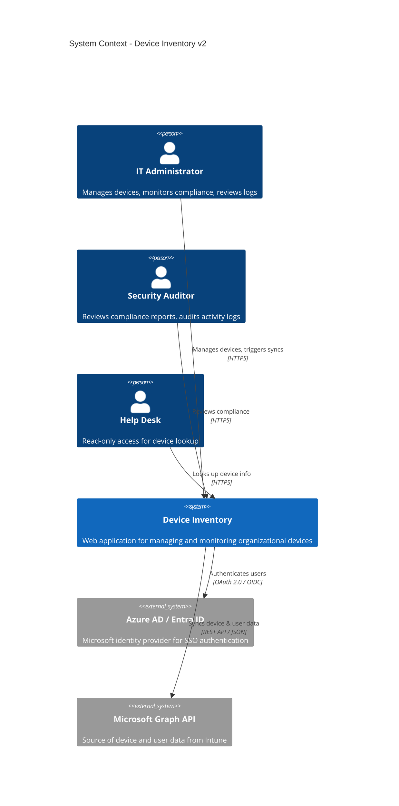

### 2.2 External System Descriptions

**Azure AD (Entra ID):**
- **Purpose:** Single Sign-On (SSO) authentication
- **Protocol:** OAuth 2.0 Authorization Code Flow
- **Integration:** NextAuth.js Azure AD provider
- **Scopes:** `openid`, `profile`, `email`, `User.Read`

**Microsoft Graph API:**
- **Purpose:** Source of truth for device and user data
- **Endpoints Used:**
  - `GET /deviceManagement/managedDevices/delta` (Incremental device sync)
  - `GET /users/delta` (Incremental user sync)
- **Authentication:** Service Principal with Client Certificate
- **Rate Limits:** 2,000 requests/minute

---

## 3. C4 Model: Container Diagram

### 3.1 Container Diagram (Logical Deployment Units)

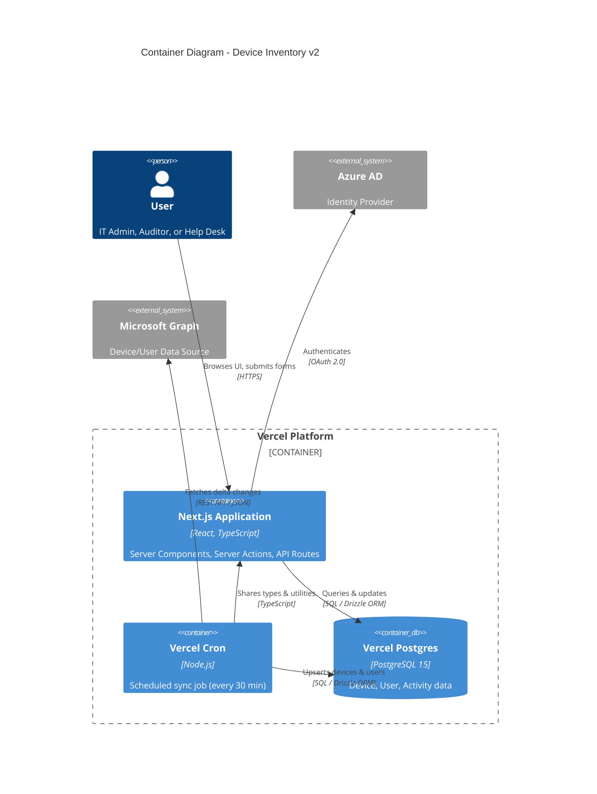

### 3.2 Container Descriptions

#### Next.js Application
- **Technology:** Next.js 15 (App Router), React 19, TypeScript
- **Responsibilities:**
  - Serve HTML pages (Server Components)
  - Handle form submissions (Server Actions)
  - API routes for client-side data fetching
  - Session management (NextAuth.js)
- **Port:** 3000 (dev), dynamic (Vercel production)
- **Scaling:** Horizontal auto-scaling via Vercel

#### Vercel Cron
- **Technology:** Node.js runtime (isolated Vercel Function)
- **Schedule:** `*/30 * * * *` (every 30 minutes)
- **Responsibilities:**
  - Fetch delta changes from Microsoft Graph API
  - Normalize and upsert data to Postgres
  - Log sync status and errors
- **Timeout:** 5 minutes (Vercel Function max)
- **Concurrency:** 1 (prevent overlapping syncs)

#### Vercel Postgres
- **Technology:** PostgreSQL 15 (managed by Vercel)
- **Storage:** 10 GB (expandable)
- **Connections:** Max 100 concurrent connections (pooled)
- **Backup:** Daily automated backups (7-day retention)
- **Responsibilities:**
  - Store devices, users, activity logs
  - Enforce referential integrity (foreign keys)
  - Provide indexed queries for fast lookups

---

## 4. C4 Model: Component Diagram

### 4.1 Component Diagram (Internal Structure)

This diagram shows the internal structure of the Next.js Application container.

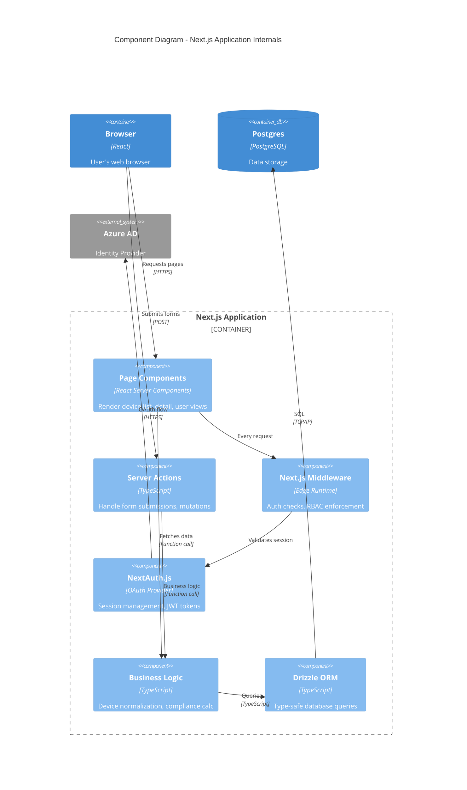

### 4.2 Component Descriptions

#### Page Components (Server Components)
- **Location:** `app/**/page.tsx`
- **Examples:**
  - `app/dashboard/page.tsx` - Dashboard with metrics
  - `app/devices/page.tsx` - Device list table
  - `app/devices/[id]/page.tsx` - Device detail view
- **Pattern:** Fetch data directly in components using Drizzle

#### Server Actions
- **Location:** `app/actions/*.ts` or colocated with forms
- **Examples:**
  - `updateDevice(deviceId, data)` - Update device properties
  - `decommissionDevice(deviceId)` - Soft delete device
  - `triggerSync()` - Manually trigger Graph API sync
- **Pattern:** `'use server'` directive, return JSON or redirect

#### Next.js Middleware
- **Location:** `middleware.ts` (project root)
- **Responsibilities:**
  - Check if user has valid session (JWT)
  - Enforce RBAC (e.g., only Admins can access `/settings`)
  - Redirect unauthenticated users to login

#### Business Logic Services
- **Location:** `lib/services/*.ts`
- **Examples:**
  - `DeviceService.normalize(graphDevice)` - Map Graph API to DB schema
  - `ComplianceService.calculateStatus(device)` - Compute compliance boolean
- **Pattern:** Pure functions, no side effects (easy to test)

#### Drizzle ORM
- **Location:** `lib/db/index.ts`, `lib/db/schema.ts`
- **Responsibilities:**
  - Generate TypeScript types from schema
  - Execute parameterized SQL queries
  - Handle migrations

---

## 5. Data Flow Diagrams

### 5.1 User Authentication Flow

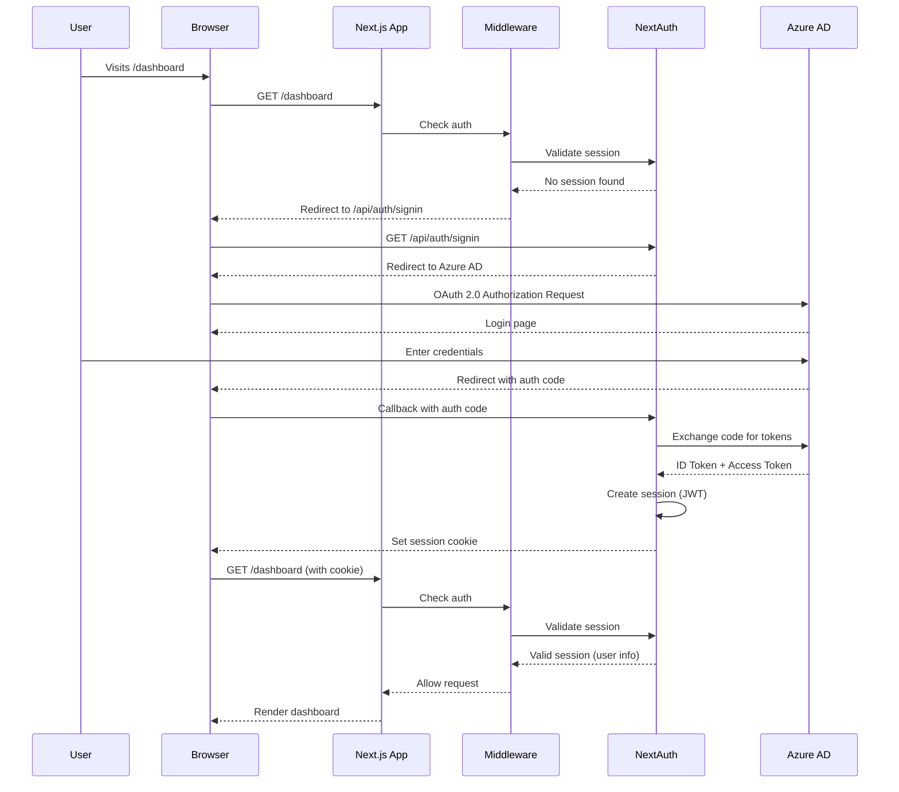

### 5.2 Device List Page Load Flow

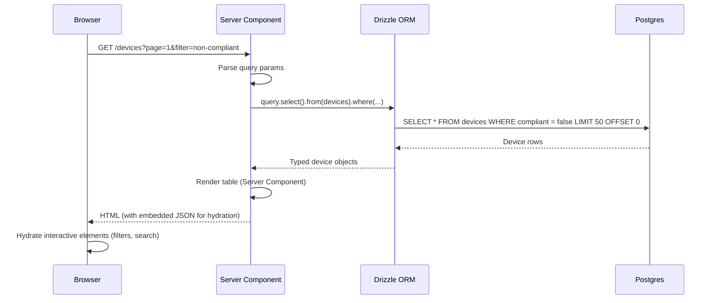

### 5.3 Device Sync Flow (Cron Job)

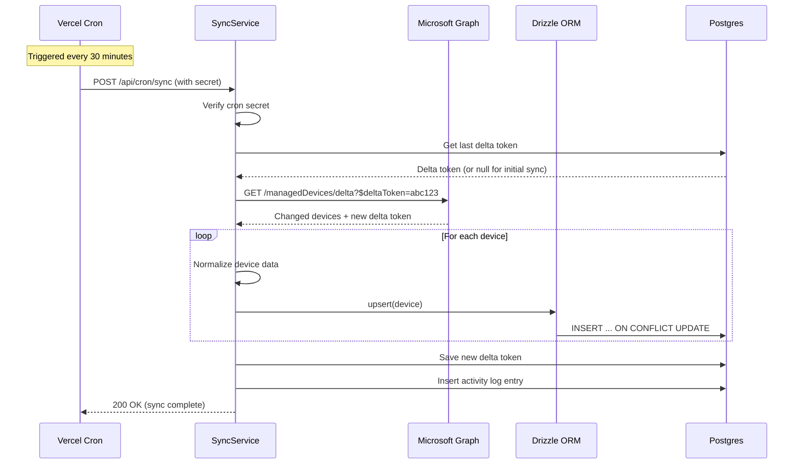

### 5.4 Device Update Flow (Server Action)

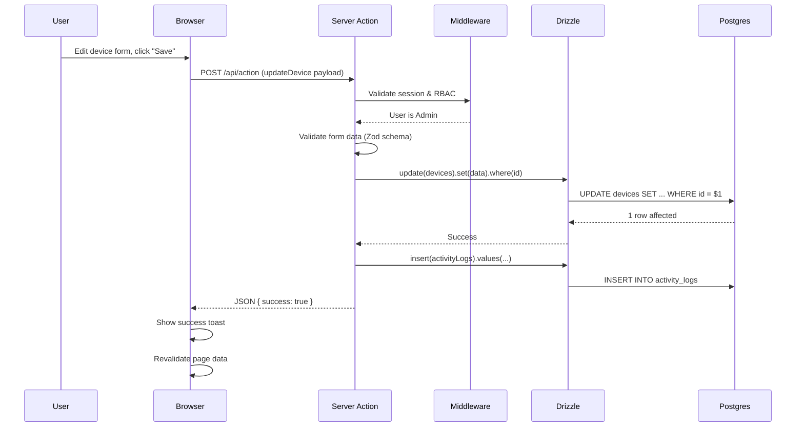

---

## 6. Deployment Architecture

### 6.1 Vercel Deployment Diagram

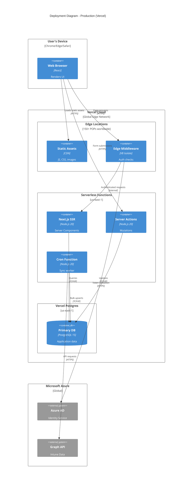

### 6.2 Infrastructure Components

| Component | Technology | Region | Scaling |
|-----------|------------|--------|---------|
| **Edge Middleware** | V8 Isolate | 150+ global POPs | Auto-scale (infinite) |
| **Serverless Functions** | Node.js 20 | us-east-1 | Auto-scale (0 to 1000+ instances) |
| **Postgres** | PostgreSQL 15 | us-east-1 | Vertical (max 100 connections) |
| **CDN** | Vercel Edge | Global | Auto-scale (infinite) |

### 6.3 Traffic Flow

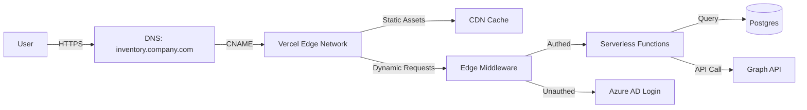

---

## 7. Technology Decisions

### 7.1 Architecture Decision Records (ADRs)

#### ADR-001: Monolith vs. Microservices

**Context:** Legacy system used microservices (5 containers). Complexity outweighed benefits for team size (2-3 engineers).

**Decision:** Monolithic Next.js application

**Rationale:**
- Single deployment reduces cognitive load
- Shared types across frontend/backend
- No inter-service communication overhead
- Easier debugging and testing

**Trade-offs:**
- Cannot scale individual services independently
- Single point of failure (mitigated by Vercel's auto-scaling)

**Status:** ✅ Accepted

---

#### ADR-002: Postgres vs. OpenSearch

**Context:** Legacy system used OpenSearch for device storage. Complex queries for relational data (devices ← users ← departments).

**Decision:** PostgreSQL relational database

**Rationale:**
- Device-user relationships are inherently relational
- Postgres JOINs are faster than OpenSearch nested queries
- Mature ecosystem (migrations, backups, replication)
- Vercel Postgres integration

**Trade-offs:**
- No full-text search (acceptable for v1; can add Postgres `tsvector` later)
- Requires schema migrations (mitigated by Drizzle tooling)

**Status:** ✅ Accepted

---

#### ADR-003: Drizzle ORM vs. Prisma

**Context:** Need type-safe ORM for Postgres. Prisma is popular but has runtime overhead.

**Decision:** Drizzle ORM

**Rationale:**
- Zero runtime overhead (compiles to SQL)
- Better TypeScript inference (no `prisma generate` step)
- Lightweight (bundle size matters for Vercel Functions)
- SQL-first approach (easier to optimize queries)

**Trade-offs:**
- Smaller community than Prisma
- Less mature admin UI (but we don't need it)

**Status:** ✅ Accepted

---

#### ADR-004: Server Components vs. Client Components

**Context:** Next.js App Router supports React Server Components. When to use vs. Client Components?

**Decision:** Server Components by default; Client Components only for interactivity

**Rules:**
- **Server Component:** Data fetching, business logic, static UI
- **Client Component:** Forms with validation, interactive tables, modals

**Rationale:**
- Smaller bundle size (Server Components don't ship JS to client)
- Better SEO (fully rendered HTML)
- Faster initial page load

**Trade-offs:**
- Cannot use React hooks (useState, useEffect) in Server Components
- Requires rethinking component boundaries

**Status:** ✅ Accepted

---

#### ADR-005: Vercel Cron vs. Hosted Cron Service

**Context:** Need to sync devices every 30 minutes. Options: Vercel Cron, AWS EventBridge, GitHub Actions, custom cron.

**Decision:** Vercel Cron (built-in)

**Rationale:**
- Native integration (no external dependencies)
- Same environment as main app (shared code)
- Free tier includes cron (no extra cost)
- Easy monitoring via Vercel dashboard

**Trade-offs:**
- Locked into Vercel platform
- 5-minute execution limit (but sync takes ~1 minute)

**Status:** ✅ Accepted

---

### 7.2 Technology Stack Summary

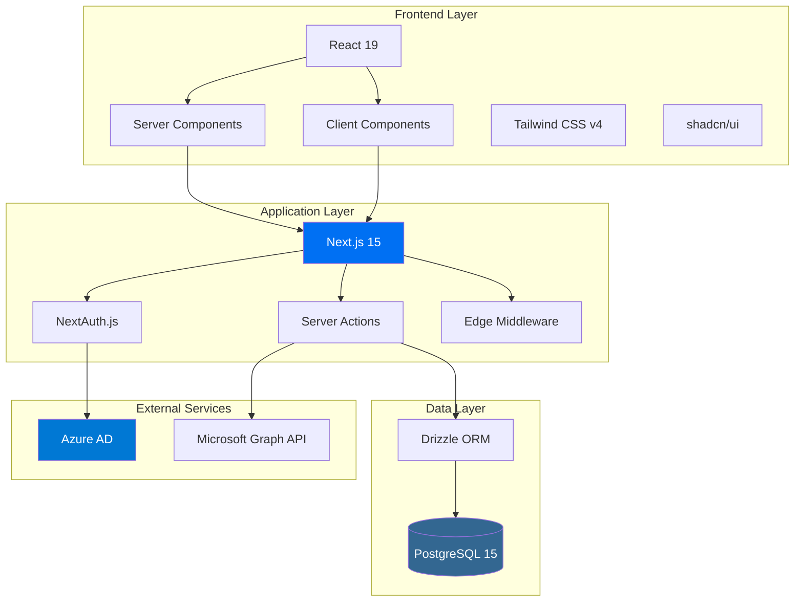

---

## 8. Cross-Cutting Concerns

### 8.1 Security Architecture

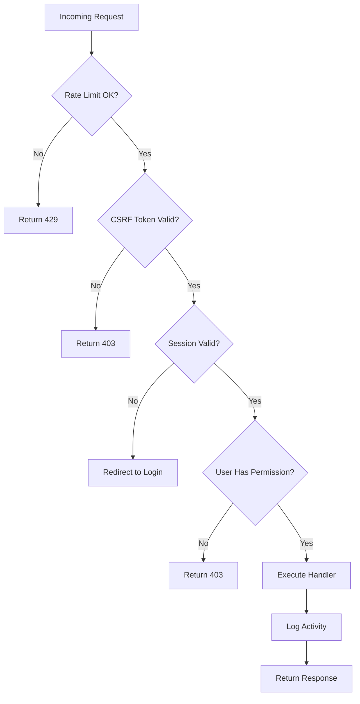

**Security Layers:**
1. **Rate Limiting:** 100 requests/minute per IP (middleware)
2. **CSRF Protection:** Built-in Next.js CSRF tokens
3. **Authentication:** NextAuth.js session validation
4. **Authorization:** Role-Based Access Control (middleware)
5. **Activity Logging:** All mutations logged to `activity_logs` table

### 8.2 Error Handling Strategy

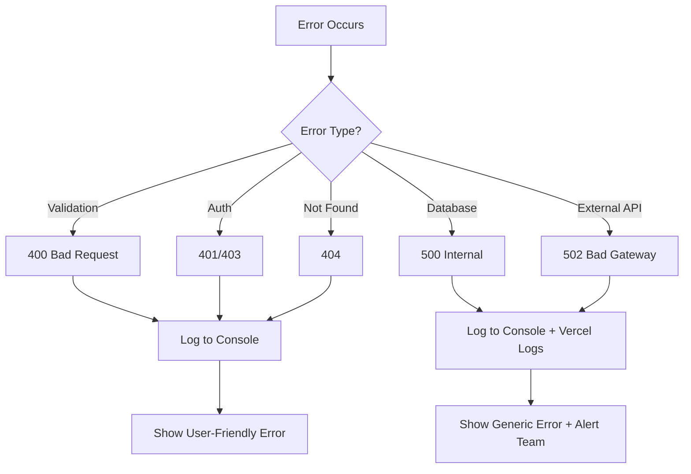

**Error Categories:**
- **User Errors (4xx):** Show helpful messages, don't log
- **System Errors (5xx):** Log to Vercel, alert engineering team
- **External API Errors:** Retry with exponential backoff (up to 3 times)

### 8.3 Performance Optimization

**Key Optimizations:**
1. **Database Indexes:** All foreign keys and frequent `WHERE` clauses indexed
2. **Server Component Caching:** `fetch()` calls cached by Next.js
3. **Static Generation:** Dashboard metrics pre-rendered at build time
4. **Image Optimization:** Next.js Image component with WebP format
5. **Code Splitting:** Client Components lazy-loaded with `next/dynamic`

### 8.4 Observability

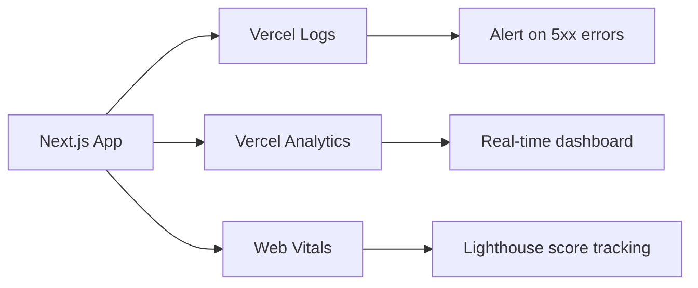

**Monitoring Points:**
- **Vercel Logs:** All console.log, errors, and function invocations
- **Vercel Analytics:** Page views, unique visitors, TTFB
- **Web Vitals:** LCP, FID, CLS tracked per page
- **Custom Metrics:** Sync duration, Graph API latency

---

## 9. Future Architecture Considerations

### 9.1 Potential Optimizations (Post-v1)

| Concern | Current Solution | Future Option |
|---------|-----------------|---------------|
| **Search Performance** | Postgres `ILIKE` queries | Add Postgres full-text search (tsvector) or Algolia |
| **Real-Time Updates** | 30-minute cron | Microsoft Graph webhooks + Vercel KV for pub/sub |
| **Multi-Tenancy** | Single org | Port to Platforms Starter Kit pattern (subdomains) |
| **Caching** | Next.js fetch cache | Add Redis for session storage and hot data |
| **Analytics** | Basic metrics | Add PostHog or Amplitude for event tracking |

### 9.2 Scaling Thresholds

| Metric | Threshold | Action Required |
|--------|-----------|-----------------|
| **Device Count** | >50,000 | Add read replicas for Postgres |
| **Concurrent Users** | >500 | Upgrade Vercel tier (pro → enterprise) |
| **Sync Duration** | >5 minutes | Split sync job into parallel workers |
| **Database Size** | >100 GB | Partition tables by date or region |

---

## 10. Conclusion

The Device Inventory v2 architecture represents a strategic simplification from the legacy microservices design. By adopting a **monolithic Next.js application** with **Postgres** and **Vercel's platform services**, we achieve:

✅ **Reduced Complexity:** Single codebase, single deployment  
✅ **Improved Performance:** <100ms query times, global edge delivery  
✅ **Better Developer Experience:** Type-safe end-to-end, hot reloading  
✅ **Lower Operational Cost:** Zero DevOps, managed infrastructure  
✅ **Faster Iteration:** Deploy preview branches in seconds  

**Next Steps:**
- Review **Document 03** for database schema design
- Review **Document 04** for data migration strategy from OpenSearch

---

**Document Status:** ✅ Ready for Engineering Review  
**Diagrams Generated:** 11 (C4 Context, Container, Component, Sequence, Flow, Deployment)  
**Skills Used:** `c4-architecture`, `mermaid-diagrams`
