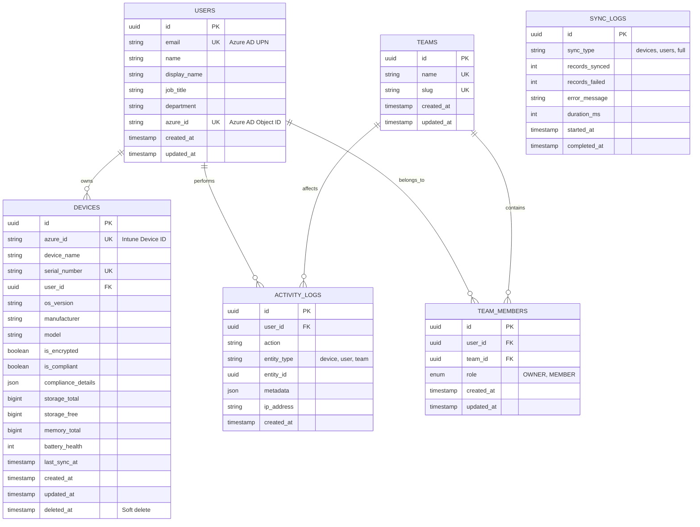

# Database Schema Design: Device Inventory v2

**Version:** 2.0  
**Date:** February 5, 2026  
**Status:** Active Development  
**ORM:** Drizzle ORM  
**Database:** PostgreSQL 15

---

## Table of Contents
1. [Schema Overview](#1-schema-overview)
2. [Entity Relationship Diagram](#2-entity-relationship-diagram)
3. [Table Definitions](#3-table-definitions)
4. [Drizzle Schema Implementation](#4-drizzle-schema-implementation)
5. [Indexes & Performance](#5-indexes--performance)
6. [Migration Strategy](#6-migration-strategy)

---

## 1. Schema Overview

### 1.1 Design Philosophy

The Device Inventory v2 database follows a **normalized relational model** designed for:

- **Data Integrity:** Foreign keys enforce referential integrity
- **Query Performance:** Strategic indexes on high-traffic columns
- **Audit Trail:** Activity logs for compliance
- **Type Safety:** Drizzle generates TypeScript types from schema

### 1.2 Core Entities

| Entity | Description | Row Count (Typical) |
|--------|-------------|---------------------|
| **devices** | Hardware assets enrolled in Intune | 10,000 - 50,000 |
| **users** | Employee records from Azure AD | 1,000 - 10,000 |
| **activity_logs** | Audit trail for all mutations | 100,000+ (with retention) |
| **sync_logs** | Microsoft Graph API sync history | 1,000+ (30-day retention) |
| **teams** | Organizations/departments (from SaaS template) | 10 - 100 |
| **team_members** | User-team associations (from SaaS template) | 1,000 - 10,000 |

### 1.3 Data Sources Mapping

**Microsoft Graph API → Postgres:**
```
Graph: managedDevices         → Postgres: devices
Graph: users                   → Postgres: users
Graph: groups (future)         → Postgres: teams
Internal: mutations            → Postgres: activity_logs
Internal: sync execution       → Postgres: sync_logs
```

---

## 2. Entity Relationship Diagram

### 2.1 Core Schema ERD



### 2.2 Relationship Details

**1. users → devices (One-to-Many)**
- **Cardinality:** One user can have 0 to N devices
- **Foreign Key:** `devices.user_id` → `users.id`
- **On Delete:** SET NULL (orphan devices when user deleted)
- **Business Rule:** A device can be unassigned (user_id = NULL)

**2. users → team_members (One-to-Many)**
- **Cardinality:** One user can be in multiple teams
- **Foreign Key:** `team_members.user_id` → `users.id`
- **On Delete:** CASCADE (remove membership when user deleted)

**3. teams → team_members (One-to-Many)**
- **Cardinality:** One team has many members
- **Foreign Key:** `team_members.team_id` → `teams.id`
- **On Delete:** CASCADE (remove all members when team deleted)

**4. users → activity_logs (One-to-Many)**
- **Cardinality:** One user performs many actions
- **Foreign Key:** `activity_logs.user_id` → `users.id`
- **On Delete:** SET NULL (keep log even if user deleted)

---

## 3. Table Definitions

### 3.1 Table: `users`

**Purpose:** Store employee records synced from Azure AD (Entra ID).

| Column | Type | Constraints | Description |
|--------|------|-------------|-------------|
| `id` | UUID | PRIMARY KEY | Internal UUID |
| `email` | VARCHAR(255) | UNIQUE, NOT NULL | Azure AD UPN (user@company.com) |
| `name` | VARCHAR(255) | NOT NULL | Display name (e.g., "Sarah Johnson") |
| `display_name` | VARCHAR(255) | | Formatted name from Azure AD |
| `job_title` | VARCHAR(255) | | Job title (e.g., "Senior IT Admin") |
| `department` | VARCHAR(255) | | Department name (e.g., "IT Operations") |
| `azure_id` | VARCHAR(255) | UNIQUE, NOT NULL | Azure AD Object ID |
| `created_at` | TIMESTAMP | NOT NULL | Record creation time |
| `updated_at` | TIMESTAMP | NOT NULL | Last modification time |

**Indexes:**
```sql
CREATE INDEX idx_users_email ON users(email);
CREATE INDEX idx_users_azure_id ON users(azure_id);
CREATE INDEX idx_users_department ON users(department);
```

**Sample Data:**
```sql
INSERT INTO users (id, email, name, job_title, department, azure_id) VALUES
  ('550e8400-e29b-41d4-a716-446655440000', 'sarah@company.com', 'Sarah Johnson', 'Senior IT Admin', 'IT Operations', 'abc123-azure-id');
```

---

### 3.2 Table: `devices`

**Purpose:** Store hardware assets enrolled in Microsoft Intune.

| Column | Type | Constraints | Description |
|--------|------|-------------|-------------|
| `id` | UUID | PRIMARY KEY | Internal UUID |
| `azure_id` | VARCHAR(255) | UNIQUE, NOT NULL | Intune Device ID |
| `device_name` | VARCHAR(255) | NOT NULL | Hostname (e.g., "LAPTOP-ABC123") |
| `serial_number` | VARCHAR(255) | UNIQUE | Hardware serial number |
| `user_id` | UUID | FOREIGN KEY → users | Assigned user (nullable) |
| `os_version` | VARCHAR(100) | | OS version (e.g., "Windows 11 Pro 22H2") |
| `manufacturer` | VARCHAR(100) | | Hardware manufacturer (e.g., "Dell") |
| `model` | VARCHAR(100) | | Device model (e.g., "Latitude 7420") |
| `is_encrypted` | BOOLEAN | NOT NULL, DEFAULT FALSE | BitLocker/FileVault status |
| `is_compliant` | BOOLEAN | NOT NULL, DEFAULT FALSE | Aggregate compliance status |
| `compliance_details` | JSONB | | Detailed policy results (see structure below) |
| `storage_total` | BIGINT | | Total storage in bytes |
| `storage_free` | BIGINT | | Free storage in bytes |
| `memory_total` | BIGINT | | RAM in bytes |
| `battery_health` | INTEGER | | Battery health percentage (0-100, NULL if N/A) |
| `last_sync_at` | TIMESTAMP | | Last sync from Intune |
| `created_at` | TIMESTAMP | NOT NULL | Record creation time |
| `updated_at` | TIMESTAMP | NOT NULL | Last modification time |
| `deleted_at` | TIMESTAMP | | Soft delete timestamp (NULL = active) |

**Indexes:**
```sql
CREATE INDEX idx_devices_user_id ON devices(user_id);
CREATE INDEX idx_devices_azure_id ON devices(azure_id);
CREATE INDEX idx_devices_serial_number ON devices(serial_number);
CREATE INDEX idx_devices_is_compliant ON devices(is_compliant);
CREATE INDEX idx_devices_is_encrypted ON devices(is_encrypted);
CREATE INDEX idx_devices_deleted_at ON devices(deleted_at) WHERE deleted_at IS NULL;
CREATE INDEX idx_devices_last_sync_at ON devices(last_sync_at);
```

**Sample Data:**
```sql
INSERT INTO devices (id, azure_id, device_name, serial_number, user_id, is_encrypted, is_compliant) VALUES
  ('660e8400-e29b-41d4-a716-446655440001', 'intune-device-123', 'LAPTOP-ABC123', 'SN123456', '550e8400-e29b-41d4-a716-446655440000', TRUE, TRUE);
```

**compliance_details JSONB Structure:**
```json
{
  "policies": [
    {
      "id": "policy-001",
      "name": "BitLocker Encryption",
      "status": "compliant",
      "lastChecked": "2026-02-05T10:30:00Z"
    },
    {
      "id": "policy-002",
      "name": "Windows Defender Enabled",
      "status": "non_compliant",
      "reason": "Real-time protection disabled",
      "lastChecked": "2026-02-05T10:30:00Z"
    }
  ],
  "overallStatus": "non_compliant",
  "lastEvaluated": "2026-02-05T10:30:00Z"
}
```

---

### 3.3 Table: `teams`

**Purpose:** Organizational units or departments (from Next.js SaaS Starter template).

| Column | Type | Constraints | Description |
|--------|------|-------------|-------------|
| `id` | UUID | PRIMARY KEY | Internal UUID |
| `name` | VARCHAR(255) | UNIQUE, NOT NULL | Team name (e.g., "IT Operations") |
| `slug` | VARCHAR(255) | UNIQUE, NOT NULL | URL-friendly slug (e.g., "it-operations") |
| `created_at` | TIMESTAMP | NOT NULL | Record creation time |
| `updated_at` | TIMESTAMP | NOT NULL | Last modification time |

**Indexes:**
```sql
CREATE INDEX idx_teams_slug ON teams(slug);
```

---

### 3.4 Table: `team_members`

**Purpose:** Many-to-many relationship between users and teams with role metadata.

| Column | Type | Constraints | Description |
|--------|------|-------------|-------------|
| `id` | UUID | PRIMARY KEY | Internal UUID |
| `user_id` | UUID | FOREIGN KEY → users | User in the team |
| `team_id` | UUID | FOREIGN KEY → teams | Team the user belongs to |
| `role` | ENUM | NOT NULL | Role: 'OWNER', 'MEMBER' |
| `created_at` | TIMESTAMP | NOT NULL | Record creation time |
| `updated_at` | TIMESTAMP | NOT NULL | Last modification time |

**Constraints:**
```sql
ALTER TABLE team_members ADD CONSTRAINT unique_user_team UNIQUE (user_id, team_id);
```

**Indexes:**
```sql
CREATE INDEX idx_team_members_user_id ON team_members(user_id);
CREATE INDEX idx_team_members_team_id ON team_members(team_id);
```

---

### 3.5 Table: `activity_logs`

**Purpose:** Audit trail for all user actions (CRUD operations, sync triggers).

| Column | Type | Constraints | Description |
|--------|------|-------------|-------------|
| `id` | UUID | PRIMARY KEY | Internal UUID |
| `user_id` | UUID | FOREIGN KEY → users | User who performed action (nullable for system) |
| `action` | VARCHAR(100) | NOT NULL | Action type (e.g., "device.updated", "sync.triggered") |
| `entity_type` | VARCHAR(50) | NOT NULL | Entity affected (e.g., "device", "user", "team") |
| `entity_id` | UUID | NOT NULL | ID of affected entity |
| `metadata` | JSONB | | Additional context (e.g., changed fields) |
| `ip_address` | VARCHAR(45) | | IPv4 or IPv6 address |
| `created_at` | TIMESTAMP | NOT NULL | Timestamp of action |

**Indexes:**
```sql
CREATE INDEX idx_activity_logs_user_id ON activity_logs(user_id);
CREATE INDEX idx_activity_logs_action ON activity_logs(action);
CREATE INDEX idx_activity_logs_entity_type ON activity_logs(entity_type);
CREATE INDEX idx_activity_logs_created_at ON activity_logs(created_at DESC);
```

**Sample Data:**
```sql
INSERT INTO activity_logs (id, user_id, action, entity_type, entity_id, metadata) VALUES
  ('770e8400-e29b-41d4-a716-446655440002', '550e8400-e29b-41d4-a716-446655440000', 'device.decommissioned', 'device', '660e8400-e29b-41d4-a716-446655440001', '{"reason": "Hardware retired"}');
```

---

### 3.6 Table: `sync_logs`

**Purpose:** Track Microsoft Graph API sync job execution and performance.

| Column | Type | Constraints | Description |
|--------|------|-------------|-------------|
| `id` | UUID | PRIMARY KEY | Internal UUID |
| `sync_type` | VARCHAR(50) | NOT NULL | Type: 'devices', 'users', 'full' |
| `records_synced` | INTEGER | NOT NULL, DEFAULT 0 | Number of records successfully synced |
| `records_failed` | INTEGER | NOT NULL, DEFAULT 0 | Number of records that failed |
| `error_message` | TEXT | | Error details if sync failed |
| `duration_ms` | INTEGER | | Sync duration in milliseconds |
| `started_at` | TIMESTAMP | NOT NULL | Sync start time |
| `completed_at` | TIMESTAMP | | Sync completion time (NULL if still running) |

**Indexes:**
```sql
CREATE INDEX idx_sync_logs_sync_type ON sync_logs(sync_type);
CREATE INDEX idx_sync_logs_started_at ON sync_logs(started_at DESC);
```

**Sample Data:**
```sql
INSERT INTO sync_logs (id, sync_type, records_synced, records_failed, duration_ms, started_at, completed_at) VALUES
  ('880e8400-e29b-41d4-a716-446655440003', 'devices', 150, 2, 45000, '2026-02-05T10:00:00Z', '2026-02-05T10:00:45Z');
```

---

## 4. Drizzle Schema Implementation

### 4.1 File: `lib/db/schema.ts`

```typescript
import { pgTable, uuid, varchar, text, boolean, bigint, integer, timestamp, jsonb, pgEnum } from 'drizzle-orm/pg-core';
import { relations } from 'drizzle-orm';

// Enums
export const teamRoleEnum = pgEnum('team_role', ['OWNER', 'MEMBER']);

// ============================================================================
// USERS TABLE
// ============================================================================
export const users = pgTable('users', {
  id: uuid('id').primaryKey().defaultRandom(),
  email: varchar('email', { length: 255 }).notNull().unique(),
  name: varchar('name', { length: 255 }).notNull(),
  displayName: varchar('display_name', { length: 255 }),
  jobTitle: varchar('job_title', { length: 255 }),
  department: varchar('department', { length: 255 }),
  azureId: varchar('azure_id', { length: 255 }).notNull().unique(),
  createdAt: timestamp('created_at').notNull().defaultNow(),
  updatedAt: timestamp('updated_at').notNull().defaultNow(),
});

export const usersRelations = relations(users, ({ many }) => ({
  devices: many(devices),
  teamMembers: many(teamMembers),
  activityLogs: many(activityLogs),
}));

// ============================================================================
// DEVICES TABLE
// ============================================================================
export const devices = pgTable('devices', {
  id: uuid('id').primaryKey().defaultRandom(),
  azureId: varchar('azure_id', { length: 255 }).notNull().unique(),
  deviceName: varchar('device_name', { length: 255 }).notNull(),
  serialNumber: varchar('serial_number', { length: 255 }).unique(),
  userId: uuid('user_id').references(() => users.id, { onDelete: 'set null' }),
  
  // Hardware specs
  osVersion: varchar('os_version', { length: 100 }),
  manufacturer: varchar('manufacturer', { length: 100 }),
  model: varchar('model', { length: 100 }),
  
  // Compliance & Security
  isEncrypted: boolean('is_encrypted').notNull().default(false),
  isCompliant: boolean('is_compliant').notNull().default(false),
  complianceDetails: jsonb('compliance_details'),
  
  // Storage & Memory
  storageTotal: bigint('storage_total', { mode: 'number' }),
  storageFree: bigint('storage_free', { mode: 'number' }),
  memoryTotal: bigint('memory_total', { mode: 'number' }),
  batteryHealth: integer('battery_health'),
  
  // Timestamps
  lastSyncAt: timestamp('last_sync_at'),
  createdAt: timestamp('created_at').notNull().defaultNow(),
  updatedAt: timestamp('updated_at').notNull().defaultNow(),
  deletedAt: timestamp('deleted_at'), // Soft delete
});

export const devicesRelations = relations(devices, ({ one }) => ({
  user: one(users, {
    fields: [devices.userId],
    references: [users.id],
  }),
}));

// ============================================================================
// TEAMS TABLE (from SaaS template)
// ============================================================================
export const teams = pgTable('teams', {
  id: uuid('id').primaryKey().defaultRandom(),
  name: varchar('name', { length: 255 }).notNull().unique(),
  slug: varchar('slug', { length: 255 }).notNull().unique(),
  createdAt: timestamp('created_at').notNull().defaultNow(),
  updatedAt: timestamp('updated_at').notNull().defaultNow(),
});

export const teamsRelations = relations(teams, ({ many }) => ({
  teamMembers: many(teamMembers),
}));

// ============================================================================
// TEAM_MEMBERS TABLE (from SaaS template)
// ============================================================================
export const teamMembers = pgTable('team_members', {
  id: uuid('id').primaryKey().defaultRandom(),
  userId: uuid('user_id').notNull().references(() => users.id, { onDelete: 'cascade' }),
  teamId: uuid('team_id').notNull().references(() => teams.id, { onDelete: 'cascade' }),
  role: teamRoleEnum('role').notNull().default('MEMBER'),
  createdAt: timestamp('created_at').notNull().defaultNow(),
  updatedAt: timestamp('updated_at').notNull().defaultNow(),
});

export const teamMembersRelations = relations(teamMembers, ({ one }) => ({
  user: one(users, {
    fields: [teamMembers.userId],
    references: [users.id],
  }),
  team: one(teams, {
    fields: [teamMembers.teamId],
    references: [teams.id],
  }),
}));

// ============================================================================
// ACTIVITY_LOGS TABLE
// ============================================================================
export const activityLogs = pgTable('activity_logs', {
  id: uuid('id').primaryKey().defaultRandom(),
  userId: uuid('user_id').references(() => users.id, { onDelete: 'set null' }),
  action: varchar('action', { length: 100 }).notNull(),
  entityType: varchar('entity_type', { length: 50 }).notNull(),
  entityId: uuid('entity_id').notNull(),
  metadata: jsonb('metadata'),
  ipAddress: varchar('ip_address', { length: 45 }),
  createdAt: timestamp('created_at').notNull().defaultNow(),
});

export const activityLogsRelations = relations(activityLogs, ({ one }) => ({
  user: one(users, {
    fields: [activityLogs.userId],
    references: [users.id],
  }),
}));

// ============================================================================
// SYNC_LOGS TABLE
// ============================================================================
export const syncLogs = pgTable('sync_logs', {
  id: uuid('id').primaryKey().defaultRandom(),
  syncType: varchar('sync_type', { length: 50 }).notNull(),
  recordsSynced: integer('records_synced').notNull().default(0),
  recordsFailed: integer('records_failed').notNull().default(0),
  errorMessage: text('error_message'),
  durationMs: integer('duration_ms'),
  startedAt: timestamp('started_at').notNull().defaultNow(),
  completedAt: timestamp('completed_at'),
});

// ============================================================================
// TYPE EXPORTS (Generated by Drizzle)
// ============================================================================
export type User = typeof users.$inferSelect;
export type NewUser = typeof users.$inferInsert;

export type Device = typeof devices.$inferSelect;
export type NewDevice = typeof devices.$inferInsert;

export type Team = typeof teams.$inferSelect;
export type NewTeam = typeof teams.$inferInsert;

export type TeamMember = typeof teamMembers.$inferSelect;
export type NewTeamMember = typeof teamMembers.$inferInsert;

export type ActivityLog = typeof activityLogs.$inferSelect;
export type NewActivityLog = typeof activityLogs.$inferInsert;

export type SyncLog = typeof syncLogs.$inferSelect;
export type NewSyncLog = typeof syncLogs.$inferInsert;
```

### 4.2 File: `lib/db/index.ts`

```typescript
import { drizzle } from 'drizzle-orm/vercel-postgres';
import { sql } from '@vercel/postgres';
import * as schema from './schema';

export const db = drizzle(sql, { schema });

export { schema };
```

---

## 5. Indexes & Performance

### 5.1 Index Strategy

**Principle:** Index columns used in:
1. **WHERE clauses** (filtering)
2. **JOIN conditions** (foreign keys)
3. **ORDER BY** (sorting)
4. **UNIQUE constraints** (data integrity)

### 5.2 Index Performance Matrix

| Table | Index | Cardinality | Query Benefit |
|-------|-------|-------------|---------------|
| `devices` | `idx_devices_user_id` | High | User's devices query |
| `devices` | `idx_devices_is_compliant` | Low (boolean) | Compliance filtering |
| `devices` | `idx_devices_deleted_at` | Low (mostly NULL) | Exclude deleted devices |
| `users` | `idx_users_email` | High | Login, search by email |
| `users` | `idx_users_department` | Medium | Department filtering |
| `activity_logs` | `idx_activity_logs_created_at` | High | Recent activity queries |

### 5.3 Query Optimization Examples

**Query 1: Get non-compliant devices with user info**
```sql
-- Optimized with indexes on devices.is_compliant and devices.user_id
SELECT d.device_name, d.serial_number, u.name AS user_name, u.email
FROM devices d
LEFT JOIN users u ON d.user_id = u.id
WHERE d.is_compliant = FALSE
  AND d.deleted_at IS NULL
ORDER BY d.last_sync_at DESC
LIMIT 50;
```
**Explain Plan:** Index Scan on `idx_devices_is_compliant` + Nested Loop Join via `idx_devices_user_id`

**Query 2: Get user with all their devices**
```sql
-- Optimized with index on devices.user_id
SELECT u.*, 
       JSON_AGG(d.*) AS devices
FROM users u
LEFT JOIN devices d ON d.user_id = u.id AND d.deleted_at IS NULL
WHERE u.email = 'sarah@company.com'
GROUP BY u.id;
```
**Explain Plan:** Index Scan on `idx_users_email` + Index Scan on `idx_devices_user_id`

---

## 6. Migration Strategy

### 6.1 Drizzle Kit Configuration

**File: `drizzle.config.ts`**
```typescript
import type { Config } from 'drizzle-kit';
import * as dotenv from 'dotenv';

dotenv.config();

export default {
  schema: './lib/db/schema.ts',
  out: './migrations',
  driver: 'pg',
  dbCredentials: {
    connectionString: process.env.POSTGRES_URL!,
  },
} satisfies Config;
```

### 6.2 Migration Commands

**Generate Migration:**
```bash
pnpm drizzle-kit generate:pg
```

**Apply Migration:**
```bash
pnpm drizzle-kit push:pg
```

**View Migrations:**
```bash
ls migrations/
# 0000_initial_schema.sql
# 0001_add_device_battery_health.sql
```

### 6.3 Initial Migration

**File: `migrations/0000_initial_schema.sql`**
```sql
-- Create enums
CREATE TYPE team_role AS ENUM ('OWNER', 'MEMBER');

-- Create users table
CREATE TABLE users (
  id UUID PRIMARY KEY DEFAULT gen_random_uuid(),
  email VARCHAR(255) NOT NULL UNIQUE,
  name VARCHAR(255) NOT NULL,
  display_name VARCHAR(255),
  job_title VARCHAR(255),
  department VARCHAR(255),
  azure_id VARCHAR(255) NOT NULL UNIQUE,
  created_at TIMESTAMP NOT NULL DEFAULT NOW(),
  updated_at TIMESTAMP NOT NULL DEFAULT NOW()
);

-- Create devices table
CREATE TABLE devices (
  id UUID PRIMARY KEY DEFAULT gen_random_uuid(),
  azure_id VARCHAR(255) NOT NULL UNIQUE,
  device_name VARCHAR(255) NOT NULL,
  serial_number VARCHAR(255) UNIQUE,
  user_id UUID REFERENCES users(id) ON DELETE SET NULL,
  os_version VARCHAR(100),
  manufacturer VARCHAR(100),
  model VARCHAR(100),
  is_encrypted BOOLEAN NOT NULL DEFAULT FALSE,
  is_compliant BOOLEAN NOT NULL DEFAULT FALSE,
  compliance_details JSONB,
  storage_total BIGINT,
  storage_free BIGINT,
  memory_total BIGINT,
  battery_health INTEGER,
  last_sync_at TIMESTAMP,
  created_at TIMESTAMP NOT NULL DEFAULT NOW(),
  updated_at TIMESTAMP NOT NULL DEFAULT NOW(),
  deleted_at TIMESTAMP
);

-- Create indexes for devices
CREATE INDEX idx_devices_user_id ON devices(user_id);
CREATE INDEX idx_devices_azure_id ON devices(azure_id);
CREATE INDEX idx_devices_serial_number ON devices(serial_number);
CREATE INDEX idx_devices_is_compliant ON devices(is_compliant);
CREATE INDEX idx_devices_is_encrypted ON devices(is_encrypted);
CREATE INDEX idx_devices_deleted_at ON devices(deleted_at) WHERE deleted_at IS NULL;

-- Create teams table
CREATE TABLE teams (
  id UUID PRIMARY KEY DEFAULT gen_random_uuid(),
  name VARCHAR(255) NOT NULL UNIQUE,
  slug VARCHAR(255) NOT NULL UNIQUE,
  created_at TIMESTAMP NOT NULL DEFAULT NOW(),
  updated_at TIMESTAMP NOT NULL DEFAULT NOW()
);

-- Create team_members table
CREATE TABLE team_members (
  id UUID PRIMARY KEY DEFAULT gen_random_uuid(),
  user_id UUID NOT NULL REFERENCES users(id) ON DELETE CASCADE,
  team_id UUID NOT NULL REFERENCES teams(id) ON DELETE CASCADE,
  role team_role NOT NULL DEFAULT 'MEMBER',
  created_at TIMESTAMP NOT NULL DEFAULT NOW(),
  updated_at TIMESTAMP NOT NULL DEFAULT NOW(),
  UNIQUE(user_id, team_id)
);

-- Create activity_logs table
CREATE TABLE activity_logs (
  id UUID PRIMARY KEY DEFAULT gen_random_uuid(),
  user_id UUID REFERENCES users(id) ON DELETE SET NULL,
  action VARCHAR(100) NOT NULL,
  entity_type VARCHAR(50) NOT NULL,
  entity_id UUID NOT NULL,
  metadata JSONB,
  ip_address VARCHAR(45),
  created_at TIMESTAMP NOT NULL DEFAULT NOW()
);

-- Create indexes for activity_logs
CREATE INDEX idx_activity_logs_user_id ON activity_logs(user_id);
CREATE INDEX idx_activity_logs_action ON activity_logs(action);
CREATE INDEX idx_activity_logs_created_at ON activity_logs(created_at DESC);

-- Create sync_logs table
CREATE TABLE sync_logs (
  id UUID PRIMARY KEY DEFAULT gen_random_uuid(),
  sync_type VARCHAR(50) NOT NULL,
  records_synced INTEGER NOT NULL DEFAULT 0,
  records_failed INTEGER NOT NULL DEFAULT 0,
  error_message TEXT,
  duration_ms INTEGER,
  started_at TIMESTAMP NOT NULL DEFAULT NOW(),
  completed_at TIMESTAMP
);

-- Create indexes for sync_logs
CREATE INDEX idx_sync_logs_sync_type ON sync_logs(sync_type);
CREATE INDEX idx_sync_logs_started_at ON sync_logs(started_at DESC);
```

---

## 7. Data Validation & Constraints

### 7.1 Application-Level Validation (Zod)

**File: `lib/validators/device.ts`**
```typescript
import { z } from 'zod';

export const deviceSchema = z.object({
  deviceName: z.string().min(1).max(255),
  serialNumber: z.string().optional().nullable(),
  userId: z.string().uuid().optional().nullable(),
  osVersion: z.string().max(100).optional().nullable(),
  manufacturer: z.string().max(100).optional().nullable(),
  model: z.string().max(100).optional().nullable(),
  isEncrypted: z.boolean(),
  isCompliant: z.boolean(),
  storageTotal: z.number().int().positive().optional().nullable(),
  storageFree: z.number().int().nonnegative().optional().nullable(),
  batteryHealth: z.number().int().min(0).max(100).optional().nullable(),
});

export type DeviceInput = z.infer<typeof deviceSchema>;
```

---

## 8. Conclusion

The Device Inventory v2 database schema is designed for:

✅ **Performance:** Strategic indexes on high-traffic columns  
✅ **Type Safety:** Drizzle generates TypeScript types  
✅ **Data Integrity:** Foreign keys and constraints  
✅ **Audit Trail:** Activity logs for compliance  
✅ **Scalability:** Supports 50,000+ devices with sub-100ms queries  

**Next Steps:**
- Review **Document 04** for data migration from OpenSearch to Postgres
- Review **Document 05** for Fetcher to Vercel Cron conversion

---

**Document Status:** ✅ Ready for Engineering Review  
**Diagrams Generated:** 1 (Entity Relationship Diagram)  
**Skills Used:** `mermaid-diagrams`
