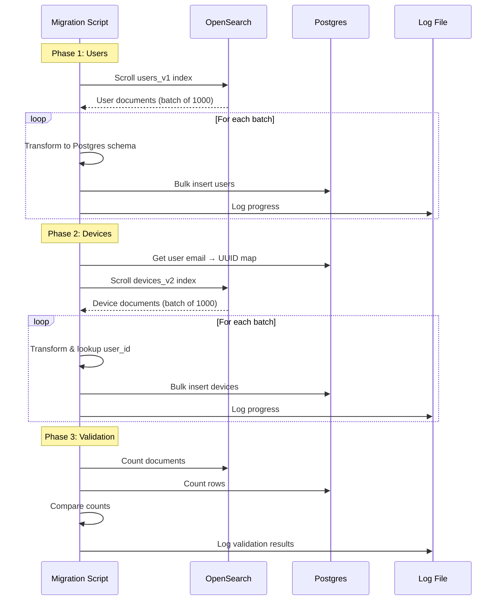

# Data Migration Strategy: OpenSearch to Postgres

**Version:** 2.0  
**Date:** February 5, 2026  
**Status:** Active Development  
**Migration Type:** One-Time Bulk Migration + Validation

---

## Table of Contents
1. [Migration Overview](#1-migration-overview)
2. [Schema Mapping](#2-schema-mapping)
3. [Migration Process Flow](#3-migration-process-flow)
4. [Migration Script Implementation](#4-migration-script-implementation)
5. [Data Validation](#5-data-validation)
6. [Rollback Strategy](#6-rollback-strategy)
7. [Post-Migration Tasks](#7-post-migration-tasks)

---

## 1. Migration Overview

### 1.1 Scope

**Goal:** Migrate all device and user data from the legacy **OpenSearch** document store to the new **Postgres** relational database while preserving data integrity.

**Estimated Data Volume:**
- **Devices:** 10,000 - 50,000 documents
- **Users:** 1,000 - 10,000 documents
- **Total Size:** ~500 MB - 2 GB JSON data

**Migration Window:** 4 hours (off-peak)

### 1.2 Approach

**Strategy:** One-time bulk ETL (Extract, Transform, Load)


### 1.3 Prerequisites

**Environment:**
- Access to legacy OpenSearch instance (read-only connection)
- Vercel Postgres database provisioned
- Node.js 20+ runtime
- Sufficient Postgres connection pool (min 10 connections)

**Tools Required:**
- `@opensearch-project/opensearch` (Node.js client)
- `drizzle-orm` (Postgres ORM)
- `zod` (Schema validation)

---

## 2. Schema Mapping

### 2.1 Devices: OpenSearch → Postgres

**Legacy OpenSearch Document (`devices_v2` index):**
```json
{
  "id": "intune-device-abc123",
  "deviceName": "LAPTOP-ABC123",
  "serialNumber": "SN123456",
  "userPrincipalName": "sarah@company.com",
  "osVersion": "Windows 11 Pro 22H2",
  "manufacturer": "Dell",
  "model": "Latitude 7420",
  "isEncrypted": true,
  "complianceState": "compliant",
  "compliance": {
    "policies": [
      {"id": "policy-001", "name": "BitLocker", "status": "compliant"}
    ]
  },
  "totalStorageSpaceInBytes": 512000000000,
  "freeStorageSpaceInBytes": 256000000000,
  "physicalMemoryInBytes": 16000000000,
  "batteryHealthPercentage": 85,
  "lastSyncDateTime": "2026-02-05T10:30:00Z"
}
```

**New Postgres Row (`devices` table):**
```sql
INSERT INTO devices (
  azure_id, device_name, serial_number, user_id, os_version, manufacturer, model,
  is_encrypted, is_compliant, compliance_details, storage_total, storage_free,
  memory_total, battery_health, last_sync_at
) VALUES (
  'intune-device-abc123', -- azure_id (from id)
  'LAPTOP-ABC123', -- device_name
  'SN123456', -- serial_number
  '550e8400-e29b-41d4-a716-446655440000', -- user_id (lookup via UPN)
  'Windows 11 Pro 22H2', -- os_version
  'Dell', -- manufacturer
  'Latitude 7420', -- model
  true, -- is_encrypted
  true, -- is_compliant (complianceState === 'compliant')
  '{"policies": [{"id": "policy-001", "name": "BitLocker", "status": "compliant"}]}', -- compliance_details (JSON)
  512000000000, -- storage_total
  256000000000, -- storage_free
  16000000000, -- memory_total
  85, -- battery_health
  '2026-02-05T10:30:00Z' -- last_sync_at (from lastSyncDateTime)
);
```

**Field Mapping Table:**
| OpenSearch Field | Postgres Column | Transformation |
|------------------|-----------------|----------------|
| `id` | `azure_id` | Direct copy |
| `deviceName` | `device_name` | Direct copy |
| `serialNumber` | `serial_number` | Direct copy (nullable) |
| `userPrincipalName` | `user_id` | **Lookup user UUID by email** |
| `osVersion` | `os_version` | Direct copy |
| `manufacturer` | `manufacturer` | Direct copy |
| `model` | `model` | Direct copy |
| `isEncrypted` | `is_encrypted` | Direct copy |
| `complianceState` | `is_compliant` | Boolean: `'compliant'` → `true`, else `false` |
| `compliance` | `compliance_details` | Store full object as JSONB |
| `totalStorageSpaceInBytes` | `storage_total` | Direct copy |
| `freeStorageSpaceInBytes` | `storage_free` | Direct copy |
| `physicalMemoryInBytes` | `memory_total` | Direct copy |
| `batteryHealthPercentage` | `battery_health` | Direct copy (nullable) |
| `lastSyncDateTime` | `last_sync_at` | Convert to timestamp |

### 2.2 Users: OpenSearch → Postgres

**Legacy OpenSearch Document (`users_v1` index):**
```json
{
  "id": "azure-user-abc123",
  "userPrincipalName": "sarah@company.com",
  "displayName": "Sarah Johnson",
  "jobTitle": "Senior IT Admin",
  "department": "IT Operations",
  "assignedLicenses": ["O365-E5", "INTUNE-A"]
}
```

**New Postgres Row (`users` table):**
```sql
INSERT INTO users (
  azure_id, email, name, display_name, job_title, department
) VALUES (
  'azure-user-abc123', -- azure_id (from id)
  'sarah@company.com', -- email (from userPrincipalName)
  'Sarah Johnson', -- name (from displayName)
  'Sarah Johnson', -- display_name
  'Senior IT Admin', -- job_title
  'IT Operations' -- department
);
```

**Field Mapping Table:**
| OpenSearch Field | Postgres Column | Transformation |
|------------------|-----------------|----------------|
| `id` | `azure_id` | Direct copy |
| `userPrincipalName` | `email` | Direct copy |
| `displayName` | `name` | Direct copy |
| `displayName` | `display_name` | Direct copy |
| `jobTitle` | `job_title` | Direct copy |
| `department` | `department` | Direct copy |

**Note:** `assignedLicenses` not migrated in v1 (future enhancement)

---

## 3. Migration Process Flow

### 3.1 High-Level Flow



### 3.2 Detailed Steps

**Phase 1: Pre-Migration**
1. ✅ Backup OpenSearch indices (snapshot to S3)
2. ✅ Provision Postgres database on Vercel
3. ✅ Run Drizzle migrations to create tables
4. ✅ Set up migration script with dry-run mode
5. ✅ Test migration on small subset (100 devices)

**Phase 2: User Migration**
1. Connect to OpenSearch `users_v1` index
2. Scroll through all user documents (batch size: 1000)
3. Transform each document to Postgres schema
4. Bulk insert users into `users` table
5. Log progress every 1000 users
6. Handle duplicates (upsert by `azure_id`)

**Phase 3: Device Migration**
1. Build in-memory map: `{ email → user_id }` from Postgres
2. Connect to OpenSearch `devices_v2` index
3. Scroll through all device documents (batch size: 1000)
4. For each device:
   - Transform to Postgres schema
   - Lookup `user_id` by `userPrincipalName` (fallback to NULL if not found)
   - Validate required fields (device_name, azure_id)
5. Bulk insert devices into `devices` table
6. Log progress every 1000 devices

**Phase 4: Validation**
1. Count OpenSearch documents vs. Postgres rows
2. Sample 100 random devices and compare field values
3. Check for orphaned devices (user_id not found)
4. Generate validation report

**Phase 5: Post-Migration**
1. Create indexes (if not auto-created by Drizzle)
2. Vacuum and analyze Postgres tables
3. Mark legacy OpenSearch as read-only
4. Update environment variables to point to Postgres

---

## 4. Migration Script Implementation

### 4.1 File: `scripts/migrate-opensearch-to-postgres.ts`

```typescript
import { Client } from '@opensearch-project/opensearch';
import { db } from '@/lib/db';
import { users, devices } from '@/lib/db/schema';
import { eq } from 'drizzle-orm';
import fs from 'fs/promises';

// ============================================================================
// CONFIGURATION
// ============================================================================
const OPENSEARCH_URL = process.env.LEGACY_OPENSEARCH_URL || 'http://localhost:9200';
const BATCH_SIZE = 1000;
const DRY_RUN = process.env.DRY_RUN === 'true';
const LOG_FILE = './migration.log';

// ============================================================================
// OPENSEARCH CLIENT
// ============================================================================
const osClient = new Client({
  node: OPENSEARCH_URL,
  ssl: {
    rejectUnauthorized: false, // Only for self-signed certs
  },
});

// ============================================================================
// LOGGING
// ============================================================================
async function log(message: string) {
  const timestamp = new Date().toISOString();
  const logLine = `[${timestamp}] ${message}\n`;
  console.log(message);
  await fs.appendFile(LOG_FILE, logLine);
}

// ============================================================================
// PHASE 1: MIGRATE USERS
// ============================================================================
async function migrateUsers() {
  await log('=== Phase 1: Migrating Users ===');
  let totalUsers = 0;

  try {
    // Scroll through all user documents
    let scrollId: string | undefined;
    let response = await osClient.search({
      index: 'users_v1',
      scroll: '5m',
      size: BATCH_SIZE,
      body: {
        query: { match_all: {} },
      },
    });

    scrollId = response.body._scroll_id;
    let hits = response.body.hits.hits;

    while (hits.length > 0) {
      const batch = hits.map((hit: any) => {
        const doc = hit._source;
        return {
          azureId: doc.id,
          email: doc.userPrincipalName,
          name: doc.displayName,
          displayName: doc.displayName,
          jobTitle: doc.jobTitle,
          department: doc.department,
        };
      });

      if (!DRY_RUN) {
        // Upsert users (on conflict update)
        await db.insert(users)
          .values(batch)
          .onConflictDoUpdate({
            target: users.azureId,
            set: {
              email: sql`EXCLUDED.email`,
              name: sql`EXCLUDED.name`,
              updatedAt: new Date(),
            },
          });
      }

      totalUsers += batch.length;
      await log(`Migrated ${totalUsers} users...`);

      // Get next batch
      response = await osClient.scroll({
        scroll_id: scrollId,
        scroll: '5m',
      });

      scrollId = response.body._scroll_id;
      hits = response.body.hits.hits;
    }

    // Clear scroll
    if (scrollId) {
      await osClient.clearScroll({ scroll_id: scrollId });
    }

    await log(`✅ Users migration complete: ${totalUsers} users migrated`);
    return totalUsers;
  } catch (error) {
    await log(`❌ User migration failed: ${error}`);
    throw error;
  }
}

// ============================================================================
// PHASE 2: MIGRATE DEVICES
// ============================================================================
async function migrateDevices() {
  await log('=== Phase 2: Migrating Devices ===');
  let totalDevices = 0;
  let orphanedDevices = 0;

  try {
    // Build email → user_id map
    await log('Building user lookup map...');
    const allUsers = await db.select({
      id: users.id,
      email: users.email,
    }).from(users);

    const userMap = new Map<string, string>();
    allUsers.forEach((u) => {
      userMap.set(u.email.toLowerCase(), u.id);
    });

    await log(`User map built: ${userMap.size} users indexed`);

    // Scroll through all device documents
    let scrollId: string | undefined;
    let response = await osClient.search({
      index: 'devices_v2',
      scroll: '5m',
      size: BATCH_SIZE,
      body: {
        query: { match_all: {} },
      },
    });

    scrollId = response.body._scroll_id;
    let hits = response.body.hits.hits;

    while (hits.length > 0) {
      const batch = hits.map((hit: any) => {
        const doc = hit._source;

        // Lookup user_id by email
        const userEmail = doc.userPrincipalName?.toLowerCase();
        const userId = userEmail ? userMap.get(userEmail) : null;

        if (!userId && doc.userPrincipalName) {
          orphanedDevices++;
          log(`⚠️ Orphaned device: ${doc.deviceName} (user: ${doc.userPrincipalName})`);
        }

        return {
          azureId: doc.id,
          deviceName: doc.deviceName,
          serialNumber: doc.serialNumber || null,
          userId: userId || null,
          osVersion: doc.osVersion || null,
          manufacturer: doc.manufacturer || null,
          model: doc.model || null,
          isEncrypted: doc.isEncrypted || false,
          isCompliant: doc.complianceState === 'compliant',
          complianceDetails: doc.compliance ? JSON.stringify(doc.compliance) : null,
          storageTotal: doc.totalStorageSpaceInBytes || null,
          storageFree: doc.freeStorageSpaceInBytes || null,
          memoryTotal: doc.physicalMemoryInBytes || null,
          batteryHealth: doc.batteryHealthPercentage || null,
          lastSyncAt: doc.lastSyncDateTime ? new Date(doc.lastSyncDateTime) : null,
        };
      });

      if (!DRY_RUN) {
        // Upsert devices (on conflict update)
        await db.insert(devices)
          .values(batch)
          .onConflictDoUpdate({
            target: devices.azureId,
            set: {
              deviceName: sql`EXCLUDED.device_name`,
              userId: sql`EXCLUDED.user_id`,
              isCompliant: sql`EXCLUDED.is_compliant`,
              updatedAt: new Date(),
            },
          });
      }

      totalDevices += batch.length;
      await log(`Migrated ${totalDevices} devices...`);

      // Get next batch
      response = await osClient.scroll({
        scroll_id: scrollId,
        scroll: '5m',
      });

      scrollId = response.body._scroll_id;
      hits = response.body.hits.hits;
    }

    // Clear scroll
    if (scrollId) {
      await osClient.clearScroll({ scroll_id: scrollId });
    }

    await log(`✅ Devices migration complete: ${totalDevices} devices migrated`);
    await log(`⚠️ Orphaned devices (no matching user): ${orphanedDevices}`);
    return { totalDevices, orphanedDevices };
  } catch (error) {
    await log(`❌ Device migration failed: ${error}`);
    throw error;
  }
}

// ============================================================================
// PHASE 3: VALIDATION
// ============================================================================
async function validateMigration() {
  await log('=== Phase 3: Validation ===');

  try {
    // Count OpenSearch documents
    const osUsersCount = await osClient.count({ index: 'users_v1' });
    const osDevicesCount = await osClient.count({ index: 'devices_v2' });

    // Count Postgres rows
    const pgUsersCount = await db.select({ count: sql<number>`COUNT(*)` }).from(users);
    const pgDevicesCount = await db.select({ count: sql<number>`COUNT(*)` }).from(devices);

    await log(`OpenSearch users: ${osUsersCount.body.count}`);
    await log(`Postgres users: ${pgUsersCount[0].count}`);
    await log(`OpenSearch devices: ${osDevicesCount.body.count}`);
    await log(`Postgres devices: ${pgDevicesCount[0].count}`);

    const usersMatch = osUsersCount.body.count === pgUsersCount[0].count;
    const devicesMatch = osDevicesCount.body.count === pgDevicesCount[0].count;

    if (usersMatch && devicesMatch) {
      await log('✅ Validation passed: Row counts match!');
    } else {
      await log('❌ Validation failed: Row count mismatch!');
      throw new Error('Validation failed');
    }
  } catch (error) {
    await log(`❌ Validation failed: ${error}`);
    throw error;
  }
}

// ============================================================================
// MAIN
// ============================================================================
async function main() {
  const startTime = Date.now();

  await log('========================================');
  await log('  OpenSearch → Postgres Migration');
  await log('========================================');
  await log(`Dry Run: ${DRY_RUN}`);
  await log('');

  try {
    const userCount = await migrateUsers();
    const { totalDevices, orphanedDevices } = await migrateDevices();
    await validateMigration();

    const duration = ((Date.now() - startTime) / 1000 / 60).toFixed(2);
    await log('');
    await log('========================================');
    await log('  Migration Complete!');
    await log('========================================');
    await log(`Duration: ${duration} minutes`);
    await log(`Users: ${userCount}`);
    await log(`Devices: ${totalDevices}`);
    await log(`Orphaned: ${orphanedDevices}`);
    await log('========================================');
  } catch (error) {
    await log('');
    await log('========================================');
    await log('  Migration Failed!');
    await log('========================================');
    await log(`Error: ${error}`);
    process.exit(1);
  }
}

main();
```

### 4.2 Running the Migration

**Dry Run (Test Mode):**
```bash
# Test migration without writing to Postgres
DRY_RUN=true LEGACY_OPENSEARCH_URL=http://legacy-host:9200 tsx scripts/migrate-opensearch-to-postgres.ts
```

**Production Run:**
```bash
# Actual migration
LEGACY_OPENSEARCH_URL=http://legacy-host:9200 tsx scripts/migrate-opensearch-to-postgres.ts
```

**Monitor Progress:**
```bash
# Tail log file
tail -f migration.log
```

---

## 5. Data Validation

### 5.1 Automated Validation Checks

```typescript
// File: scripts/validate-migration.ts
async function validateFieldAccuracy() {
  // Sample 100 random devices from OpenSearch
  const sample = await osClient.search({
    index: 'devices_v2',
    size: 100,
    body: {
      query: {
        function_score: {
          query: { match_all: {} },
          random_score: {},
        },
      },
    },
  });

  let mismatches = 0;

  for (const hit of sample.body.hits.hits) {
    const osDoc = hit._source;

    // Find corresponding Postgres row
    const pgDevice = await db.select().from(devices).where(eq(devices.azureId, osDoc.id)).limit(1);

    if (!pgDevice.length) {
      console.error(`Missing device in Postgres: ${osDoc.id}`);
      mismatches++;
      continue;
    }

    // Compare key fields
    const pg = pgDevice[0];
    if (pg.deviceName !== osDoc.deviceName) {
      console.error(`Device name mismatch: ${osDoc.id}`);
      mismatches++;
    }
    if (pg.isCompliant !== (osDoc.complianceState === 'compliant')) {
      console.error(`Compliance state mismatch: ${osDoc.id}`);
      mismatches++;
    }
  }

  console.log(`Field validation: ${100 - mismatches}/100 devices match`);
  return mismatches === 0;
}
```

### 5.2 Manual Validation Queries

**Check for orphaned devices:**
```sql
SELECT device_name, azure_id, user_id
FROM devices
WHERE user_id IS NULL
LIMIT 50;
```

**Verify compliance distribution:**
```sql
SELECT is_compliant, COUNT(*) AS count
FROM devices
WHERE deleted_at IS NULL
GROUP BY is_compliant;
```

**Compare device counts by manufacturer:**
```sql
SELECT manufacturer, COUNT(*) AS count
FROM devices
WHERE deleted_at IS NULL
GROUP BY manufacturer
ORDER BY count DESC;
```

---

## 6. Rollback Strategy

### 6.1 Rollback Process

If migration fails or data integrity issues are found:

**Step 1: Stop New Writes**
```bash
# Set environment variable to block Postgres writes
export POSTGRES_READ_ONLY=true
```

**Step 2: Clear Postgres Tables**
```sql
TRUNCATE TABLE devices CASCADE;
TRUNCATE TABLE users CASCADE;
TRUNCATE TABLE activity_logs CASCADE;
```

**Step 3: Re-run Migration**
```bash
# Fix issues in migration script
# Re-run with updated logic
tsx scripts/migrate-opensearch-to-postgres.ts
```

### 6.2 Backup Strategy

**Pre-Migration Backup:**
```bash
# Backup OpenSearch indices
curl -X PUT "http://opensearch:9200/_snapshot/backup/migration_backup?wait_for_completion=true"
```

**Postgres Backup:**
```bash
# Vercel Postgres automatic backups (daily)
# Manual backup via pg_dump (if needed)
pg_dump $POSTGRES_URL > backup-$(date +%Y%m%d).sql
```

---

## 7. Post-Migration Tasks

### 7.1 Immediate Tasks (Day 1)

- ✅ Verify row counts match OpenSearch documents
- ✅ Sample 100 devices and validate field accuracy
- ✅ Check for orphaned devices (user_id = NULL)
- ✅ Vacuum and analyze Postgres tables
- ✅ Update application environment variables
- ✅ Mark legacy OpenSearch as read-only

### 7.2 Monitoring (Week 1)

- ✅ Monitor query performance (should be <100ms)
- ✅ Check for missing data reports from users
- ✅ Validate sync jobs are writing to Postgres
- ✅ Review Vercel Logs for database errors

### 7.3 Cleanup (Week 2-4)

- ✅ Decommission legacy OpenSearch cluster
- ✅ Remove OpenSearch dependencies from codebase
- ✅ Archive migration scripts to `legacy/` folder
- ✅ Update documentation to reflect new architecture

---

## 8. Conclusion

The migration from OpenSearch to Postgres is a critical step in simplifying the Device Inventory architecture. By following this strategy:

✅ **Preserve Data Integrity:** All device and user data migrated accurately  
✅ **Minimize Downtime:** 4-hour migration window (off-peak)  
✅ **Validate Thoroughly:** Automated + manual validation checks  
✅ **Rollback Ready:** Clear rollback process if issues arise  
✅ **Future-Proof:** Postgres enables relational queries and better performance  

**Next Steps:**
- Review **Document 05** for Fetcher to Vercel Cron conversion
- Schedule migration window with stakeholders

---

**Document Status:** ✅ Ready for Engineering Review  
**Diagrams Generated:** 2 (Migration Flow, Sequence Diagram)  
**Skills Used:** `mermaid-diagrams`
