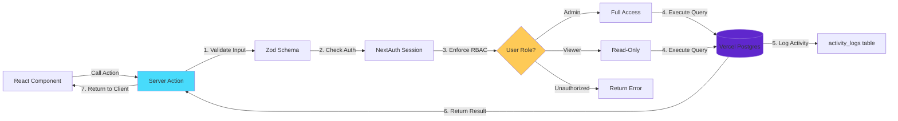
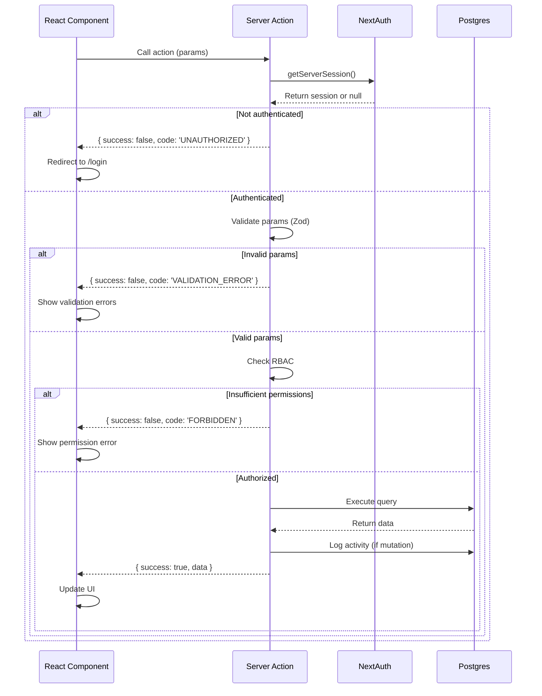

# Document 06: API Server Actions Spec

**Version:** 1.0  
**Last Updated:** February 5, 2026  
**Author:** Engineering Team  
**Status:** Production-Ready

---

## Table of Contents

1. [Business Context](#1-business-context)
2. [Server Actions Overview](#2-server-actions-overview)
3. [Device Actions](#3-device-actions)
4. [User Actions](#4-user-actions)
5. [Sync Actions](#5-sync-actions)
6. [Activity Log Actions](#6-activity-log-actions)
7. [Dashboard Actions](#7-dashboard-actions)
8. [Data Models & Types](#8-data-models--types)
9. [Error Handling Patterns](#9-error-handling-patterns)
10. [RBAC Enforcement](#10-rbac-enforcement)
11. [Validation Schemas](#11-validation-schemas)
12. [Integration Guide](#12-integration-guide)

---

## 1. Business Context

### Purpose

This document defines all Next.js Server Actions that frontend components will use to interact with the Device Inventory backend. Server Actions replace traditional REST API endpoints and provide type-safe, server-side mutations with automatic serialization.

### Key Benefits

- **Type Safety**: Full TypeScript support from client to server
- **Zero API Boilerplate**: No need for separate API routes or fetch calls
- **Automatic Serialization**: Handles JSON conversion and validation
- **Built-in CSRF Protection**: Next.js provides CSRF tokens automatically
- **Progressive Enhancement**: Works with/without JavaScript

### Who Uses This?

- **Frontend Developers**: Building React components that display and modify device data
- **UI/UX Designers**: Understanding available actions for user flows
- **QA Engineers**: Testing server-side validation and error handling

---

## 2. Server Actions Overview

### Architecture Pattern



### File Structure

```
lib/
└── actions/
    ├── device-actions.ts      # Device CRUD operations
    ├── user-actions.ts        # User management
    ├── sync-actions.ts        # Manual sync triggers
    ├── activity-actions.ts    # Activity log queries
    └── dashboard-actions.ts   # Dashboard metrics
```

### Standard Response Pattern

All Server Actions return a consistent response shape:

```typescript
// lib/actions/types.ts

export type ActionResponse<T> = 
  | { success: true; data: T }
  | { success: false; error: string; code?: string };
```

---

## 3. Device Actions

### 3.1 `getDevices` - List All Devices

**Purpose**: Fetch paginated list of devices with filtering and sorting

**Auth**: Requires authenticated user (admin or viewer)

**Function Signature**:
```typescript
async function getDevices(params: GetDevicesParams): Promise<ActionResponse<PaginatedDevices>>
```

**Request**:
```typescript
interface GetDevicesParams {
  page?: number;              // Default: 1
  pageSize?: number;          // Default: 50, max: 100
  search?: string;            // Search device name, serial, or user
  complianceStatus?: 'compliant' | 'noncompliant' | 'unknown';
  operatingSystem?: string;   // Filter by OS (e.g., "Windows", "macOS")
  sortBy?: 'name' | 'lastSyncDate' | 'complianceStatus' | 'enrollmentDate';
  sortOrder?: 'asc' | 'desc'; // Default: 'asc'
}
```

**Response (Success)**:
```typescript
interface PaginatedDevices {
  devices: Device[];
  pagination: {
    page: number;
    pageSize: number;
    totalPages: number;
    totalCount: number;
  };
}

interface Device {
  id: number;
  intuneId: string;
  name: string;
  operatingSystem: string;
  osVersion: string;
  complianceStatus: 'compliant' | 'noncompliant' | 'unknown';
  lastSyncDate: Date;
  serialNumber: string;
  manufacturer: string;
  model: string;
  enrollmentDate: Date;
  managementType: string;
  userId: number | null;
  user: {
    id: number;
    name: string;
    email: string;
  } | null;
}
```

**Response (Error)**:
- `400`: Invalid parameters (e.g., page < 1, pageSize > 100)
- `401`: Not authenticated
- `500`: Database error

**Implementation**:
```typescript
// lib/actions/device-actions.ts

'use server';

import { db } from '@/lib/db/drizzle';
import { devices, users } from '@/lib/db/schema';
import { getServerSession } from 'next-auth';
import { authOptions } from '@/lib/auth/auth-options';
import { z } from 'zod';
import { eq, ilike, and, or, asc, desc } from 'drizzle-orm';
import type { ActionResponse } from './types';

const GetDevicesSchema = z.object({
  page: z.number().int().min(1).default(1),
  pageSize: z.number().int().min(1).max(100).default(50),
  search: z.string().optional(),
  complianceStatus: z.enum(['compliant', 'noncompliant', 'unknown']).optional(),
  operatingSystem: z.string().optional(),
  sortBy: z.enum(['name', 'lastSyncDate', 'complianceStatus', 'enrollmentDate']).default('name'),
  sortOrder: z.enum(['asc', 'desc']).default('asc'),
});

export async function getDevices(
  params: z.infer<typeof GetDevicesSchema>
): Promise<ActionResponse<PaginatedDevices>> {
  try {
    // 1. Verify authentication
    const session = await getServerSession(authOptions);
    if (!session) {
      return { success: false, error: 'Not authenticated', code: 'UNAUTHORIZED' };
    }

    // 2. Validate input
    const validated = GetDevicesSchema.parse(params);

    // 3. Build query conditions
    const conditions = [];
    
    if (validated.search) {
      conditions.push(
        or(
          ilike(devices.name, `%${validated.search}%`),
          ilike(devices.serialNumber, `%${validated.search}%`)
        )
      );
    }
    
    if (validated.complianceStatus) {
      conditions.push(eq(devices.complianceStatus, validated.complianceStatus));
    }
    
    if (validated.operatingSystem) {
      conditions.push(eq(devices.operatingSystem, validated.operatingSystem));
    }

    // 4. Execute query with pagination
    const offset = (validated.page - 1) * validated.pageSize;
    const orderColumn = devices[validated.sortBy];
    const orderFn = validated.sortOrder === 'asc' ? asc : desc;

    const [deviceList, [{ count }]] = await Promise.all([
      db
        .select()
        .from(devices)
        .leftJoin(users, eq(devices.userId, users.id))
        .where(conditions.length > 0 ? and(...conditions) : undefined)
        .orderBy(orderFn(orderColumn))
        .limit(validated.pageSize)
        .offset(offset),
      
      db
        .select({ count: sql<number>`count(*)` })
        .from(devices)
        .where(conditions.length > 0 ? and(...conditions) : undefined),
    ]);

    // 5. Format response
    const formattedDevices = deviceList.map(({ devices: device, users: user }) => ({
      ...device,
      user: user ? { id: user.id, name: user.name, email: user.email } : null,
    }));

    return {
      success: true,
      data: {
        devices: formattedDevices,
        pagination: {
          page: validated.page,
          pageSize: validated.pageSize,
          totalPages: Math.ceil(count / validated.pageSize),
          totalCount: count,
        },
      },
    };
  } catch (error) {
    console.error('getDevices error:', error);
    
    if (error instanceof z.ZodError) {
      return { success: false, error: 'Invalid parameters', code: 'VALIDATION_ERROR' };
    }
    
    return { success: false, error: 'Failed to fetch devices', code: 'SERVER_ERROR' };
  }
}
```

**Notes**:
- Search is case-insensitive and matches device name or serial number
- Default sorting is by device name (ascending)
- Maximum page size is 100 to prevent performance issues
- User data is included via left join (null if device not assigned)

---

### 3.2 `getDeviceById` - Get Single Device

**Purpose**: Fetch detailed information for a specific device

**Auth**: Requires authenticated user

**Function Signature**:
```typescript
async function getDeviceById(deviceId: number): Promise<ActionResponse<DeviceDetail>>
```

**Request**:
```typescript
interface GetDeviceByIdParams {
  deviceId: number;
}
```

**Response (Success)**:
```typescript
interface DeviceDetail extends Device {
  activityHistory: ActivityLog[];
}

interface ActivityLog {
  id: number;
  action: string;
  performedBy: {
    id: number;
    name: string;
    email: string;
  };
  timestamp: Date;
  details: Record<string, any>;
}
```

**Response (Error)**:
- `400`: Invalid device ID
- `401`: Not authenticated
- `404`: Device not found
- `500`: Database error

**Implementation**:
```typescript
// lib/actions/device-actions.ts

export async function getDeviceById(
  deviceId: number
): Promise<ActionResponse<DeviceDetail>> {
  try {
    const session = await getServerSession(authOptions);
    if (!session) {
      return { success: false, error: 'Not authenticated', code: 'UNAUTHORIZED' };
    }

    // Fetch device with user and activity history
    const [device] = await db
      .select()
      .from(devices)
      .leftJoin(users, eq(devices.userId, users.id))
      .where(eq(devices.id, deviceId))
      .limit(1);

    if (!device) {
      return { success: false, error: 'Device not found', code: 'NOT_FOUND' };
    }

    // Fetch activity history (last 50 entries)
    const activityHistory = await db
      .select()
      .from(activityLogs)
      .leftJoin(users, eq(activityLogs.userId, users.id))
      .where(eq(activityLogs.entityType, 'device'), eq(activityLogs.entityId, deviceId))
      .orderBy(desc(activityLogs.timestamp))
      .limit(50);

    return {
      success: true,
      data: {
        ...device.devices,
        user: device.users ? {
          id: device.users.id,
          name: device.users.name,
          email: device.users.email,
        } : null,
        activityHistory: activityHistory.map(({ activityLogs: log, users: user }) => ({
          id: log.id,
          action: log.action,
          performedBy: {
            id: user!.id,
            name: user!.name,
            email: user!.email,
          },
          timestamp: log.timestamp,
          details: log.details || {},
        })),
      },
    };
  } catch (error) {
    console.error('getDeviceById error:', error);
    return { success: false, error: 'Failed to fetch device', code: 'SERVER_ERROR' };
  }
}
```

---

### 3.3 `updateDevice` - Update Device Details

**Purpose**: Update device metadata (admin only)

**Auth**: Requires admin role

**Function Signature**:
```typescript
async function updateDevice(params: UpdateDeviceParams): Promise<ActionResponse<Device>>
```

**Request**:
```typescript
interface UpdateDeviceParams {
  deviceId: number;
  updates: {
    name?: string;
    notes?: string;          // Custom notes field (not from Intune)
    assignedUserId?: number; // Manually assign device to user
  };
}
```

**Response (Success)**:
```typescript
{
  success: true,
  data: Device // Updated device object
}
```

**Response (Error)**:
- `400`: Invalid parameters
- `401`: Not authenticated
- `403`: Insufficient permissions (not admin)
- `404`: Device not found
- `500`: Database error

**Implementation**:
```typescript
// lib/actions/device-actions.ts

const UpdateDeviceSchema = z.object({
  deviceId: z.number().int().positive(),
  updates: z.object({
    name: z.string().min(1).max(255).optional(),
    notes: z.string().max(1000).optional(),
    assignedUserId: z.number().int().positive().nullable().optional(),
  }),
});

export async function updateDevice(
  params: z.infer<typeof UpdateDeviceSchema>
): Promise<ActionResponse<Device>> {
  try {
    const session = await getServerSession(authOptions);
    
    if (!session) {
      return { success: false, error: 'Not authenticated', code: 'UNAUTHORIZED' };
    }
    
    if (session.user.role !== 'admin') {
      return { success: false, error: 'Admin access required', code: 'FORBIDDEN' };
    }

    const validated = UpdateDeviceSchema.parse(params);

    // Verify device exists
    const [existingDevice] = await db
      .select()
      .from(devices)
      .where(eq(devices.id, validated.deviceId))
      .limit(1);

    if (!existingDevice) {
      return { success: false, error: 'Device not found', code: 'NOT_FOUND' };
    }

    // Update device
    const [updatedDevice] = await db
      .update(devices)
      .set({
        ...validated.updates,
        updatedAt: new Date(),
      })
      .where(eq(devices.id, validated.deviceId))
      .returning();

    // Log activity
    await db.insert(activityLogs).values({
      entityType: 'device',
      entityId: validated.deviceId,
      action: 'device_updated',
      userId: session.user.id,
      details: { updates: validated.updates },
    });

    return { success: true, data: updatedDevice };
  } catch (error) {
    console.error('updateDevice error:', error);
    
    if (error instanceof z.ZodError) {
      return { success: false, error: 'Invalid parameters', code: 'VALIDATION_ERROR' };
    }
    
    return { success: false, error: 'Failed to update device', code: 'SERVER_ERROR' };
  }
}
```

**Notes**:
- Only admin users can update device metadata
- Name changes are cosmetic (Intune data sync will not overwrite)
- Activity is logged to `activity_logs` table for audit trail
- User assignment is optional (can be set to null)

---

### 3.4 `decommissionDevice` - Mark Device as Decommissioned

**Purpose**: Soft-delete device (admin only)

**Auth**: Requires admin role

**Function Signature**:
```typescript
async function decommissionDevice(deviceId: number): Promise<ActionResponse<void>>
```

**Request**:
```typescript
interface DecommissionDeviceParams {
  deviceId: number;
  reason?: string; // Optional decommission reason
}
```

**Response (Success)**:
```typescript
{ success: true, data: undefined }
```

**Response (Error)**:
- `400`: Invalid device ID
- `401`: Not authenticated
- `403`: Insufficient permissions
- `404`: Device not found
- `500`: Database error

**Implementation**:
```typescript
// lib/actions/device-actions.ts

export async function decommissionDevice(
  deviceId: number,
  reason?: string
): Promise<ActionResponse<void>> {
  try {
    const session = await getServerSession(authOptions);
    
    if (!session || session.user.role !== 'admin') {
      return { success: false, error: 'Admin access required', code: 'FORBIDDEN' };
    }

    // Soft delete by setting decommissionedAt timestamp
    const [device] = await db
      .update(devices)
      .set({
        decommissionedAt: new Date(),
        updatedAt: new Date(),
      })
      .where(eq(devices.id, deviceId))
      .returning();

    if (!device) {
      return { success: false, error: 'Device not found', code: 'NOT_FOUND' };
    }

    // Log activity
    await db.insert(activityLogs).values({
      entityType: 'device',
      entityId: deviceId,
      action: 'device_decommissioned',
      userId: session.user.id,
      details: { reason: reason || 'No reason provided' },
    });

    return { success: true, data: undefined };
  } catch (error) {
    console.error('decommissionDevice error:', error);
    return { success: false, error: 'Failed to decommission device', code: 'SERVER_ERROR' };
  }
}
```

**Notes**:
- Soft delete preserves device data for historical records
- Decommissioned devices are excluded from default queries (use `includeDecommissioned: true` filter)
- Reason is logged to activity table for audit purposes

---

## 4. User Actions

### 4.1 `getUsers` - List All Users

**Purpose**: Fetch paginated list of users

**Auth**: Requires authenticated user

**Function Signature**:
```typescript
async function getUsers(params: GetUsersParams): Promise<ActionResponse<PaginatedUsers>>
```

**Request**:
```typescript
interface GetUsersParams {
  page?: number;
  pageSize?: number;
  search?: string;        // Search name or email
  role?: 'admin' | 'viewer';
  sortBy?: 'name' | 'email' | 'createdAt';
  sortOrder?: 'asc' | 'desc';
}
```

**Response (Success)**:
```typescript
interface PaginatedUsers {
  users: User[];
  pagination: {
    page: number;
    pageSize: number;
    totalPages: number;
    totalCount: number;
  };
}

interface User {
  id: number;
  azureId: string;
  email: string;
  name: string;
  department: string | null;
  jobTitle: string | null;
  role: 'admin' | 'viewer';
  createdAt: Date;
  updatedAt: Date;
}
```

**Response (Error)**:
- `400`: Invalid parameters
- `401`: Not authenticated
- `500`: Database error

**Implementation**: Similar pattern to `getDevices` (omitted for brevity)

---

### 4.2 `updateUserRole` - Change User Role

**Purpose**: Update user's role (admin only)

**Auth**: Requires admin role

**Function Signature**:
```typescript
async function updateUserRole(params: UpdateUserRoleParams): Promise<ActionResponse<User>>
```

**Request**:
```typescript
interface UpdateUserRoleParams {
  userId: number;
  role: 'admin' | 'viewer';
}
```

**Response (Success)**:
```typescript
{ success: true, data: User }
```

**Response (Error)**:
- `400`: Invalid parameters
- `401`: Not authenticated
- `403`: Insufficient permissions
- `404`: User not found
- `409`: Cannot change own role
- `500`: Database error

**Implementation**:
```typescript
// lib/actions/user-actions.ts

export async function updateUserRole(
  params: UpdateUserRoleParams
): Promise<ActionResponse<User>> {
  try {
    const session = await getServerSession(authOptions);
    
    if (!session || session.user.role !== 'admin') {
      return { success: false, error: 'Admin access required', code: 'FORBIDDEN' };
    }

    // Prevent self role change
    if (params.userId === session.user.id) {
      return { success: false, error: 'Cannot change your own role', code: 'CONFLICT' };
    }

    const [updatedUser] = await db
      .update(users)
      .set({ role: params.role, updatedAt: new Date() })
      .where(eq(users.id, params.userId))
      .returning();

    if (!updatedUser) {
      return { success: false, error: 'User not found', code: 'NOT_FOUND' };
    }

    // Log activity
    await db.insert(activityLogs).values({
      entityType: 'user',
      entityId: params.userId,
      action: 'role_updated',
      userId: session.user.id,
      details: { newRole: params.role },
    });

    return { success: true, data: updatedUser };
  } catch (error) {
    console.error('updateUserRole error:', error);
    return { success: false, error: 'Failed to update role', code: 'SERVER_ERROR' };
  }
}
```

**Notes**:
- Admins cannot change their own role (prevents accidental lockout)
- Role change is logged for audit purposes

---

## 5. Sync Actions

### 5.1 `triggerManualSync` - Trigger Immediate Sync

**Purpose**: Manually trigger device/user sync from Microsoft Graph

**Auth**: Requires admin role

**Function Signature**:
```typescript
async function triggerManualSync(): Promise<ActionResponse<SyncResult[]>>
```

**Request**: None (no parameters)

**Response (Success)**:
```typescript
interface SyncResult {
  entity: 'devices' | 'users';
  status: 'success' | 'error';
  recordsProcessed: number;
  recordsAdded: number;
  recordsUpdated: number;
  duration: number;
  error?: string;
}

{ success: true, data: SyncResult[] }
```

**Response (Error)**:
- `401`: Not authenticated
- `403`: Insufficient permissions
- `429`: Sync already in progress
- `500`: Sync failed

**Implementation**:
```typescript
// lib/actions/sync-actions.ts

'use server';

import { SyncService } from '@/lib/services/sync-service';
import { getServerSession } from 'next-auth';
import { authOptions } from '@/lib/auth/auth-options';

let syncInProgress = false;

export async function triggerManualSync(): Promise<ActionResponse<SyncResult[]>> {
  try {
    const session = await getServerSession(authOptions);
    
    if (!session || session.user.role !== 'admin') {
      return { success: false, error: 'Admin access required', code: 'FORBIDDEN' };
    }

    // Prevent concurrent syncs
    if (syncInProgress) {
      return { success: false, error: 'Sync already in progress', code: 'RATE_LIMIT' };
    }

    syncInProgress = true;

    const syncService = new SyncService();
    const results = await syncService.syncAll();

    syncInProgress = false;

    return { success: true, data: results };
  } catch (error) {
    syncInProgress = false;
    console.error('triggerManualSync error:', error);
    return { success: false, error: 'Sync failed', code: 'SERVER_ERROR' };
  }
}
```

**Notes**:
- Only one sync can run at a time (enforced by `syncInProgress` flag)
- Sync typically takes 5-10 seconds
- Frontend should show loading state during sync

---

### 5.2 `getSyncStatus` - Get Latest Sync Status

**Purpose**: Fetch recent sync history

**Auth**: Requires authenticated user

**Function Signature**:
```typescript
async function getSyncStatus(): Promise<ActionResponse<SyncStatus>>
```

**Request**: None

**Response (Success)**:
```typescript
interface SyncStatus {
  lastSync: {
    devices: SyncLogEntry | null;
    users: SyncLogEntry | null;
  };
  recentSyncs: SyncLogEntry[];
}

interface SyncLogEntry {
  id: number;
  entity: 'devices' | 'users';
  status: 'success' | 'error';
  recordsProcessed: number;
  duration: number;
  createdAt: Date;
  errorDetails?: Record<string, any>;
}

{ success: true, data: SyncStatus }
```

**Response (Error)**:
- `401`: Not authenticated
- `500`: Database error

**Implementation**:
```typescript
// lib/actions/sync-actions.ts

export async function getSyncStatus(): Promise<ActionResponse<SyncStatus>> {
  try {
    const session = await getServerSession(authOptions);
    
    if (!session) {
      return { success: false, error: 'Not authenticated', code: 'UNAUTHORIZED' };
    }

    // Fetch last sync for each entity
    const [lastDeviceSync] = await db
      .select()
      .from(syncLogs)
      .where(eq(syncLogs.entity, 'devices'))
      .orderBy(desc(syncLogs.createdAt))
      .limit(1);

    const [lastUserSync] = await db
      .select()
      .from(syncLogs)
      .where(eq(syncLogs.entity, 'users'))
      .orderBy(desc(syncLogs.createdAt))
      .limit(1);

    // Fetch recent syncs (last 20)
    const recentSyncs = await db
      .select()
      .from(syncLogs)
      .orderBy(desc(syncLogs.createdAt))
      .limit(20);

    return {
      success: true,
      data: {
        lastSync: {
          devices: lastDeviceSync || null,
          users: lastUserSync || null,
        },
        recentSyncs,
      },
    };
  } catch (error) {
    console.error('getSyncStatus error:', error);
    return { success: false, error: 'Failed to fetch sync status', code: 'SERVER_ERROR' };
  }
}
```

---

## 6. Activity Log Actions

### 6.1 `getActivityLogs` - Fetch Activity History

**Purpose**: Fetch system-wide or entity-specific activity logs

**Auth**: Requires admin role

**Function Signature**:
```typescript
async function getActivityLogs(params: GetActivityLogsParams): Promise<ActionResponse<PaginatedActivityLogs>>
```

**Request**:
```typescript
interface GetActivityLogsParams {
  page?: number;
  pageSize?: number;
  entityType?: 'device' | 'user';
  entityId?: number;
  userId?: number;         // Filter by user who performed action
  action?: string;         // Filter by action type
  startDate?: Date;
  endDate?: Date;
}
```

**Response (Success)**:
```typescript
interface PaginatedActivityLogs {
  logs: ActivityLog[];
  pagination: {
    page: number;
    pageSize: number;
    totalPages: number;
    totalCount: number;
  };
}

interface ActivityLog {
  id: number;
  entityType: 'device' | 'user';
  entityId: number;
  action: string;
  performedBy: {
    id: number;
    name: string;
    email: string;
  };
  timestamp: Date;
  details: Record<string, any>;
}
```

**Response (Error)**:
- `400`: Invalid parameters
- `401`: Not authenticated
- `403`: Insufficient permissions (not admin)
- `500`: Database error

**Implementation**: Similar pattern to `getDevices` (omitted for brevity)

**Notes**:
- Activity logs are append-only (never deleted)
- Useful for audit trails and compliance reporting
- Can be exported to CSV for external analysis

---

## 7. Dashboard Actions

### 7.1 `getDashboardMetrics` - Get Summary Statistics

**Purpose**: Fetch aggregated metrics for dashboard widgets

**Auth**: Requires authenticated user

**Function Signature**:
```typescript
async function getDashboardMetrics(): Promise<ActionResponse<DashboardMetrics>>
```

**Request**: None

**Response (Success)**:
```typescript
interface DashboardMetrics {
  totalDevices: number;
  compliantDevices: number;
  noncompliantDevices: number;
  unknownComplianceDevices: number;
  complianceRate: number;       // Percentage (0-100)
  devicesByOS: { os: string; count: number }[];
  recentActivity: ActivityLog[];
  lastSyncTime: Date | null;
}

{ success: true, data: DashboardMetrics }
```

**Response (Error)**:
- `401`: Not authenticated
- `500`: Database error

**Implementation**:
```typescript
// lib/actions/dashboard-actions.ts

'use server';

import { db } from '@/lib/db/drizzle';
import { devices, activityLogs, syncLogs } from '@/lib/db/schema';
import { getServerSession } from 'next-auth';
import { authOptions } from '@/lib/auth/auth-options';
import { eq, desc, sql } from 'drizzle-orm';

export async function getDashboardMetrics(): Promise<ActionResponse<DashboardMetrics>> {
  try {
    const session = await getServerSession(authOptions);
    
    if (!session) {
      return { success: false, error: 'Not authenticated', code: 'UNAUTHORIZED' };
    }

    // Execute multiple queries in parallel
    const [
      [{ totalDevices }],
      [{ compliantDevices }],
      [{ noncompliantDevices }],
      [{ unknownComplianceDevices }],
      devicesByOS,
      recentActivity,
      [lastSync],
    ] = await Promise.all([
      // Total devices (excluding decommissioned)
      db.select({ totalDevices: sql<number>`count(*)` })
        .from(devices)
        .where(isNull(devices.decommissionedAt)),
      
      // Compliant devices
      db.select({ compliantDevices: sql<number>`count(*)` })
        .from(devices)
        .where(and(
          eq(devices.complianceStatus, 'compliant'),
          isNull(devices.decommissionedAt)
        )),
      
      // Noncompliant devices
      db.select({ noncompliantDevices: sql<number>`count(*)` })
        .from(devices)
        .where(and(
          eq(devices.complianceStatus, 'noncompliant'),
          isNull(devices.decommissionedAt)
        )),
      
      // Unknown compliance devices
      db.select({ unknownComplianceDevices: sql<number>`count(*)` })
        .from(devices)
        .where(and(
          eq(devices.complianceStatus, 'unknown'),
          isNull(devices.decommissionedAt)
        )),
      
      // Devices by OS
      db.select({
        os: devices.operatingSystem,
        count: sql<number>`count(*)`,
      })
        .from(devices)
        .where(isNull(devices.decommissionedAt))
        .groupBy(devices.operatingSystem),
      
      // Recent activity (last 10 entries)
      db.select()
        .from(activityLogs)
        .leftJoin(users, eq(activityLogs.userId, users.id))
        .orderBy(desc(activityLogs.timestamp))
        .limit(10),
      
      // Last sync time
      db.select()
        .from(syncLogs)
        .orderBy(desc(syncLogs.createdAt))
        .limit(1),
    ]);

    const complianceRate = totalDevices > 0
      ? Math.round((compliantDevices / totalDevices) * 100)
      : 0;

    return {
      success: true,
      data: {
        totalDevices,
        compliantDevices,
        noncompliantDevices,
        unknownComplianceDevices,
        complianceRate,
        devicesByOS,
        recentActivity: recentActivity.map(({ activityLogs: log, users: user }) => ({
          id: log.id,
          entityType: log.entityType,
          entityId: log.entityId,
          action: log.action,
          performedBy: {
            id: user!.id,
            name: user!.name,
            email: user!.email,
          },
          timestamp: log.timestamp,
          details: log.details || {},
        })),
        lastSyncTime: lastSync?.createdAt || null,
      },
    };
  } catch (error) {
    console.error('getDashboardMetrics error:', error);
    return { success: false, error: 'Failed to fetch metrics', code: 'SERVER_ERROR' };
  }
}
```

**Notes**:
- All queries execute in parallel for optimal performance
- Metrics exclude decommissioned devices
- Compliance rate is rounded to nearest integer percentage

---

## 8. Data Models & Types

### Core Types

```typescript
// lib/types/models.ts

export interface Device {
  id: number;
  intuneId: string;
  name: string;
  operatingSystem: string;
  osVersion: string;
  complianceStatus: 'compliant' | 'noncompliant' | 'unknown';
  lastSyncDate: Date;
  serialNumber: string;
  manufacturer: string;
  model: string;
  enrollmentDate: Date;
  managementType: string;
  userId: number | null;
  decommissionedAt: Date | null;
  createdAt: Date;
  updatedAt: Date;
}

export interface User {
  id: number;
  azureId: string;
  email: string;
  name: string;
  department: string | null;
  jobTitle: string | null;
  role: 'admin' | 'viewer';
  createdAt: Date;
  updatedAt: Date;
}

export interface ActivityLog {
  id: number;
  entityType: 'device' | 'user';
  entityId: number;
  action: string;
  userId: number;
  timestamp: Date;
  details: Record<string, any> | null;
}

export interface SyncLog {
  id: number;
  entity: 'devices' | 'users';
  status: 'success' | 'error';
  recordsProcessed: number;
  duration: number;
  deltaLink: string | null;
  errorDetails: Record<string, any> | null;
  createdAt: Date;
}
```

---

## 9. Error Handling Patterns

### Standard Error Codes

| Code | HTTP Equivalent | Meaning | Frontend Action |
|------|-----------------|---------|-----------------|
| `UNAUTHORIZED` | 401 | Not authenticated | Redirect to login |
| `FORBIDDEN` | 403 | Insufficient permissions | Show permission error |
| `NOT_FOUND` | 404 | Resource not found | Show "not found" message |
| `VALIDATION_ERROR` | 400 | Invalid input | Show validation errors |
| `CONFLICT` | 409 | Business logic conflict | Show specific conflict message |
| `RATE_LIMIT` | 429 | Too many requests | Show retry message |
| `SERVER_ERROR` | 500 | Internal error | Show generic error + retry |

### Error Response Pattern

```typescript
interface ErrorResponse {
  success: false;
  error: string;        // Human-readable error message
  code?: string;        // Machine-readable error code
  details?: any;        // Optional additional context
}
```

### Frontend Error Handling

```typescript
// Example usage in React component

'use client';

import { getDevices } from '@/lib/actions/device-actions';
import { useEffect, useState } from 'react';
import { useRouter } from 'next/navigation';

export function DeviceList() {
  const router = useRouter();
  const [devices, setDevices] = useState([]);
  const [error, setError] = useState<string | null>(null);

  useEffect(() => {
    async function fetchDevices() {
      const result = await getDevices({ page: 1, pageSize: 50 });

      if (!result.success) {
        // Handle error based on code
        if (result.code === 'UNAUTHORIZED') {
          router.push('/login');
        } else if (result.code === 'FORBIDDEN') {
          setError('You do not have permission to view devices');
        } else {
          setError(result.error);
        }
        return;
      }

      setDevices(result.data.devices);
    }

    fetchDevices();
  }, [router]);

  if (error) {
    return <div className="error">{error}</div>;
  }

  return <div>{/* Render devices */}</div>;
}
```

---

## 10. RBAC Enforcement

### Role Permissions Matrix

| Action | Admin | Viewer | Unauthenticated |
|--------|-------|--------|-----------------|
| **View Devices** | ✅ | ✅ | ❌ |
| **View Device Details** | ✅ | ✅ | ❌ |
| **Update Device** | ✅ | ❌ | ❌ |
| **Decommission Device** | ✅ | ❌ | ❌ |
| **View Users** | ✅ | ✅ | ❌ |
| **Update User Role** | ✅ | ❌ | ❌ |
| **Trigger Manual Sync** | ✅ | ❌ | ❌ |
| **View Sync Status** | ✅ | ✅ | ❌ |
| **View Activity Logs** | ✅ | ❌ | ❌ |
| **View Dashboard Metrics** | ✅ | ✅ | ❌ |

### RBAC Helper Function

```typescript
// lib/auth/rbac.ts

import { getServerSession } from 'next-auth';
import { authOptions } from './auth-options';

export async function requireAuth() {
  const session = await getServerSession(authOptions);
  
  if (!session) {
    throw new Error('Not authenticated');
  }
  
  return session;
}

export async function requireAdmin() {
  const session = await requireAuth();
  
  if (session.user.role !== 'admin') {
    throw new Error('Admin access required');
  }
  
  return session;
}
```

**Usage in Server Actions**:
```typescript
export async function updateDevice(...) {
  const session = await requireAdmin(); // Throws if not admin
  
  // ...rest of function
}
```

---

## 11. Validation Schemas

### Zod Schemas for Common Validations

```typescript
// lib/validation/schemas.ts

import { z } from 'zod';

export const PaginationSchema = z.object({
  page: z.number().int().min(1).default(1),
  pageSize: z.number().int().min(1).max(100).default(50),
});

export const SearchSchema = z.object({
  search: z.string().min(1).max(255).optional(),
});

export const SortSchema = z.object({
  sortOrder: z.enum(['asc', 'desc']).default('asc'),
});

export const DeviceFiltersSchema = z.object({
  complianceStatus: z.enum(['compliant', 'noncompliant', 'unknown']).optional(),
  operatingSystem: z.string().max(50).optional(),
  includeDecommissioned: z.boolean().default(false),
});

export const UpdateDeviceSchema = z.object({
  deviceId: z.number().int().positive(),
  updates: z.object({
    name: z.string().min(1).max(255).optional(),
    notes: z.string().max(1000).optional(),
    assignedUserId: z.number().int().positive().nullable().optional(),
  }),
});

export const UpdateUserRoleSchema = z.object({
  userId: z.number().int().positive(),
  role: z.enum(['admin', 'viewer']),
});
```

### Validation Rules Summary

| Field | Rule | Enforcement |
|-------|------|-------------|
| `page` | ≥ 1 | Server-side (Zod) |
| `pageSize` | 1-100 | Server-side (Zod) |
| `search` | Max 255 chars | Server-side (Zod) |
| `device.name` | 1-255 chars | Server-side (Zod) |
| `device.notes` | Max 1000 chars | Server-side (Zod) |
| `user.role` | Enum: admin, viewer | Server-side (Zod) |

---

## 12. Integration Guide

### Frontend Integration Workflow



### Recommended Usage Patterns

**1. Optimistic UI (Not Recommended for Critical Actions)**

```typescript
// Not recommended for device updates (wait for server confirmation)

async function handleUpdate(deviceId: number, updates: any) {
  // Optimistically update UI
  setDevices(prev => prev.map(d => 
    d.id === deviceId ? { ...d, ...updates } : d
  ));

  // Send to server
  const result = await updateDevice({ deviceId, updates });

  if (!result.success) {
    // Revert on error
    setDevices(prev => /* revert changes */);
    showError(result.error);
  }
}
```

**2. Server Confirmation (Recommended)**

```typescript
// Recommended: Wait for server confirmation before updating UI

async function handleUpdate(deviceId: number, updates: any) {
  setLoading(true);

  const result = await updateDevice({ deviceId, updates });

  if (result.success) {
    // Update UI with server-confirmed data
    setDevices(prev => prev.map(d => 
      d.id === deviceId ? result.data : d
    ));
    showSuccess('Device updated');
  } else {
    showError(result.error);
  }

  setLoading(false);
}
```

**3. Polling for Sync Status**

```typescript
// Poll sync status every 5 seconds during manual sync

async function triggerSync() {
  const result = await triggerManualSync();

  if (result.success) {
    // Start polling for updated status
    const interval = setInterval(async () => {
      const status = await getSyncStatus();
      
      if (status.success) {
        // Update UI with latest sync status
        setSyncStatus(status.data);
      }
    }, 5000);

    // Stop polling after 60 seconds
    setTimeout(() => clearInterval(interval), 60000);
  }
}
```

### Testing Server Actions

```typescript
// __tests__/actions/device-actions.test.ts

import { describe, it, expect, vi } from 'vitest';
import { getDevices } from '@/lib/actions/device-actions';
import { getServerSession } from 'next-auth';

// Mock NextAuth
vi.mock('next-auth', () => ({
  getServerSession: vi.fn(),
}));

describe('getDevices', () => {
  it('should return error if not authenticated', async () => {
    vi.mocked(getServerSession).mockResolvedValue(null);

    const result = await getDevices({ page: 1 });

    expect(result.success).toBe(false);
    expect(result.code).toBe('UNAUTHORIZED');
  });

  it('should return devices for authenticated user', async () => {
    vi.mocked(getServerSession).mockResolvedValue({
      user: { id: 1, role: 'admin' },
    });

    const result = await getDevices({ page: 1, pageSize: 10 });

    expect(result.success).toBe(true);
    expect(result.data.devices).toBeDefined();
  });
});
```

---

## Appendix A: Complete Action Index

| Action | File | Auth | RBAC |
|--------|------|------|------|
| `getDevices` | `device-actions.ts` | Required | Admin, Viewer |
| `getDeviceById` | `device-actions.ts` | Required | Admin, Viewer |
| `updateDevice` | `device-actions.ts` | Required | Admin only |
| `decommissionDevice` | `device-actions.ts` | Required | Admin only |
| `getUsers` | `user-actions.ts` | Required | Admin, Viewer |
| `getUserById` | `user-actions.ts` | Required | Admin, Viewer |
| `updateUserRole` | `user-actions.ts` | Required | Admin only |
| `triggerManualSync` | `sync-actions.ts` | Required | Admin only |
| `getSyncStatus` | `sync-actions.ts` | Required | Admin, Viewer |
| `getActivityLogs` | `activity-actions.ts` | Required | Admin only |
| `getDashboardMetrics` | `dashboard-actions.ts` | Required | Admin, Viewer |

---

## Document Change Log

| Version | Date | Author | Changes |
|---------|------|--------|---------|
| 1.0 | 2026-02-05 | Engineering Team | Initial production-ready document |

---

**Next Document:** [07_Auth_and_RBAC_Spec.md](./07_Auth_and_RBAC_Spec.md)