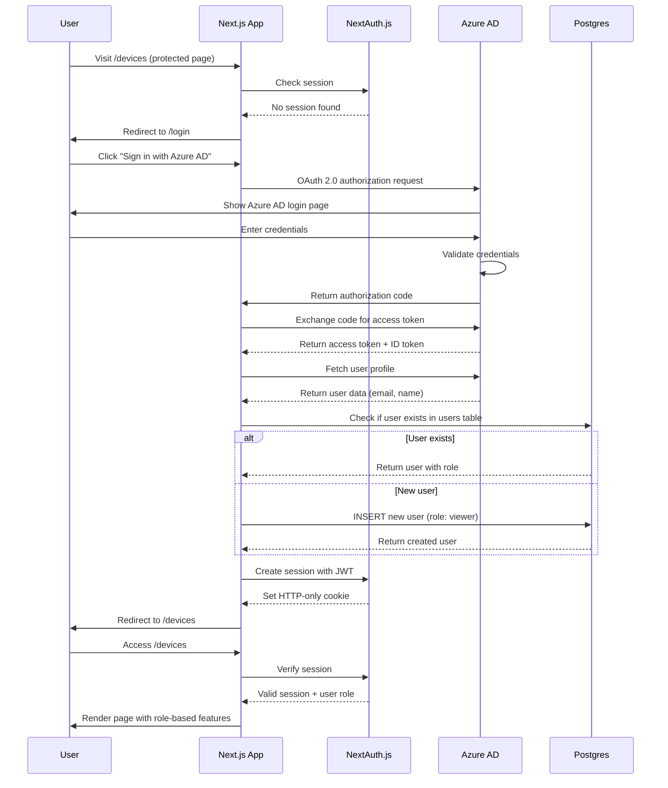
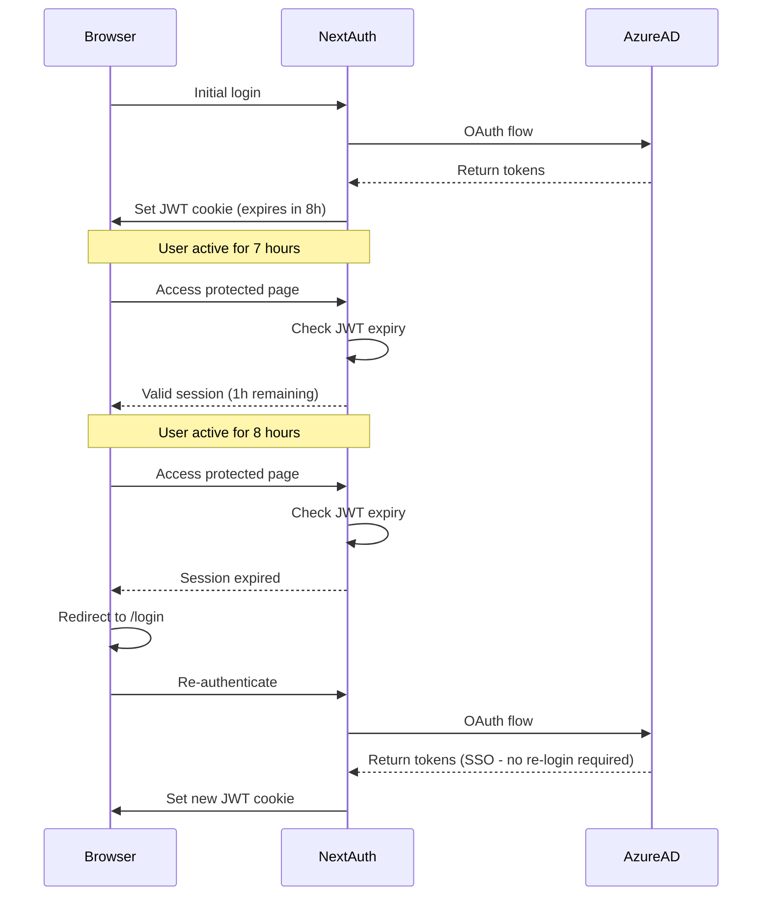
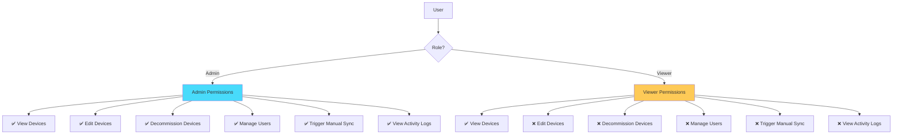
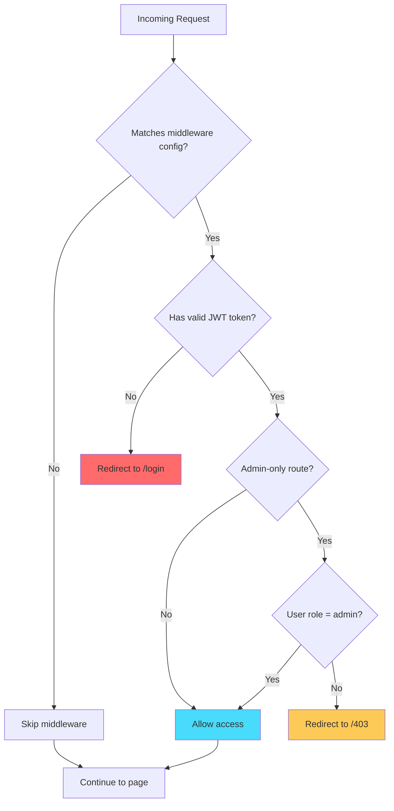
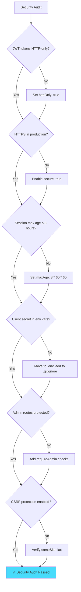

# Document 07: Auth and RBAC Spec

**Version:** 1.0  
**Last Updated:** February 5, 2026  
**Author:** Engineering Team  
**Status:** Production-Ready

---

## Table of Contents

1. [Executive Summary](#1-executive-summary)
2. [Authentication Architecture](#2-authentication-architecture)
3. [Azure AD Integration](#3-azure-ad-integration)
4. [NextAuth.js Configuration](#4-nextauthjs-configuration)
5. [Session Management](#5-session-management)
6. [Role-Based Access Control](#6-role-based-access-control)
7. [Middleware Implementation](#7-middleware-implementation)
8. [Protected Routes](#8-protected-routes)
9. [Server-Side Authorization](#9-server-side-authorization)
10. [Client-Side Authorization](#10-client-side-authorization)
11. [Security Best Practices](#11-security-best-practices)
12. [Testing Strategy](#12-testing-strategy)

---

## 1. Executive Summary

### Purpose

This document defines the authentication and authorization strategy for Device Inventory v2, leveraging Azure AD for single sign-on (SSO) and NextAuth.js for session management. Role-Based Access Control (RBAC) restricts features based on user roles (Admin vs Viewer).

### Authentication Flow



### Key Features

| Feature | Implementation | Benefit |
|---------|----------------|---------|
| **Single Sign-On (SSO)** | Azure AD OAuth 2.0 | Users login with corporate credentials |
| **JWT Sessions** | NextAuth.js with HTTP-only cookies | Secure, stateless sessions |
| **Role-Based Access Control** | Database-backed roles (admin/viewer) | Fine-grained permissions |
| **Protected Routes** | Next.js middleware | Automatic redirect for unauthenticated users |
| **Auto User Provisioning** | Create user on first login | Zero manual user management |

---

## 2. Authentication Architecture

### Architecture Diagram

```mermaid
flowchart TD
    User[User Browser] -->|1. Access protected page| Middleware[Next.js Middleware]
    Middleware -->|2. Check session| NextAuth[NextAuth.js]
    NextAuth -->|3. Read JWT cookie| Cookie[HTTP-only Cookie]
    
    Cookie -->|Valid token| Auth{Authenticated?}
    Cookie -->|No token/expired| Auth
    
    Auth -->|No| LoginPage[/login page]
    Auth -->|Yes| RBACCheck{Check Role}
    
    LoginPage -->|Click Sign In| AzureAD[Azure AD OAuth]
    AzureAD -->|OAuth flow| Callback[/api/auth/callback]
    Callback -->|Create user if needed| DB[(Postgres)]
    Callback -->|Create session| NextAuth
    
    RBACCheck -->|Admin| AdminFeatures[Full Access]
    RBACCheck -->|Viewer| ViewerFeatures[Read-Only Access]
    
    AdminFeatures --> Page[Render Page]
    ViewerFeatures --> Page
    
    style NextAuth fill:#48dbfb
    style AzureAD fill:#00d2d3
    style DB fill:#5f27cd
```

### Components

| Component | Technology | Responsibility |
|-----------|------------|----------------|
| **Azure AD** | Microsoft Entra ID | Identity provider (IdP), OAuth 2.0 authorization server |
| **NextAuth.js** | Authentication library | OAuth flow, session management, JWT signing |
| **Next.js Middleware** | Edge runtime function | Route protection, session validation |
| **Postgres Database** | Vercel Postgres | User storage, role persistence |
| **JWT Tokens** | Signed JSON Web Tokens | Session data (user ID, role, email) |

---

## 3. Azure AD Integration

### Azure AD App Registration

#### Prerequisites

- Azure AD tenant (e.g., `contoso.onmicrosoft.com`)
- Global Administrator or Application Administrator role

#### Registration Steps

**1. Create App Registration**

```bash
# Navigate to Azure Portal
https://portal.azure.com > Azure Active Directory > App registrations > New registration

# App Registration Details:
Name: Device Inventory v2
Supported account types: Accounts in this organizational directory only (Single tenant)
Redirect URI: Web > https://your-app.vercel.app/api/auth/callback/azure-ad
```

**2. Configure Authentication**

```
Platform: Web
Redirect URIs:
  - https://your-app.vercel.app/api/auth/callback/azure-ad (production)
  - http://localhost:3000/api/auth/callback/azure-ad (development)

Front-channel logout URL: https://your-app.vercel.app/api/auth/signout

Implicit grant and hybrid flows:
  ☑ ID tokens (used for implicit and hybrid flows)
```

**3. Create Client Secret**

```bash
# Navigate to: Certificates & secrets > New client secret

Description: Device Inventory Production Secret
Expires: 24 months

# IMPORTANT: Copy the secret value immediately (it won't be shown again)
Secret Value: YOUR_CLIENT_SECRET_HERE
```

**4. Configure API Permissions**

```
API Permissions > Add a permission > Microsoft Graph > Delegated permissions

Required permissions:
  - User.Read (Read user profile)
  - openid (Sign in and read user profile)
  - profile (View users' basic profile)
  - email (View users' email address)

Admin consent required: No (delegated permissions)
```

**5. Copy Application IDs**

```
Application (client) ID: 12345678-1234-1234-1234-123456789abc
Directory (tenant) ID: 87654321-4321-4321-4321-cba987654321
```

### Azure AD Configuration Table

| Setting | Value | Notes |
|---------|-------|-------|
| **Tenant ID** | `87654321-...` | From Azure AD overview |
| **Client ID** | `12345678-...` | From app registration overview |
| **Client Secret** | `YOUR_SECRET` | From Certificates & secrets |
| **Authority** | `https://login.microsoftonline.com/{tenantId}` | OAuth 2.0 authorization endpoint |
| **Token URL** | `https://login.microsoftonline.com/{tenantId}/oauth2/v2.0/token` | Token exchange endpoint |
| **Redirect URI** | `https://your-app.vercel.app/api/auth/callback/azure-ad` | OAuth callback |

---

## 4. NextAuth.js Configuration

### Installation

```bash
pnpm add next-auth @auth/drizzle-adapter
```

### Auth Options Configuration

```typescript
// lib/auth/auth-options.ts

import { NextAuthOptions } from 'next-auth';
import AzureADProvider from 'next-auth/providers/azure-ad';
import { DrizzleAdapter } from '@auth/drizzle-adapter';
import { db } from '@/lib/db/drizzle';
import { users } from '@/lib/db/schema';
import { eq } from 'drizzle-orm';

export const authOptions: NextAuthOptions = {
  // Use Drizzle adapter for session persistence
  adapter: DrizzleAdapter(db),

  // Configure Azure AD provider
  providers: [
    AzureADProvider({
      clientId: process.env.AZURE_AD_CLIENT_ID!,
      clientSecret: process.env.AZURE_AD_CLIENT_SECRET!,
      tenantId: process.env.AZURE_AD_TENANT_ID!,
      authorization: {
        params: {
          scope: 'openid profile email User.Read',
        },
      },
    }),
  ],

  // Session configuration
  session: {
    strategy: 'jwt', // Use JWT tokens (no database sessions)
    maxAge: 8 * 60 * 60, // 8 hours
  },

  // JWT configuration
  jwt: {
    maxAge: 8 * 60 * 60, // 8 hours
  },

  // Custom pages
  pages: {
    signIn: '/login',
    error: '/auth/error',
  },

  // Callbacks for session and JWT customization
  callbacks: {
    /**
     * Called when JWT is created or updated
     * Add custom user data to the token
     */
    async jwt({ token, user, account }) {
      // On initial sign-in, user and account objects are available
      if (user) {
        // Fetch user from database to get role
        const [dbUser] = await db
          .select()
          .from(users)
          .where(eq(users.email, user.email!))
          .limit(1);

        if (dbUser) {
          token.id = dbUser.id;
          token.role = dbUser.role;
          token.azureId = dbUser.azureId;
        } else {
          // Create new user on first login (auto-provisioning)
          const [newUser] = await db
            .insert(users)
            .values({
              azureId: account!.providerAccountId,
              email: user.email!,
              name: user.name || user.email!,
              role: 'viewer', // Default role for new users
            })
            .returning();

          token.id = newUser.id;
          token.role = newUser.role;
          token.azureId = newUser.azureId;
        }
      }

      return token;
    },

    /**
     * Called whenever session is accessed on client or server
     * Add custom user data to the session object
     */
    async session({ session, token }) {
      if (session.user) {
        session.user.id = token.id as number;
        session.user.role = token.role as 'admin' | 'viewer';
        session.user.azureId = token.azureId as string;
      }

      return session;
    },

    /**
     * Called when user is redirected after sign-in
     */
    async redirect({ url, baseUrl }) {
      // Redirect to dashboard after successful login
      if (url.startsWith(baseUrl)) {
        return url;
      } else if (url.startsWith('/')) {
        return `${baseUrl}${url}`;
      }
      return baseUrl + '/dashboard';
    },
  },

  // Event handlers for logging
  events: {
    async signIn({ user, account, profile }) {
      console.log(`User signed in: ${user.email}`);
    },
    async signOut({ session, token }) {
      console.log(`User signed out: ${token.email}`);
    },
  },

  // Enable debug logs in development
  debug: process.env.NODE_ENV === 'development',
};
```

### NextAuth Type Extensions

```typescript
// types/next-auth.d.ts

import NextAuth, { DefaultSession } from 'next-auth';
import { JWT } from 'next-auth/jwt';

declare module 'next-auth' {
  /**
   * Extend the built-in session type
   */
  interface Session {
    user: {
      id: number;
      azureId: string;
      role: 'admin' | 'viewer';
    } & DefaultSession['user'];
  }

  /**
   * Extend the built-in user type
   */
  interface User {
    id: number;
    azureId: string;
    role: 'admin' | 'viewer';
  }
}

declare module 'next-auth/jwt' {
  /**
   * Extend the built-in JWT type
   */
  interface JWT {
    id: number;
    azureId: string;
    role: 'admin' | 'viewer';
  }
}
```

### API Route Handler

```typescript
// app/api/auth/[...nextauth]/route.ts

import NextAuth from 'next-auth';
import { authOptions } from '@/lib/auth/auth-options';

const handler = NextAuth(authOptions);

export { handler as GET, handler as POST };
```

---

## 5. Session Management

### Session Storage Strategy

Device Inventory v2 uses **JWT-based sessions** (stateless) instead of database sessions for optimal performance.

| Aspect | JWT Strategy | Database Strategy |
|--------|--------------|-------------------|
| **Storage** | HTTP-only cookie (client-side) | Session table (server-side) |
| **Lookup Speed** | Instant (no DB query) | Requires DB query on every request |
| **Scalability** | Excellent (stateless) | Good (requires DB connection) |
| **Revocation** | Cannot revoke immediately | Can revoke immediately |
| **Use Case** | Best for most apps | Best for real-time revocation needs |

**Decision:** JWT strategy chosen for simplicity and performance. Session revocation is not critical for Device Inventory (users can be blocked by changing role to inactive).

### Session Cookie Configuration

```typescript
// Session cookie settings (configured in authOptions)

{
  session: {
    strategy: 'jwt',
    maxAge: 8 * 60 * 60, // 8 hours (work day)
  },
  cookies: {
    sessionToken: {
      name: `next-auth.session-token`,
      options: {
        httpOnly: true,      // Cannot be accessed by JavaScript (XSS protection)
        sameSite: 'lax',     // CSRF protection
        path: '/',
        secure: process.env.NODE_ENV === 'production', // HTTPS only in production
      },
    },
  },
}
```

### Session Refresh Flow



**Note:** Azure AD maintains its own session (typically 24 hours). Users won't need to re-enter credentials unless Azure AD session expires.

### Session Access Patterns

**Server Components (Recommended)**

```typescript
// app/dashboard/page.tsx

import { getServerSession } from 'next-auth';
import { authOptions } from '@/lib/auth/auth-options';
import { redirect } from 'next/navigation';

export default async function DashboardPage() {
  const session = await getServerSession(authOptions);

  if (!session) {
    redirect('/login');
  }

  return (
    <div>
      <h1>Welcome, {session.user.name}</h1>
      <p>Role: {session.user.role}</p>
    </div>
  );
}
```

**Client Components**

```typescript
// components/UserMenu.tsx

'use client';

import { useSession, signOut } from 'next-auth/react';

export function UserMenu() {
  const { data: session, status } = useSession();

  if (status === 'loading') {
    return <div>Loading...</div>;
  }

  if (!session) {
    return <a href="/login">Sign In</a>;
  }

  return (
    <div>
      <span>{session.user.name}</span>
      <button onClick={() => signOut()}>Sign Out</button>
    </div>
  );
}
```

**Server Actions**

```typescript
// lib/actions/device-actions.ts

'use server';

import { getServerSession } from 'next-auth';
import { authOptions } from '@/lib/auth/auth-options';

export async function getDevices() {
  const session = await getServerSession(authOptions);

  if (!session) {
    return { success: false, error: 'Not authenticated' };
  }

  // ...fetch devices
}
```

---

## 6. Role-Based Access Control

### Role Definitions

| Role | Description | Typical Users |
|------|-------------|---------------|
| **Admin** | Full access: read, write, delete, user management | IT administrators, system owners |
| **Viewer** | Read-only access: view devices, view dashboard | Help desk staff, auditors, managers |

### Permission Matrix



### Detailed Permission Table

| Feature | Admin | Viewer | Implementation |
|---------|-------|--------|----------------|
| **View Device List** | ✅ | ✅ | No RBAC check (all authenticated) |
| **View Device Details** | ✅ | ✅ | No RBAC check |
| **Export Device List** | ✅ | ✅ | No RBAC check |
| **Edit Device Metadata** | ✅ | ❌ | Check `session.user.role === 'admin'` |
| **Assign Device to User** | ✅ | ❌ | Check `role === 'admin'` |
| **Decommission Device** | ✅ | ❌ | Check `role === 'admin'` |
| **View User List** | ✅ | ✅ | No RBAC check |
| **Change User Role** | ✅ | ❌ | Check `role === 'admin'` |
| **View Dashboard Metrics** | ✅ | ✅ | No RBAC check |
| **Trigger Manual Sync** | ✅ | ❌ | Check `role === 'admin'` |
| **View Sync Status** | ✅ | ✅ | No RBAC check |
| **View Activity Logs** | ✅ | ❌ | Check `role === 'admin'` |

---

## 7. Middleware Implementation

### Middleware for Route Protection

```typescript
// middleware.ts (root of project)

import { withAuth } from 'next-auth/middleware';
import { NextResponse } from 'next/server';

/**
 * Middleware to protect routes and enforce RBAC
 * Runs on Edge Runtime for optimal performance
 */
export default withAuth(
  function middleware(req) {
    const token = req.nextauth.token;
    const pathname = req.nextUrl.pathname;

    // Allow access to public routes
    if (pathname === '/' || pathname === '/login') {
      return NextResponse.next();
    }

    // Check if user is authenticated
    if (!token) {
      return NextResponse.redirect(new URL('/login', req.url));
    }

    // Admin-only routes
    const adminRoutes = [
      '/admin',
      '/users/manage',
      '/devices/edit',
      '/activity-logs',
    ];

    const isAdminRoute = adminRoutes.some((route) =>
      pathname.startsWith(route)
    );

    if (isAdminRoute && token.role !== 'admin') {
      // Redirect to 403 Forbidden page
      return NextResponse.redirect(new URL('/403', req.url));
    }

    // Allow access
    return NextResponse.next();
  },
  {
    callbacks: {
      /**
       * Determines if middleware should run
       * Return true to run middleware, false to skip
       */
      authorized: ({ token }) => {
        // Always run middleware for protected routes
        return true;
      },
    },
  }
);

/**
 * Specify which routes should trigger middleware
 * Excludes public assets and API routes
 */
export const config = {
  matcher: [
    /*
     * Match all request paths except:
     * - _next/static (static files)
     * - _next/image (image optimization)
     * - favicon.ico (favicon)
     * - public folder
     * - api/auth (NextAuth.js routes)
     */
    '/((?!_next/static|_next/image|favicon.ico|public|api/auth).*)',
  ],
};
```

### Middleware Flow



---

## 8. Protected Routes

### Route Protection Strategy

```typescript
// Route structure with protection levels

/                           # Public (landing page)
/login                      # Public (login page)
/dashboard                  # Protected (authenticated)
/devices                    # Protected (authenticated)
/devices/[id]               # Protected (authenticated)
/devices/[id]/edit          # Protected (admin only) ⚠️
/users                      # Protected (authenticated)
/users/manage               # Protected (admin only) ⚠️
/admin                      # Protected (admin only) ⚠️
/admin/sync                 # Protected (admin only) ⚠️
/activity-logs              # Protected (admin only) ⚠️
/403                        # Public (forbidden error page)
/404                        # Public (not found page)
```

### Server Component Protection

```typescript
// app/devices/[id]/edit/page.tsx

import { getServerSession } from 'next-auth';
import { authOptions } from '@/lib/auth/auth-options';
import { redirect } from 'next/navigation';

export default async function EditDevicePage({ params }: { params: { id: string } }) {
  const session = await getServerSession(authOptions);

  // Check authentication
  if (!session) {
    redirect('/login');
  }

  // Check authorization (admin only)
  if (session.user.role !== 'admin') {
    redirect('/403');
  }

  // Render admin-only content
  return <EditDeviceForm deviceId={params.id} />;
}
```

### Client Component Protection

```typescript
// components/AdminPanel.tsx

'use client';

import { useSession } from 'next-auth/react';
import { useRouter } from 'next/navigation';
import { useEffect } from 'react';

export function AdminPanel() {
  const { data: session, status } = useSession();
  const router = useRouter();

  useEffect(() => {
    if (status === 'loading') return;

    if (!session) {
      router.push('/login');
    } else if (session.user.role !== 'admin') {
      router.push('/403');
    }
  }, [session, status, router]);

  if (status === 'loading' || !session || session.user.role !== 'admin') {
    return <div>Loading...</div>;
  }

  return <div>Admin Panel Content</div>;
}
```

---

## 9. Server-Side Authorization

### Authorization Helpers

```typescript
// lib/auth/rbac.ts

import { getServerSession } from 'next-auth';
import { authOptions } from './auth-options';

/**
 * Require authenticated user
 * Throws error if not authenticated
 */
export async function requireAuth() {
  const session = await getServerSession(authOptions);

  if (!session) {
    throw new Error('Not authenticated');
  }

  return session;
}

/**
 * Require admin role
 * Throws error if not authenticated or not admin
 */
export async function requireAdmin() {
  const session = await requireAuth();

  if (session.user.role !== 'admin') {
    throw new Error('Admin access required');
  }

  return session;
}

/**
 * Check if user has admin role
 * Returns boolean without throwing
 */
export async function isAdmin(): Promise<boolean> {
  try {
    const session = await getServerSession(authOptions);
    return session?.user.role === 'admin';
  } catch {
    return false;
  }
}

/**
 * Check if user has specific role
 */
export async function hasRole(role: 'admin' | 'viewer'): Promise<boolean> {
  try {
    const session = await getServerSession(authOptions);
    return session?.user.role === role;
  } catch {
    return false;
  }
}
```

### Usage in Server Actions

```typescript
// lib/actions/device-actions.ts

'use server';

import { requireAuth, requireAdmin } from '@/lib/auth/rbac';

export async function getDevices() {
  // Require authentication (any role)
  const session = await requireAuth();

  // ...fetch devices
}

export async function updateDevice(deviceId: number, updates: any) {
  // Require admin role
  const session = await requireAdmin();

  // ...update device
}
```

### Usage in API Routes

```typescript
// app/api/admin/sync/route.ts

import { NextRequest, NextResponse } from 'next/server';
import { requireAdmin } from '@/lib/auth/rbac';

export async function POST(request: NextRequest) {
  try {
    // Require admin role
    await requireAdmin();

    // ...perform sync
  } catch (error) {
    return NextResponse.json(
      { error: 'Admin access required' },
      { status: 403 }
    );
  }
}
```

---

## 10. Client-Side Authorization

### Conditional Rendering by Role

```typescript
// components/DeviceActions.tsx

'use client';

import { useSession } from 'next-auth/react';

export function DeviceActions({ deviceId }: { deviceId: number }) {
  const { data: session } = useSession();

  // All users can view details
  const canView = !!session;

  // Only admins can edit
  const canEdit = session?.user.role === 'admin';

  return (
    <div>
      {canView && <ViewButton deviceId={deviceId} />}
      {canEdit && <EditButton deviceId={deviceId} />}
      {canEdit && <DeleteButton deviceId={deviceId} />}
    </div>
  );
}
```

### Role-Based Navigation

```typescript
// components/Navigation.tsx

'use client';

import { useSession } from 'next-auth/react';
import Link from 'next/link';

export function Navigation() {
  const { data: session } = useSession();

  const isAdmin = session?.user.role === 'admin';

  return (
    <nav>
      <Link href="/dashboard">Dashboard</Link>
      <Link href="/devices">Devices</Link>
      <Link href="/users">Users</Link>

      {isAdmin && (
        <>
          <Link href="/admin">Admin</Link>
          <Link href="/activity-logs">Activity Logs</Link>
          <Link href="/users/manage">Manage Users</Link>
        </>
      )}
    </nav>
  );
}
```

### Custom Hook for Role Checks

```typescript
// hooks/useRole.ts

import { useSession } from 'next-auth/react';

export function useRole() {
  const { data: session, status } = useSession();

  return {
    isLoading: status === 'loading',
    isAuthenticated: !!session,
    isAdmin: session?.user.role === 'admin',
    isViewer: session?.user.role === 'viewer',
    role: session?.user.role,
    user: session?.user,
  };
}

// Usage in component:
export function AdminFeature() {
  const { isAdmin, isLoading } = useRole();

  if (isLoading) return <Spinner />;
  if (!isAdmin) return null;

  return <div>Admin-only content</div>;
}
```

---

## 11. Security Best Practices

### Security Checklist



### Security Measures

| Threat | Mitigation | Implementation |
|--------|------------|----------------|
| **XSS (Cross-Site Scripting)** | HTTP-only cookies | `httpOnly: true` in cookie config |
| **CSRF (Cross-Site Request Forgery)** | SameSite cookies | `sameSite: 'lax'` in cookie config |
| **Session Hijacking** | HTTPS only, short expiry | `secure: true`, `maxAge: 8h` |
| **Token Theft** | Rotate tokens on sensitive actions | JWT refresh on password change |
| **Brute Force** | Azure AD rate limiting | Handled by Azure AD |
| **SQL Injection** | Parameterized queries | Drizzle ORM (no raw SQL) |
| **Unauthorized Access** | Middleware + RBAC checks | Dual protection (middleware + actions) |
| **Privilege Escalation** | Immutable role in JWT | Role stored in JWT, validated on every request |

### Environment Variable Security

```bash
# .env.local (NEVER commit to git)

# Azure AD credentials
AZURE_AD_TENANT_ID=87654321-...
AZURE_AD_CLIENT_ID=12345678-...
AZURE_AD_CLIENT_SECRET=very_secret_value_here

# NextAuth.js secret (generate with: openssl rand -base64 32)
NEXTAUTH_SECRET=your_nextauth_secret_here

# NextAuth.js URL
NEXTAUTH_URL=http://localhost:3000
NEXTAUTH_URL=https://your-app.vercel.app  # Production
```

**Security Rules:**
- ✅ Store secrets in Vercel env vars (encrypted at rest)
- ✅ Use different secrets for dev/staging/prod
- ✅ Rotate client secrets every 12 months
- ❌ Never commit `.env.local` to git
- ❌ Never log secrets to console
- ❌ Never expose secrets in client-side code

### Content Security Policy (Optional)

```typescript
// next.config.js

const securityHeaders = [
  {
    key: 'X-Frame-Options',
    value: 'DENY',
  },
  {
    key: 'X-Content-Type-Options',
    value: 'nosniff',
  },
  {
    key: 'Referrer-Policy',
    value: 'strict-origin-when-cross-origin',
  },
  {
    key: 'Permissions-Policy',
    value: 'camera=(), microphone=(), geolocation=()',
  },
];

module.exports = {
  async headers() {
    return [
      {
        source: '/:path*',
        headers: securityHeaders,
      },
    ];
  },
};
```

---

## 12. Testing Strategy

### Unit Tests

```typescript
// __tests__/lib/auth/rbac.test.ts

import { describe, it, expect, vi } from 'vitest';
import { requireAuth, requireAdmin, isAdmin } from '@/lib/auth/rbac';
import { getServerSession } from 'next-auth';

// Mock NextAuth
vi.mock('next-auth', () => ({
  getServerSession: vi.fn(),
}));

describe('RBAC Helpers', () => {
  describe('requireAuth', () => {
    it('should return session if authenticated', async () => {
      const mockSession = { user: { id: 1, role: 'viewer' } };
      vi.mocked(getServerSession).mockResolvedValue(mockSession);

      const session = await requireAuth();

      expect(session).toEqual(mockSession);
    });

    it('should throw error if not authenticated', async () => {
      vi.mocked(getServerSession).mockResolvedValue(null);

      await expect(requireAuth()).rejects.toThrow('Not authenticated');
    });
  });

  describe('requireAdmin', () => {
    it('should return session if user is admin', async () => {
      const mockSession = { user: { id: 1, role: 'admin' } };
      vi.mocked(getServerSession).mockResolvedValue(mockSession);

      const session = await requireAdmin();

      expect(session).toEqual(mockSession);
    });

    it('should throw error if user is not admin', async () => {
      const mockSession = { user: { id: 1, role: 'viewer' } };
      vi.mocked(getServerSession).mockResolvedValue(mockSession);

      await expect(requireAdmin()).rejects.toThrow('Admin access required');
    });
  });

  describe('isAdmin', () => {
    it('should return true if user is admin', async () => {
      const mockSession = { user: { id: 1, role: 'admin' } };
      vi.mocked(getServerSession).mockResolvedValue(mockSession);

      const result = await isAdmin();

      expect(result).toBe(true);
    });

    it('should return false if user is not admin', async () => {
      const mockSession = { user: { id: 1, role: 'viewer' } };
      vi.mocked(getServerSession).mockResolvedValue(mockSession);

      const result = await isAdmin();

      expect(result).toBe(false);
    });
  });
});
```

### Integration Tests

```typescript
// __tests__/middleware.test.ts

import { describe, it, expect } from 'vitest';
import { NextRequest } from 'next/server';
import middleware from '@/middleware';

describe('Middleware', () => {
  it('should redirect unauthenticated users to /login', async () => {
    const request = new NextRequest('http://localhost:3000/devices');

    const response = await middleware(request);

    expect(response.status).toBe(307); // Redirect
    expect(response.headers.get('location')).toContain('/login');
  });

  it('should allow authenticated users to access protected routes', async () => {
    const request = new NextRequest('http://localhost:3000/devices');
    // Mock JWT token in cookie
    request.cookies.set('next-auth.session-token', 'valid-jwt-token');

    const response = await middleware(request);

    expect(response.status).toBe(200);
  });

  it('should block viewers from admin routes', async () => {
    const request = new NextRequest('http://localhost:3000/admin');
    // Mock viewer token
    request.cookies.set('next-auth.session-token', 'viewer-jwt-token');

    const response = await middleware(request);

    expect(response.status).toBe(307);
    expect(response.headers.get('location')).toContain('/403');
  });
});
```

### Manual Testing Checklist

- [ ] Test login with valid Azure AD account
- [ ] Test login with invalid Azure AD account (should fail)
- [ ] Test session expiration (wait 8 hours or manually expire JWT)
- [ ] Test accessing protected route without authentication
- [ ] Test accessing admin route as viewer (should redirect to /403)
- [ ] Test accessing admin route as admin (should succeed)
- [ ] Test logout (session should be cleared)
- [ ] Test SSO flow (Azure AD session should persist)
- [ ] Test role change (admin demotes self to viewer, verify UI updates)
- [ ] Test concurrent sessions (login from two browsers, verify both work)

---

## Appendix A: Environment Variables

```bash
# .env.local (Development)
AZURE_AD_TENANT_ID=your-tenant-id
AZURE_AD_CLIENT_ID=your-client-id
AZURE_AD_CLIENT_SECRET=your-client-secret
NEXTAUTH_SECRET=generate-with-openssl-rand-base64-32
NEXTAUTH_URL=http://localhost:3000

# .env.production (Production - set in Vercel)
AZURE_AD_TENANT_ID=your-tenant-id
AZURE_AD_CLIENT_ID=your-client-id
AZURE_AD_CLIENT_SECRET=your-client-secret
NEXTAUTH_SECRET=generate-with-openssl-rand-base64-32
NEXTAUTH_URL=https://your-app.vercel.app
```

---

## Appendix B: Azure AD Troubleshooting

| Error | Cause | Solution |
|-------|-------|----------|
| `AADSTS50011: Redirect URI mismatch` | Redirect URI in code doesn't match Azure AD | Add exact URI to Azure AD app registration |
| `AADSTS7000215: Invalid client secret` | Client secret expired or incorrect | Generate new client secret, update env var |
| `AADSTS50020: User account not in tenant` | User not in Azure AD tenant | Invite user to tenant first |
| `AADSTS65001: Consent required` | App requires admin consent | Grant admin consent in Azure AD |
| `AADSTS700016: Application not found` | Client ID incorrect | Verify client ID in env vars |

---

## Document Change Log

| Version | Date | Author | Changes |
|---------|------|--------|---------|
| 1.0 | 2026-02-05 | Engineering Team | Initial production-ready document |

---

**Next Document:** [08_UI_UX_Guidelines.md](./08_UI_UX_Guidelines.md)