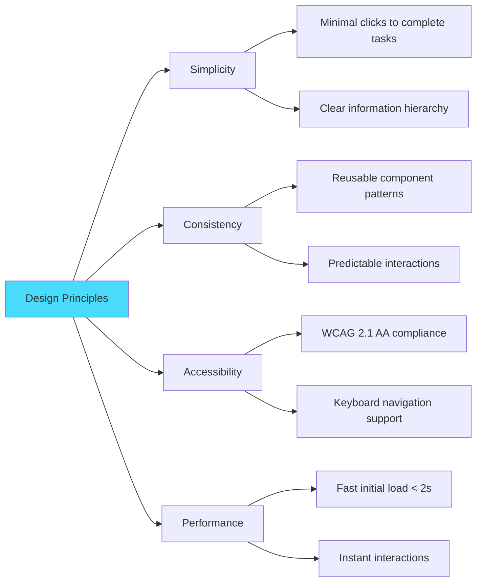
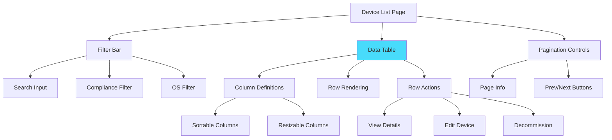

# Document 08: UI/UX Guidelines

**Version:** 1.0  
**Last Updated:** February 5, 2026  
**Author:** Engineering Team  
**Status:** Production-Ready

---

## Table of Contents

1. [Executive Summary](#1-executive-summary)
2. [Design System Overview](#2-design-system-overview)
3. [Component Library (shadcn/ui)](#3-component-library-shadcnui)
4. [Device List Table](#4-device-list-table)
5. [Device Detail View](#5-device-detail-view)
6. [Dashboard Layout](#6-dashboard-layout)
7. [Forms & Input Patterns](#7-forms--input-patterns)
8. [Navigation & Layout](#8-navigation--layout)
9. [Responsive Design](#9-responsive-design)
10. [Accessibility Guidelines](#10-accessibility-guidelines)
11. [Dark Mode Support](#11-dark-mode-support)
12. [Component Catalog](#12-component-catalog)

---

## 1. Executive Summary

### Purpose

This document defines the UI/UX standards for Device Inventory v2, ensuring consistent, accessible, and performant user interfaces across the application.

### Design Principles



### Technology Stack

| Layer | Technology | Purpose |
|-------|------------|---------|
| **Component Library** | shadcn/ui | Pre-built accessible components |
| **Styling** | Tailwind CSS | Utility-first CSS framework |
| **Icons** | Lucide React | Consistent icon system |
| **Forms** | React Hook Form + Zod | Type-safe form validation |
| **Tables** | TanStack Table | Powerful data table library |
| **Charts** | Recharts | Responsive chart library |

---

## 2. Design System Overview

### Color Palette

```typescript
// tailwind.config.ts

export default {
  theme: {
    extend: {
      colors: {
        // Primary colors (brand)
        primary: {
          50: '#eff6ff',
          100: '#dbeafe',
          500: '#3b82f6',  // Main brand color
          600: '#2563eb',
          700: '#1d4ed8',
        },
        
        // Status colors
        success: {
          500: '#10b981',  // Compliant devices
          600: '#059669',
        },
        warning: {
          500: '#f59e0b',  // Unknown compliance
          600: '#d97706',
        },
        danger: {
          500: '#ef4444',  // Noncompliant devices
          600: '#dc2626',
        },
        
        // Neutral colors (UI elements)
        neutral: {
          50: '#f9fafb',
          100: '#f3f4f6',
          200: '#e5e7eb',
          500: '#6b7280',
          700: '#374151',
          900: '#111827',
        },
      },
    },
  },
};
```

### Typography Scale

| Element | Font | Size | Weight | Usage |
|---------|------|------|--------|-------|
| **H1** | Inter | 36px | 700 | Page titles |
| **H2** | Inter | 30px | 600 | Section headers |
| **H3** | Inter | 24px | 600 | Card headers |
| **H4** | Inter | 20px | 600 | Subsection headers |
| **Body** | Inter | 16px | 400 | Body text |
| **Small** | Inter | 14px | 400 | Helper text, labels |
| **Code** | Fira Code | 14px | 400 | Serial numbers, IDs |

### Spacing System

```typescript
// Consistent spacing scale (Tailwind defaults)

const spacing = {
  0: '0px',
  1: '4px',    // Tight spacing
  2: '8px',    // Small gaps
  3: '12px',   // Default gaps
  4: '16px',   // Card padding
  6: '24px',   // Section padding
  8: '32px',   // Page padding
  12: '48px',  // Large gaps
  16: '64px',  // Extra large gaps
};
```

### Component States

```mermaid
stateDiagram-v2
    [*] --> Default
    Default --> Hover: Mouse over
    Default --> Focus: Tab/click
    Default --> Disabled: Cannot interact
    Hover --> Default: Mouse leave
    Focus --> Default: Blur
    Focus --> Active: Click/press
    Active --> Default: Release
    Default --> Loading: Async action
    Loading --> Default: Complete
    Loading --> Error: Failed
    Error --> Default: Retry
```

---

## 3. Component Library (shadcn/ui)

### Installation

```bash
# Initialize shadcn/ui
pnpm dlx shadcn-ui@latest init

# Install required components
pnpm dlx shadcn-ui@latest add button
pnpm dlx shadcn-ui@latest add card
pnpm dlx shadcn-ui@latest add table
pnpm dlx shadcn-ui@latest add badge
pnpm dlx shadcn-ui@latest add dialog
pnpm dlx shadcn-ui@latest add form
pnpm dlx shadcn-ui@latest add input
pnpm dlx shadcn-ui@latest add select
pnpm dlx shadcn-ui@latest add dropdown-menu
pnpm dlx shadcn-ui@latest add tooltip
pnpm dlx shadcn-ui@latest add alert
pnpm dlx shadcn-ui@latest add skeleton
```

### Core Components

#### Button Component

```typescript
// components/ui/button.tsx (from shadcn/ui)

import { Button } from '@/components/ui/button';

// Usage examples
<Button variant="default">Primary Action</Button>
<Button variant="secondary">Secondary Action</Button>
<Button variant="outline">Outlined</Button>
<Button variant="ghost">Ghost</Button>
<Button variant="destructive">Delete</Button>
<Button size="sm">Small</Button>
<Button size="lg">Large</Button>
<Button disabled>Disabled</Button>
```

**Button Variants:**

| Variant | Use Case | Example |
|---------|----------|---------|
| `default` | Primary actions | "Save", "Submit", "Create" |
| `secondary` | Secondary actions | "Cancel", "Back" |
| `outline` | Tertiary actions | "Learn More", "Details" |
| `ghost` | Subtle actions | Icon buttons, menu items |
| `destructive` | Dangerous actions | "Delete", "Remove", "Decommission" |

#### Card Component

```typescript
// components/ui/card.tsx

import {
  Card,
  CardHeader,
  CardTitle,
  CardDescription,
  CardContent,
  CardFooter,
} from '@/components/ui/card';

// Usage
<Card>
  <CardHeader>
    <CardTitle>Device Details</CardTitle>
    <CardDescription>View and manage device information</CardDescription>
  </CardHeader>
  <CardContent>
    <p>Device content here...</p>
  </CardContent>
  <CardFooter>
    <Button>Save Changes</Button>
  </CardFooter>
</Card>
```

#### Badge Component

```typescript
// components/ui/badge.tsx

import { Badge } from '@/components/ui/badge';

// Usage for compliance status
<Badge variant="success">Compliant</Badge>
<Badge variant="warning">Unknown</Badge>
<Badge variant="destructive">Noncompliant</Badge>
<Badge variant="outline">Decommissioned</Badge>
```

**Badge Color Mapping:**

| Status | Variant | Color | Use Case |
|--------|---------|-------|----------|
| Compliant | `success` | Green | Device meets compliance |
| Noncompliant | `destructive` | Red | Device violates policies |
| Unknown | `warning` | Yellow | Compliance status unclear |
| Decommissioned | `outline` | Gray | Device retired |

---

## 4. Device List Table

### Table Architecture



### Data Table Implementation

```typescript
// components/devices/device-table.tsx

'use client';

import { useState } from 'react';
import {
  useReactTable,
  getCoreRowModel,
  getSortedRowModel,
  getFilteredRowModel,
  getPaginationRowModel,
  ColumnDef,
  flexRender,
} from '@tanstack/react-table';
import { Badge } from '@/components/ui/badge';
import { Button } from '@/components/ui/button';
import { Input } from '@/components/ui/input';
import { Device } from '@/lib/types/models';
import { formatDate } from '@/lib/utils/date';

// Column definitions
const columns: ColumnDef<Device>[] = [
  {
    accessorKey: 'name',
    header: 'Device Name',
    cell: ({ row }) => (
      <div className="font-medium">{row.original.name}</div>
    ),
  },
  {
    accessorKey: 'user.name',
    header: 'User',
    cell: ({ row }) => (
      <div className="text-sm">
        {row.original.user?.name || 'Unassigned'}
      </div>
    ),
  },
  {
    accessorKey: 'operatingSystem',
    header: 'OS',
    cell: ({ row }) => (
      <div className="flex items-center gap-2">
        <OSIcon os={row.original.operatingSystem} />
        <span>{row.original.operatingSystem}</span>
      </div>
    ),
  },
  {
    accessorKey: 'complianceStatus',
    header: 'Compliance',
    cell: ({ row }) => {
      const status = row.original.complianceStatus;
      const variantMap = {
        compliant: 'success',
        noncompliant: 'destructive',
        unknown: 'warning',
      } as const;
      
      return (
        <Badge variant={variantMap[status]}>
          {status.charAt(0).toUpperCase() + status.slice(1)}
        </Badge>
      );
    },
  },
  {
    accessorKey: 'lastSyncDate',
    header: 'Last Sync',
    cell: ({ row }) => (
      <div className="text-sm text-muted-foreground">
        {formatDate(row.original.lastSyncDate)}
      </div>
    ),
  },
  {
    id: 'actions',
    cell: ({ row }) => (
      <DeviceActions device={row.original} />
    ),
  },
];

interface DeviceTableProps {
  devices: Device[];
}

export function DeviceTable({ devices }: DeviceTableProps) {
  const [globalFilter, setGlobalFilter] = useState('');

  const table = useReactTable({
    data: devices,
    columns,
    getCoreRowModel: getCoreRowModel(),
    getSortedRowModel: getSortedRowModel(),
    getFilteredRowModel: getFilteredRowModel(),
    getPaginationRowModel: getPaginationRowModel(),
    state: {
      globalFilter,
    },
    onGlobalFilterChange: setGlobalFilter,
    initialState: {
      pagination: {
        pageSize: 50,
      },
    },
  });

  return (
    <div className="space-y-4">
      {/* Search and Filters */}
      <div className="flex items-center gap-4">
        <Input
          placeholder="Search devices..."
          value={globalFilter}
          onChange={(e) => setGlobalFilter(e.target.value)}
          className="max-w-sm"
        />
        <ComplianceFilter />
        <OSFilter />
      </div>

      {/* Table */}
      <div className="rounded-md border">
        <table className="w-full">
          <thead>
            {table.getHeaderGroups().map((headerGroup) => (
              <tr key={headerGroup.id} className="border-b bg-muted/50">
                {headerGroup.headers.map((header) => (
                  <th
                    key={header.id}
                    className="px-4 py-3 text-left text-sm font-medium"
                  >
                    {flexRender(
                      header.column.columnDef.header,
                      header.getContext()
                    )}
                  </th>
                ))}
              </tr>
            ))}
          </thead>
          <tbody>
            {table.getRowModel().rows.length === 0 ? (
              <tr>
                <td
                  colSpan={columns.length}
                  className="px-4 py-8 text-center text-sm text-muted-foreground"
                >
                  No devices found
                </td>
              </tr>
            ) : (
              table.getRowModel().rows.map((row) => (
                <tr
                  key={row.id}
                  className="border-b transition-colors hover:bg-muted/50"
                >
                  {row.getVisibleCells().map((cell) => (
                    <td key={cell.id} className="px-4 py-3">
                      {flexRender(
                        cell.column.columnDef.cell,
                        cell.getContext()
                      )}
                    </td>
                  ))}
                </tr>
              ))
            )}
          </tbody>
        </table>
      </div>

      {/* Pagination */}
      <div className="flex items-center justify-between">
        <div className="text-sm text-muted-foreground">
          Showing {table.getState().pagination.pageIndex * 50 + 1} to{' '}
          {Math.min(
            (table.getState().pagination.pageIndex + 1) * 50,
            devices.length
          )}{' '}
          of {devices.length} devices
        </div>
        <div className="flex items-center gap-2">
          <Button
            variant="outline"
            size="sm"
            onClick={() => table.previousPage()}
            disabled={!table.getCanPreviousPage()}
          >
            Previous
          </Button>
          <Button
            variant="outline"
            size="sm"
            onClick={() => table.nextPage()}
            disabled={!table.getCanNextPage()}
          >
            Next
          </Button>
        </div>
      </div>
    </div>
  );
}
```

### Row Actions Component

```typescript
// components/devices/device-actions.tsx

'use client';

import { useState } from 'react';
import { useRouter } from 'next/navigation';
import { MoreHorizontal, Eye, Edit, Trash2 } from 'lucide-react';
import {
  DropdownMenu,
  DropdownMenuContent,
  DropdownMenuItem,
  DropdownMenuSeparator,
  DropdownMenuTrigger,
} from '@/components/ui/dropdown-menu';
import { Button } from '@/components/ui/button';
import { useRole } from '@/hooks/useRole';
import { Device } from '@/lib/types/models';

interface DeviceActionsProps {
  device: Device;
}

export function DeviceActions({ device }: DeviceActionsProps) {
  const router = useRouter();
  const { isAdmin } = useRole();
  const [isLoading, setIsLoading] = useState(false);

  const handleView = () => {
    router.push(`/devices/${device.id}`);
  };

  const handleEdit = () => {
    router.push(`/devices/${device.id}/edit`);
  };

  const handleDecommission = async () => {
    if (!confirm(`Are you sure you want to decommission ${device.name}?`)) {
      return;
    }

    setIsLoading(true);
    // Call decommission action
    const result = await decommissionDevice(device.id);
    setIsLoading(false);

    if (result.success) {
      router.refresh();
    }
  };

  return (
    <DropdownMenu>
      <DropdownMenuTrigger asChild>
        <Button variant="ghost" size="sm">
          <MoreHorizontal className="h-4 w-4" />
          <span className="sr-only">Open menu</span>
        </Button>
      </DropdownMenuTrigger>
      <DropdownMenuContent align="end">
        <DropdownMenuItem onClick={handleView}>
          <Eye className="mr-2 h-4 w-4" />
          View Details
        </DropdownMenuItem>

        {isAdmin && (
          <>
            <DropdownMenuItem onClick={handleEdit}>
              <Edit className="mr-2 h-4 w-4" />
              Edit Device
            </DropdownMenuItem>
            <DropdownMenuSeparator />
            <DropdownMenuItem
              onClick={handleDecommission}
              disabled={isLoading}
              className="text-destructive"
            >
              <Trash2 className="mr-2 h-4 w-4" />
              Decommission
            </DropdownMenuItem>
          </>
        )}
      </DropdownMenuContent>
    </DropdownMenu>
  );
}
```

### Filter Components

```typescript
// components/devices/compliance-filter.tsx

'use client';

import {
  Select,
  SelectContent,
  SelectItem,
  SelectTrigger,
  SelectValue,
} from '@/components/ui/select';

export function ComplianceFilter() {
  return (
    <Select defaultValue="all">
      <SelectTrigger className="w-[180px]">
        <SelectValue placeholder="Compliance Status" />
      </SelectTrigger>
      <SelectContent>
        <SelectItem value="all">All Statuses</SelectItem>
        <SelectItem value="compliant">Compliant</SelectItem>
        <SelectItem value="noncompliant">Noncompliant</SelectItem>
        <SelectItem value="unknown">Unknown</SelectItem>
      </SelectContent>
    </Select>
  );
}
```

---

## 5. Device Detail View

### Layout Structure

```typescript
// app/devices/[id]/page.tsx

import { getDeviceById } from '@/lib/actions/device-actions';
import { Card, CardHeader, CardTitle, CardContent } from '@/components/ui/card';
import { Badge } from '@/components/ui/badge';
import { Tabs, TabsContent, TabsList, TabsTrigger } from '@/components/ui/tabs';

export default async function DeviceDetailPage({ params }: { params: { id: string } }) {
  const result = await getDeviceById(Number(params.id));

  if (!result.success) {
    return <div>Device not found</div>;
  }

  const device = result.data;

  return (
    <div className="space-y-6">
      {/* Header */}
      <div className="flex items-center justify-between">
        <div>
          <h1 className="text-3xl font-bold">{device.name}</h1>
          <p className="text-muted-foreground">Serial: {device.serialNumber}</p>
        </div>
        <Badge variant={getComplianceVariant(device.complianceStatus)}>
          {device.complianceStatus}
        </Badge>
      </div>

      {/* Tabs */}
      <Tabs defaultValue="overview">
        <TabsList>
          <TabsTrigger value="overview">Overview</TabsTrigger>
          <TabsTrigger value="activity">Activity History</TabsTrigger>
          <TabsTrigger value="settings">Settings</TabsTrigger>
        </TabsList>

        <TabsContent value="overview" className="space-y-4">
          {/* Device Info Card */}
          <Card>
            <CardHeader>
              <CardTitle>Device Information</CardTitle>
            </CardHeader>
            <CardContent className="grid grid-cols-2 gap-4">
              <InfoRow label="Manufacturer" value={device.manufacturer} />
              <InfoRow label="Model" value={device.model} />
              <InfoRow label="Operating System" value={device.operatingSystem} />
              <InfoRow label="OS Version" value={device.osVersion} />
              <InfoRow label="Last Sync" value={formatDate(device.lastSyncDate)} />
              <InfoRow label="Enrollment Date" value={formatDate(device.enrollmentDate)} />
            </CardContent>
          </Card>

          {/* User Info Card */}
          {device.user && (
            <Card>
              <CardHeader>
                <CardTitle>Assigned User</CardTitle>
              </CardHeader>
              <CardContent className="grid grid-cols-2 gap-4">
                <InfoRow label="Name" value={device.user.name} />
                <InfoRow label="Email" value={device.user.email} />
              </CardContent>
            </Card>
          )}
        </TabsContent>

        <TabsContent value="activity">
          <ActivityHistory logs={device.activityHistory} />
        </TabsContent>

        <TabsContent value="settings">
          <DeviceSettings device={device} />
        </TabsContent>
      </Tabs>
    </div>
  );
}

function InfoRow({ label, value }: { label: string; value: string }) {
  return (
    <div>
      <dt className="text-sm font-medium text-muted-foreground">{label}</dt>
      <dd className="text-sm mt-1">{value}</dd>
    </div>
  );
}
```

### Activity History Timeline

```typescript
// components/devices/activity-history.tsx

'use client';

import { Card, CardContent } from '@/components/ui/card';
import { ActivityLog } from '@/lib/types/models';
import { formatDate } from '@/lib/utils/date';

interface ActivityHistoryProps {
  logs: ActivityLog[];
}

export function ActivityHistory({ logs }: ActivityHistoryProps) {
  return (
    <Card>
      <CardContent className="pt-6">
        <div className="space-y-4">
          {logs.map((log) => (
            <div key={log.id} className="flex gap-4 border-l-2 border-muted pl-4">
              <div className="flex-1">
                <div className="flex items-center gap-2">
                  <span className="font-medium">{log.action}</span>
                  <span className="text-sm text-muted-foreground">
                    by {log.performedBy.name}
                  </span>
                </div>
                <div className="text-sm text-muted-foreground">
                  {formatDate(log.timestamp)}
                </div>
                {log.details && (
                  <div className="mt-2 text-sm">
                    <pre className="bg-muted p-2 rounded text-xs">
                      {JSON.stringify(log.details, null, 2)}
                    </pre>
                  </div>
                )}
              </div>
            </div>
          ))}
        </div>
      </CardContent>
    </Card>
  );
}
```

---

## 6. Dashboard Layout

### Dashboard Grid Layout

```typescript
// app/dashboard/page.tsx

import { getDashboardMetrics } from '@/lib/actions/dashboard-actions';
import { Card, CardHeader, CardTitle, CardContent } from '@/components/ui/card';

export default async function DashboardPage() {
  const result = await getDashboardMetrics();

  if (!result.success) {
    return <div>Failed to load dashboard</div>;
  }

  const metrics = result.data;

  return (
    <div className="space-y-6">
      <h1 className="text-3xl font-bold">Dashboard</h1>

      {/* Metric Cards */}
      <div className="grid grid-cols-1 md:grid-cols-2 lg:grid-cols-4 gap-4">
        <MetricCard
          title="Total Devices"
          value={metrics.totalDevices}
          icon="📱"
        />
        <MetricCard
          title="Compliant"
          value={metrics.compliantDevices}
          icon="✅"
          variant="success"
        />
        <MetricCard
          title="Noncompliant"
          value={metrics.noncompliantDevices}
          icon="⚠️"
          variant="danger"
        />
        <MetricCard
          title="Compliance Rate"
          value={`${metrics.complianceRate}%`}
          icon="📊"
        />
      </div>

      {/* Charts Row */}
      <div className="grid grid-cols-1 lg:grid-cols-2 gap-4">
        <Card>
          <CardHeader>
            <CardTitle>Devices by OS</CardTitle>
          </CardHeader>
          <CardContent>
            <DevicesByOSChart data={metrics.devicesByOS} />
          </CardContent>
        </Card>

        <Card>
          <CardHeader>
            <CardTitle>Compliance Trend</CardTitle>
          </CardHeader>
          <CardContent>
            <ComplianceTrendChart />
          </CardContent>
        </Card>
      </div>

      {/* Recent Activity */}
      <Card>
        <CardHeader>
          <CardTitle>Recent Activity</CardTitle>
        </CardHeader>
        <CardContent>
          <RecentActivityList activities={metrics.recentActivity} />
        </CardContent>
      </Card>
    </div>
  );
}
```

### Metric Card Component

```typescript
// components/dashboard/metric-card.tsx

import { Card, CardContent } from '@/components/ui/card';
import { cn } from '@/lib/utils';

interface MetricCardProps {
  title: string;
  value: string | number;
  icon: string;
  variant?: 'default' | 'success' | 'warning' | 'danger';
}

export function MetricCard({ title, value, icon, variant = 'default' }: MetricCardProps) {
  const variantStyles = {
    default: 'border-l-4 border-l-primary',
    success: 'border-l-4 border-l-green-500',
    warning: 'border-l-4 border-l-yellow-500',
    danger: 'border-l-4 border-l-red-500',
  };

  return (
    <Card className={cn(variantStyles[variant])}>
      <CardContent className="pt-6">
        <div className="flex items-center justify-between">
          <div>
            <p className="text-sm font-medium text-muted-foreground">{title}</p>
            <p className="text-3xl font-bold mt-2">{value}</p>
          </div>
          <div className="text-4xl">{icon}</div>
        </div>
      </CardContent>
    </Card>
  );
}
```

### Chart Component

```typescript
// components/dashboard/devices-by-os-chart.tsx

'use client';

import { PieChart, Pie, Cell, ResponsiveContainer, Legend, Tooltip } from 'recharts';

interface DevicesByOSChartProps {
  data: { os: string; count: number }[];
}

const COLORS = ['#3b82f6', '#10b981', '#f59e0b', '#ef4444', '#8b5cf6'];

export function DevicesByOSChart({ data }: DevicesByOSChartProps) {
  return (
    <ResponsiveContainer width="100%" height={300}>
      <PieChart>
        <Pie
          data={data}
          dataKey="count"
          nameKey="os"
          cx="50%"
          cy="50%"
          outerRadius={80}
          label
        >
          {data.map((entry, index) => (
            <Cell key={`cell-${index}`} fill={COLORS[index % COLORS.length]} />
          ))}
        </Pie>
        <Tooltip />
        <Legend />
      </PieChart>
    </ResponsiveContainer>
  );
}
```

---

## 7. Forms & Input Patterns

### Form Implementation with React Hook Form

```typescript
// components/devices/edit-device-form.tsx

'use client';

import { useForm } from 'react-hook-form';
import { zodResolver } from '@hookform/resolvers/zod';
import { z } from 'zod';
import { Button } from '@/components/ui/button';
import {
  Form,
  FormControl,
  FormDescription,
  FormField,
  FormItem,
  FormLabel,
  FormMessage,
} from '@/components/ui/form';
import { Input } from '@/components/ui/input';
import { Textarea } from '@/components/ui/textarea';
import { updateDevice } from '@/lib/actions/device-actions';
import { Device } from '@/lib/types/models';

const formSchema = z.object({
  name: z.string().min(1, 'Name is required').max(255),
  notes: z.string().max(1000).optional(),
  assignedUserId: z.number().nullable().optional(),
});

type FormValues = z.infer<typeof formSchema>;

interface EditDeviceFormProps {
  device: Device;
}

export function EditDeviceForm({ device }: EditDeviceFormProps) {
  const form = useForm<FormValues>({
    resolver: zodResolver(formSchema),
    defaultValues: {
      name: device.name,
      notes: device.notes || '',
      assignedUserId: device.userId,
    },
  });

  const onSubmit = async (values: FormValues) => {
    const result = await updateDevice({
      deviceId: device.id,
      updates: values,
    });

    if (result.success) {
      // Show success toast
      alert('Device updated successfully');
    } else {
      // Show error toast
      alert(`Error: ${result.error}`);
    }
  };

  return (
    <Form {...form}>
      <form onSubmit={form.handleSubmit(onSubmit)} className="space-y-6">
        <FormField
          control={form.control}
          name="name"
          render={({ field }) => (
            <FormItem>
              <FormLabel>Device Name</FormLabel>
              <FormControl>
                <Input placeholder="Enter device name" {...field} />
              </FormControl>
              <FormDescription>
                Custom display name for this device
              </FormDescription>
              <FormMessage />
            </FormItem>
          )}
        />

        <FormField
          control={form.control}
          name="notes"
          render={({ field }) => (
            <FormItem>
              <FormLabel>Notes</FormLabel>
              <FormControl>
                <Textarea
                  placeholder="Add notes about this device..."
                  rows={4}
                  {...field}
                />
              </FormControl>
              <FormDescription>
                Internal notes (not synced to Intune)
              </FormDescription>
              <FormMessage />
            </FormItem>
          )}
        />

        <div className="flex gap-4">
          <Button type="submit" disabled={form.formState.isSubmitting}>
            {form.formState.isSubmitting ? 'Saving...' : 'Save Changes'}
          </Button>
          <Button type="button" variant="outline" onClick={() => window.history.back()}>
            Cancel
          </Button>
        </div>
      </form>
    </Form>
  );
}
```

### Input Validation Patterns

| Field Type | Validation Rule | Error Message |
|------------|-----------------|---------------|
| **Device Name** | 1-255 characters | "Name must be between 1 and 255 characters" |
| **Notes** | Max 1000 characters | "Notes cannot exceed 1000 characters" |
| **Email** | Valid email format | "Please enter a valid email address" |
| **Role** | Enum: admin, viewer | "Role must be either admin or viewer" |

---

## 8. Navigation & Layout

### Root Layout

```typescript
// app/layout.tsx

import { Inter } from 'next/font/google';
import { getServerSession } from 'next-auth';
import { authOptions } from '@/lib/auth/auth-options';
import { Sidebar } from '@/components/layout/sidebar';
import { Header } from '@/components/layout/header';
import './globals.css';

const inter = Inter({ subsets: ['latin'] });

export default async function RootLayout({ children }: { children: React.ReactNode }) {
  const session = await getServerSession(authOptions);

  return (
    <html lang="en">
      <body className={inter.className}>
        {session ? (
          <div className="flex h-screen">
            <Sidebar />
            <div className="flex-1 flex flex-col overflow-hidden">
              <Header />
              <main className="flex-1 overflow-y-auto p-6 bg-neutral-50">
                {children}
              </main>
            </div>
          </div>
        ) : (
          <main>{children}</main>
        )}
      </body>
    </html>
  );
}
```

### Sidebar Navigation

```typescript
// components/layout/sidebar.tsx

'use client';

import Link from 'next/link';
import { usePathname } from 'next/navigation';
import { Home, HardDrive, Users, Activity, Settings } from 'lucide-react';
import { cn } from '@/lib/utils';
import { useRole } from '@/hooks/useRole';

const navItems = [
  { href: '/dashboard', label: 'Dashboard', icon: Home, roles: ['admin', 'viewer'] },
  { href: '/devices', label: 'Devices', icon: HardDrive, roles: ['admin', 'viewer'] },
  { href: '/users', label: 'Users', icon: Users, roles: ['admin', 'viewer'] },
  { href: '/activity-logs', label: 'Activity Logs', icon: Activity, roles: ['admin'] },
  { href: '/settings', label: 'Settings', icon: Settings, roles: ['admin'] },
];

export function Sidebar() {
  const pathname = usePathname();
  const { role } = useRole();

  const visibleItems = navItems.filter((item) =>
    item.roles.includes(role || 'viewer')
  );

  return (
    <aside className="w-64 border-r bg-white">
      <div className="p-6">
        <h1 className="text-xl font-bold">Device Inventory</h1>
      </div>
      <nav className="px-3 space-y-1">
        {visibleItems.map((item) => {
          const Icon = item.icon;
          const isActive = pathname === item.href;

          return (
            <Link
              key={item.href}
              href={item.href}
              className={cn(
                'flex items-center gap-3 px-3 py-2 rounded-md text-sm font-medium transition-colors',
                isActive
                  ? 'bg-primary text-primary-foreground'
                  : 'text-muted-foreground hover:bg-neutral-100'
              )}
            >
              <Icon className="h-5 w-5" />
              {item.label}
            </Link>
          );
        })}
      </nav>
    </aside>
  );
}
```

### Header with User Menu

```typescript
// components/layout/header.tsx

'use client';

import { useSession, signOut } from 'next-auth/react';
import { Button } from '@/components/ui/button';
import {
  DropdownMenu,
  DropdownMenuContent,
  DropdownMenuItem,
  DropdownMenuSeparator,
  DropdownMenuTrigger,
} from '@/components/ui/dropdown-menu';
import { Avatar, AvatarFallback } from '@/components/ui/avatar';
import { LogOut, User } from 'lucide-react';

export function Header() {
  const { data: session } = useSession();

  if (!session) return null;

  const initials = session.user.name
    ?.split(' ')
    .map((n) => n[0])
    .join('')
    .toUpperCase();

  return (
    <header className="border-b bg-white px-6 py-4">
      <div className="flex items-center justify-between">
        <div>
          <h2 className="text-lg font-semibold">Welcome back, {session.user.name}</h2>
          <p className="text-sm text-muted-foreground">{session.user.role}</p>
        </div>

        <DropdownMenu>
          <DropdownMenuTrigger asChild>
            <Button variant="ghost" className="relative h-10 w-10 rounded-full">
              <Avatar>
                <AvatarFallback>{initials}</AvatarFallback>
              </Avatar>
            </Button>
          </DropdownMenuTrigger>
          <DropdownMenuContent align="end">
            <DropdownMenuItem>
              <User className="mr-2 h-4 w-4" />
              Profile
            </DropdownMenuItem>
            <DropdownMenuSeparator />
            <DropdownMenuItem onClick={() => signOut()}>
              <LogOut className="mr-2 h-4 w-4" />
              Sign Out
            </DropdownMenuItem>
          </DropdownMenuContent>
        </DropdownMenu>
      </div>
    </header>
  );
}
```

---

## 9. Responsive Design

### Breakpoint System

```typescript
// Tailwind CSS breakpoints (default)

const breakpoints = {
  sm: '640px',   // Mobile landscape
  md: '768px',   // Tablet
  lg: '1024px',  // Desktop
  xl: '1280px',  // Large desktop
  '2xl': '1536px', // Extra large desktop
};
```

### Responsive Patterns

#### Grid Layouts

```typescript
// Dashboard grid - responsive columns
<div className="grid grid-cols-1 md:grid-cols-2 lg:grid-cols-4 gap-4">
  {/* Cards automatically stack on mobile, 2 cols on tablet, 4 on desktop */}
</div>

// Table - horizontal scroll on mobile
<div className="overflow-x-auto">
  <table className="min-w-full">
    {/* Table content */}
  </table>
</div>
```

#### Sidebar - Mobile Drawer

```typescript
// components/layout/mobile-nav.tsx

'use client';

import { useState } from 'react';
import { Menu } from 'lucide-react';
import { Button } from '@/components/ui/button';
import { Sheet, SheetContent, SheetTrigger } from '@/components/ui/sheet';
import { Sidebar } from './sidebar';

export function MobileNav() {
  const [open, setOpen] = useState(false);

  return (
    <Sheet open={open} onOpenChange={setOpen}>
      <SheetTrigger asChild className="lg:hidden">
        <Button variant="ghost" size="sm">
          <Menu className="h-6 w-6" />
        </Button>
      </SheetTrigger>
      <SheetContent side="left" className="p-0">
        <Sidebar />
      </SheetContent>
    </Sheet>
  );
}
```

### Mobile-First Approach

```typescript
// Start with mobile styles, add larger breakpoints

// Mobile (default)
<div className="text-sm p-4">
  {/* Mobile layout */}
</div>

// Tablet and up
<div className="text-sm md:text-base p-4 md:p-6">
  {/* Tablet+ layout */}
</div>

// Desktop and up
<div className="text-sm md:text-base lg:text-lg p-4 md:p-6 lg:p-8">
  {/* Desktop+ layout */}
</div>
```

---

## 10. Accessibility Guidelines

### WCAG 2.1 AA Compliance

#### Color Contrast

| Element | Foreground | Background | Contrast Ratio | Pass |
|---------|-----------|------------|----------------|------|
| Body text | #111827 | #ffffff | 16.1:1 | ✅ AAA |
| Muted text | #6b7280 | #ffffff | 4.6:1 | ✅ AA |
| Primary button | #ffffff | #3b82f6 | 8.6:1 | ✅ AAA |
| Success badge | #ffffff | #10b981 | 4.5:1 | ✅ AA |
| Danger badge | #ffffff | #ef4444 | 4.5:1 | ✅ AA |

#### Keyboard Navigation

```typescript
// All interactive elements must be keyboard accessible

// Button with focus styles
<Button className="focus:ring-2 focus:ring-primary focus:ring-offset-2">
  Action
</Button>

// Skip to main content link
<a href="#main-content" className="sr-only focus:not-sr-only">
  Skip to main content
</a>

// Keyboard shortcuts
useEffect(() => {
  const handleKeyPress = (e: KeyboardEvent) => {
    if (e.key === '/' && !e.ctrlKey && !e.metaKey) {
      e.preventDefault();
      searchInputRef.current?.focus();
    }
  };

  window.addEventListener('keydown', handleKeyPress);
  return () => window.removeEventListener('keydown', handleKeyPress);
}, []);
```

#### Screen Reader Support

```typescript
// Proper ARIA labels and semantic HTML

// Table with aria-label
<table aria-label="List of managed devices">
  <thead>
    <tr>
      <th scope="col">Device Name</th>
      <th scope="col">User</th>
    </tr>
  </thead>
</table>

// Button with sr-only text
<Button variant="ghost">
  <MoreHorizontal className="h-4 w-4" />
  <span className="sr-only">Open device actions menu</span>
</Button>

// Loading state announcement
<div role="status" aria-live="polite">
  {isLoading && <span className="sr-only">Loading devices...</span>}
</div>
```

#### Focus Management

```typescript
// Trap focus in dialogs

import { Dialog } from '@/components/ui/dialog';

<Dialog open={open} onOpenChange={setOpen}>
  <DialogContent>
    {/* Focus is automatically trapped within dialog */}
    <DialogTitle>Delete Device</DialogTitle>
    <DialogDescription>
      Are you sure you want to delete this device?
    </DialogDescription>
    <DialogFooter>
      <Button variant="outline" onClick={() => setOpen(false)}>
        Cancel
      </Button>
      <Button variant="destructive" onClick={handleDelete}>
        Delete
      </Button>
    </DialogFooter>
  </DialogContent>
</Dialog>
```

---

## 11. Dark Mode Support

### Theme Provider Setup

```typescript
// components/theme-provider.tsx

'use client';

import { ThemeProvider as NextThemesProvider } from 'next-themes';

export function ThemeProvider({ children }: { children: React.ReactNode }) {
  return (
    <NextThemesProvider attribute="class" defaultTheme="system" enableSystem>
      {children}
    </NextThemesProvider>
  );
}
```

### Dark Mode Styles

```typescript
// tailwind.config.ts

export default {
  darkMode: 'class',
  theme: {
    extend: {
      colors: {
        background: 'hsl(var(--background))',
        foreground: 'hsl(var(--foreground))',
        // ...other colors
      },
    },
  },
};
```

```css
/* globals.css */

@layer base {
  :root {
    --background: 0 0% 100%;
    --foreground: 222.2 84% 4.9%;
    --primary: 221.2 83.2% 53.3%;
    /* ...other variables */
  }

  .dark {
    --background: 222.2 84% 4.9%;
    --foreground: 210 40% 98%;
    --primary: 217.2 91.2% 59.8%;
    /* ...other variables */
  }
}
```

### Theme Toggle Component

```typescript
// components/theme-toggle.tsx

'use client';

import { useTheme } from 'next-themes';
import { Moon, Sun } from 'lucide-react';
import { Button } from '@/components/ui/button';

export function ThemeToggle() {
  const { theme, setTheme } = useTheme();

  return (
    <Button
      variant="ghost"
      size="sm"
      onClick={() => setTheme(theme === 'dark' ? 'light' : 'dark')}
    >
      <Sun className="h-5 w-5 rotate-0 scale-100 transition-all dark:-rotate-90 dark:scale-0" />
      <Moon className="absolute h-5 w-5 rotate-90 scale-0 transition-all dark:rotate-0 dark:scale-100" />
      <span className="sr-only">Toggle theme</span>
    </Button>
  );
}
```

---

## 12. Component Catalog

### Quick Reference

| Component | Import | Use Case |
|-----------|--------|----------|
| `Button` | `@/components/ui/button` | Actions, form submits |
| `Card` | `@/components/ui/card` | Content containers |
| `Badge` | `@/components/ui/badge` | Status indicators |
| `Table` | `@tanstack/react-table` | Data tables |
| `Form` | `@/components/ui/form` | Forms with validation |
| `Dialog` | `@/components/ui/dialog` | Modal dialogs |
| `DropdownMenu` | `@/components/ui/dropdown-menu` | Context menus |
| `Select` | `@/components/ui/select` | Dropdown selections |
| `Tabs` | `@/components/ui/tabs` | Tabbed interfaces |
| `Tooltip` | `@/components/ui/tooltip` | Hover hints |
| `Alert` | `@/components/ui/alert` | Notifications |
| `Skeleton` | `@/components/ui/skeleton` | Loading states |

### Loading States

```typescript
// components/devices/device-list-skeleton.tsx

import { Skeleton } from '@/components/ui/skeleton';

export function DeviceListSkeleton() {
  return (
    <div className="space-y-4">
      {Array.from({ length: 10 }).map((_, i) => (
        <div key={i} className="flex items-center gap-4 p-4 border rounded">
          <Skeleton className="h-12 w-12 rounded-full" />
          <div className="flex-1 space-y-2">
            <Skeleton className="h-4 w-[250px]" />
            <Skeleton className="h-4 w-[200px]" />
          </div>
        </div>
      ))}
    </div>
  );
}
```

---

## Appendix A: Design Tokens

```typescript
// Design tokens for consistent styling

export const tokens = {
  // Spacing
  spacing: {
    xs: '4px',
    sm: '8px',
    md: '16px',
    lg: '24px',
    xl: '32px',
  },

  // Border radius
  radius: {
    sm: '4px',
    md: '8px',
    lg: '12px',
    full: '9999px',
  },

  // Shadows
  shadow: {
    sm: '0 1px 2px 0 rgba(0, 0, 0, 0.05)',
    md: '0 4px 6px -1px rgba(0, 0, 0, 0.1)',
    lg: '0 10px 15px -3px rgba(0, 0, 0, 0.1)',
  },

  // Typography
  fontSize: {
    xs: '12px',
    sm: '14px',
    base: '16px',
    lg: '18px',
    xl: '20px',
    '2xl': '24px',
    '3xl': '30px',
  },
};
```

---

## Document Change Log

| Version | Date | Author | Changes |
|---------|------|--------|---------|
| 1.0 | 2026-02-05 | Engineering Team | Initial production-ready document |

---

**Next Document:** [09_Developer_Handbook.md](./09_Developer_Handbook.md)