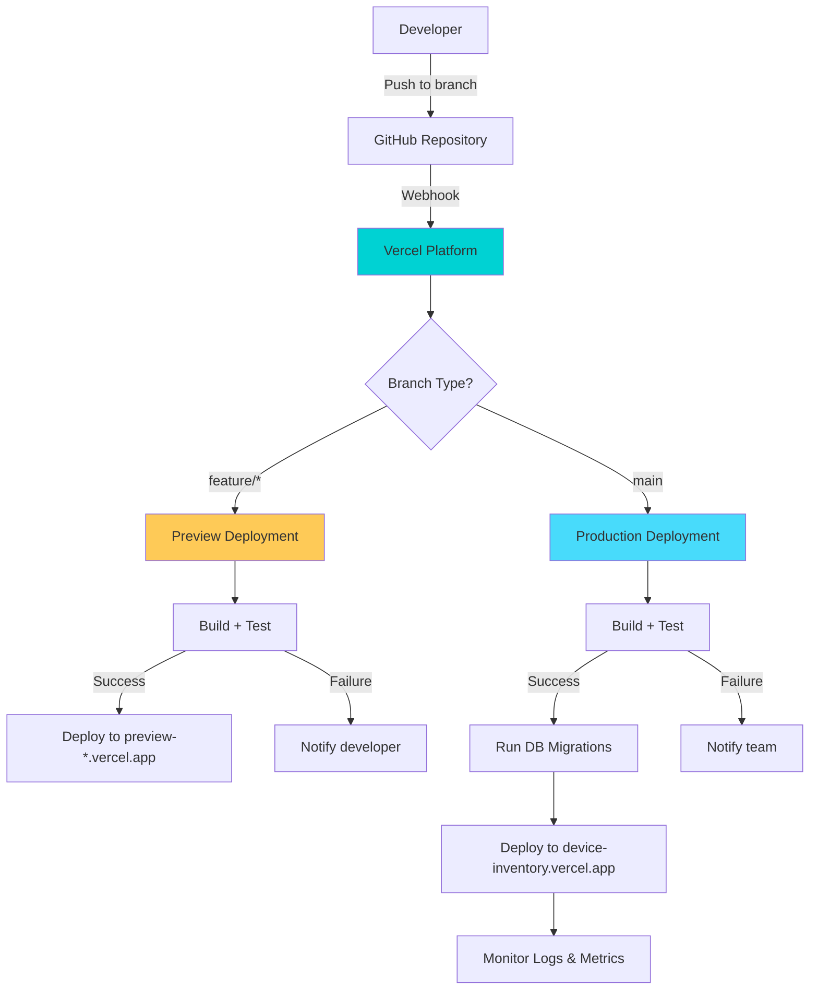
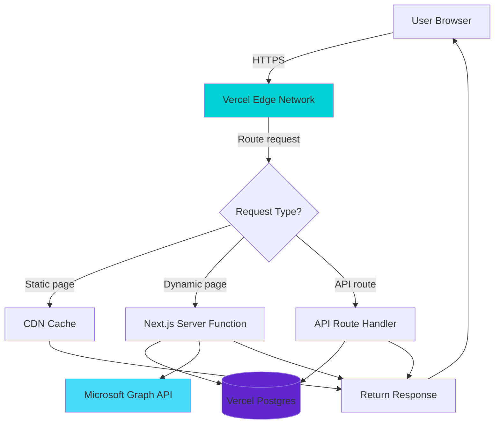
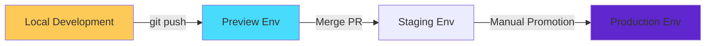
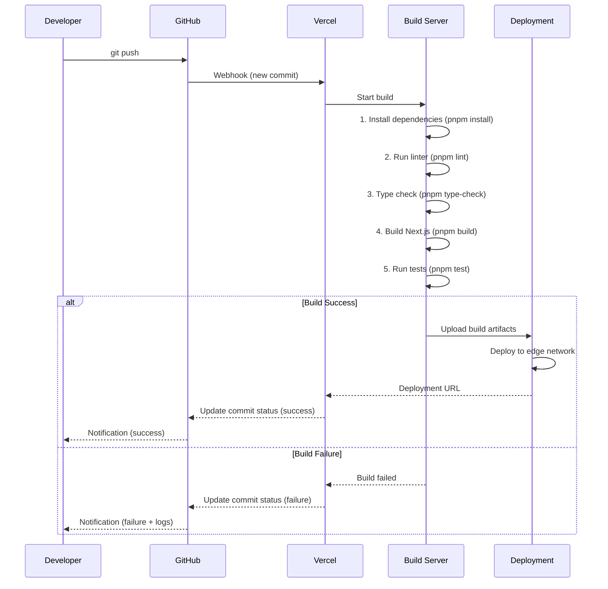
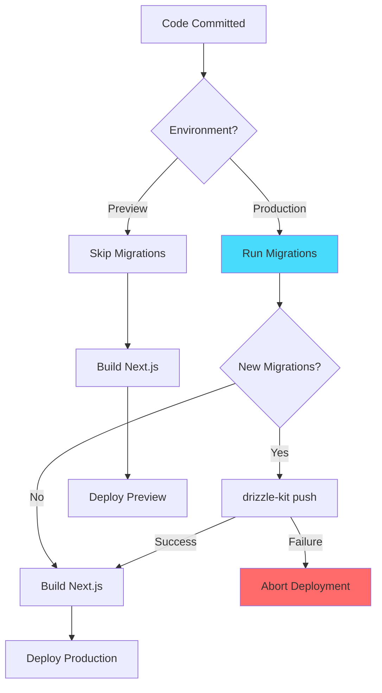
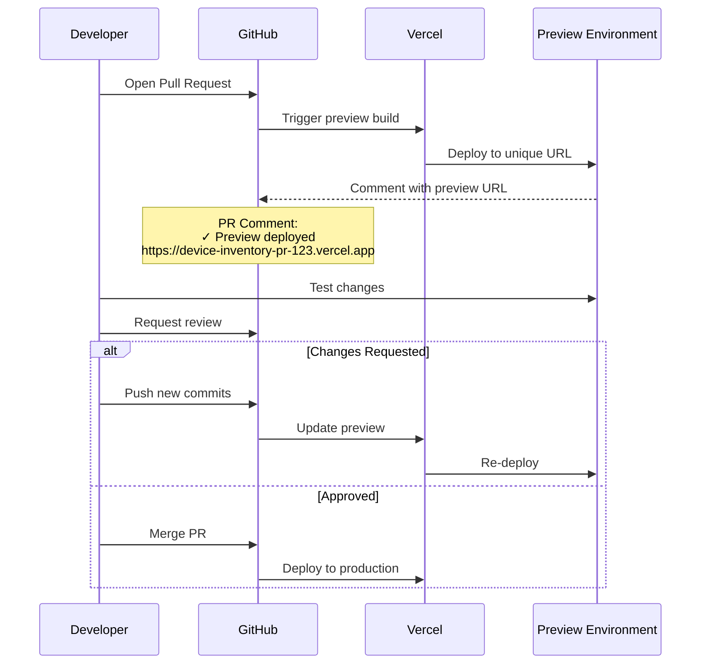
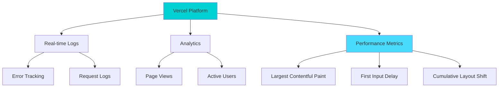

# Document 10: CI/CD Pipeline

**Version:** 1.0  
**Last Updated:** February 5, 2026  
**Author:** Engineering Team  
**Status:** Production-Ready

---

## Table of Contents

1. [Executive Summary](#1-executive-summary)
2. [Vercel Deployment Architecture](#2-vercel-deployment-architecture)
3. [Environment Management](#3-environment-management)
4. [GitHub Integration](#4-github-integration)
5. [Build Process](#5-build-process)
6. [Database Migrations in CI/CD](#6-database-migrations-in-cicd)
7. [Preview Deployments](#7-preview-deployments)
8. [Production Deployment](#8-production-deployment)
9. [Monitoring & Rollback](#9-monitoring--rollback)
10. [Security & Compliance](#10-security--compliance)

---

## 1. Executive Summary

### Purpose

This document defines the Continuous Integration and Continuous Deployment (CI/CD) pipeline for Device Inventory v2, leveraging Vercel's zero-config deployment platform with GitHub integration.

### Deployment Flow



### Key Features

| Feature | Description | Benefit |
|---------|-------------|---------|
| **Zero-Config Deployment** | No build configuration required | Deploy in seconds, not hours |
| **Automatic Previews** | Every PR gets unique URL | Test changes before merging |
| **Instant Rollback** | One-click revert to previous version | Minimize downtime |
| **Edge Functions** | Deploy globally, run close to users | Sub-100ms API responses |
| **Built-in Monitoring** | Logs, analytics, performance metrics | Troubleshoot issues quickly |

---

## 2. Vercel Deployment Architecture

### Infrastructure Overview



### Vercel Regions

Device Inventory v2 is deployed to the following regions for optimal global performance:

| Region | Location | Use Case |
|--------|----------|----------|
| **iad1** | Washington D.C., USA | Primary (closest to Azure AD) |
| **sfo1** | San Francisco, USA | West coast users |
| **fra1** | Frankfurt, Germany | European users |
| **hnd1** | Tokyo, Japan | Asian users |

**Primary Region:** `iad1` (Washington D.C.) - chosen because:
- Closest to Azure AD (reduces auth latency)
- Lowest latency to Vercel Postgres (same region)
- Covers majority of user base (US-based organization)

---

## 3. Environment Management

### Environment Hierarchy



### Environment Configuration

#### Local Development

```bash
# .env.local (not committed)

NODE_ENV=development

# Database (local Postgres or Vercel Postgres dev instance)
POSTGRES_URL=postgres://localhost:5432/device_inventory_dev

# Azure AD (use development app registration)
AZURE_AD_TENANT_ID=your-tenant-id
AZURE_AD_CLIENT_ID=dev-client-id
AZURE_AD_CLIENT_SECRET=dev-client-secret

# NextAuth.js
NEXTAUTH_SECRET=local-secret
NEXTAUTH_URL=http://localhost:3000

# Cron (disabled in local)
CRON_SECRET=local-cron-secret

# Debug
DEBUG=true
```

#### Preview Environment (Vercel)

```bash
# Automatically created for each PR
# URL: https://device-inventory-pr-123-hash.vercel.app

NODE_ENV=preview

# Database (shared preview database)
POSTGRES_URL=[Vercel Postgres Preview]

# Azure AD (use preview app registration)
AZURE_AD_TENANT_ID=your-tenant-id
AZURE_AD_CLIENT_ID=preview-client-id
AZURE_AD_CLIENT_SECRET=[Vercel Secret]

# NextAuth.js
NEXTAUTH_SECRET=[Vercel Secret]
NEXTAUTH_URL=[Auto-detected by Vercel]

# Cron (disabled in preview)
VERCEL_ENV=preview
```

#### Production Environment (Vercel)

```bash
# URL: https://device-inventory.vercel.app

NODE_ENV=production

# Database (production Postgres)
POSTGRES_URL=[Vercel Postgres Production]

# Azure AD (use production app registration)
AZURE_AD_TENANT_ID=your-tenant-id
AZURE_AD_CLIENT_ID=prod-client-id
AZURE_AD_CLIENT_SECRET=[Vercel Secret]

# NextAuth.js
NEXTAUTH_SECRET=[Vercel Secret]
NEXTAUTH_URL=https://device-inventory.vercel.app

# Cron (enabled in production)
CRON_SECRET=[Vercel Secret]
VERCEL_ENV=production
```

### Managing Secrets in Vercel

```bash
# Set secrets via Vercel CLI
vercel env add AZURE_AD_CLIENT_SECRET production
# Paste secret value when prompted

# Or via Vercel Dashboard:
# 1. Go to: vercel.com/{team}/{project}/settings/environment-variables
# 2. Add variable name and value
# 3. Select environments: Production, Preview, Development
# 4. Click "Save"

# Pull environment variables to local
vercel env pull .env.local
```

---

## 4. GitHub Integration

### Repository Setup

```bash
# 1. Connect GitHub repository to Vercel
# Go to: vercel.com/new
# Import Git Repository > Select GitHub repo
# Follow prompts to authorize Vercel

# 2. Configure deployment settings
# Project Settings > Git
#   - Production Branch: main
#   - Ignored Build Step: (leave empty)
#   - Framework Preset: Next.js (auto-detected)
```

### Branch Protection Rules

```yaml
# .github/branch-protection.yml

# Configure in GitHub: Settings > Branches > Branch protection rules

main:
  required_status_checks:
    strict: true
    contexts:
      - Vercel – Build
      - Vercel – Checks
      - Tests (Vitest)
  required_reviews:
    required_approving_review_count: 1
    dismiss_stale_reviews: true
  enforce_admins: true
  restrictions: null
```

### GitHub Actions (Optional Quality Checks)

```yaml
# .github/workflows/ci.yml

name: CI

on:
  pull_request:
    branches: [main]

jobs:
  test:
    runs-on: ubuntu-latest
    steps:
      - uses: actions/checkout@v3
      
      - name: Setup Node.js
        uses: actions/setup-node@v3
        with:
          node-version: 20
      
      - name: Install pnpm
        run: npm install -g pnpm
      
      - name: Install dependencies
        run: pnpm install
      
      - name: Run linter
        run: pnpm lint
      
      - name: Run type check
        run: pnpm type-check
      
      - name: Run tests
        run: pnpm test
      
      - name: Upload coverage
        uses: codecov/codecov-action@v3
        with:
          files: ./coverage/coverage-final.json
```

---

## 5. Build Process

### Build Pipeline



### Build Configuration

```json
// package.json

{
  "scripts": {
    "dev": "next dev",
    "build": "next build",
    "start": "next start",
    "lint": "next lint",
    "type-check": "tsc --noEmit",
    "test": "vitest run",
    "vercel-build": "pnpm db:migrate && next build"
  }
}
```

```javascript
// next.config.js

/** @type {import('next').NextConfig} */
const nextConfig = {
  // Strict mode for better debugging
  reactStrictMode: true,

  // Optimize images
  images: {
    domains: ['graph.microsoft.com'], // Allow Microsoft Graph profile images
  },

  // Environment variables exposed to client
  env: {
    NEXT_PUBLIC_APP_NAME: 'Device Inventory',
    NEXT_PUBLIC_APP_VERSION: process.env.npm_package_version,
  },

  // Build output
  output: 'standalone', // Optimize for serverless

  // Logging
  logging: {
    fetches: {
      fullUrl: process.env.NODE_ENV === 'development',
    },
  },
};

module.exports = nextConfig;
```

### Build Output Analysis

```bash
# After successful build, Vercel shows:

Route (app)                              Size     First Load JS
┌ ○ /                                    1.2 kB          87 kB
├ ○ /dashboard                           3.5 kB          95 kB
├ ○ /devices                             8.2 kB         102 kB
├ ○ /devices/[id]                        4.1 kB          96 kB
└ ○ /login                               2.3 kB          89 kB

○  (Static)  automatically rendered as static HTML (no data fetching)
λ  (Server)  server-side renders at runtime (uses getServerSideProps or Server Components)
```

---

## 6. Database Migrations in CI/CD

### Migration Strategy



### Migration Scripts

```typescript
// scripts/migrate.ts

import { drizzle } from 'drizzle-orm/vercel-postgres';
import { migrate } from 'drizzle-orm/vercel-postgres/migrator';
import { sql } from '@vercel/postgres';

async function runMigrations() {
  console.log('Running database migrations...');

  try {
    const db = drizzle(sql);
    await migrate(db, { migrationsFolder: './drizzle' });
    
    console.log('✓ Migrations completed successfully');
    process.exit(0);
  } catch (error) {
    console.error('✗ Migration failed:', error);
    process.exit(1);
  }
}

runMigrations();
```

```json
// package.json

{
  "scripts": {
    "db:generate": "drizzle-kit generate:pg",
    "db:migrate": "tsx scripts/migrate.ts",
    "vercel-build": "pnpm db:migrate && next build"
  }
}
```

### Migration Safety Checks

```typescript
// scripts/check-migrations.ts

import { readdir } from 'fs/promises';

async function checkMigrations() {
  const migrations = await readdir('./drizzle/migrations');
  
  // Ensure migrations are sequential
  const numbers = migrations
    .map((file) => parseInt(file.split('_')[0]))
    .sort((a, b) => a - b);
  
  for (let i = 0; i < numbers.length - 1; i++) {
    if (numbers[i + 1] !== numbers[i] + 1) {
      throw new Error(`Migration gap detected: ${numbers[i]} -> ${numbers[i + 1]}`);
    }
  }
  
  console.log('✓ Migration sequence valid');
}

checkMigrations();
```

---

## 7. Preview Deployments

### Preview Workflow



### Preview URL Structure

```
# Preview URLs follow this pattern:
https://device-inventory-{branch}-{hash}.vercel.app

# Examples:
https://device-inventory-feature-device-filtering-abc123.vercel.app
https://device-inventory-bugfix-auth-redirect-def456.vercel.app
https://device-inventory-pr-42-ghi789.vercel.app

# Each PR gets a unique preview that updates on new commits
```

### Preview Environment Features

| Feature | Status | Notes |
|---------|--------|-------|
| **Unique URL** | ✅ Enabled | Every PR gets isolated environment |
| **Database** | ✅ Shared Preview DB | Separate from production |
| **Authentication** | ✅ Enabled | Use preview Azure AD app |
| **Cron Jobs** | ❌ Disabled | No automatic syncs in preview |
| **Analytics** | ✅ Enabled | Track usage separately |
| **Comments** | ✅ Enabled | Password protection optional |

### Sharing Previews with Stakeholders

```bash
# Option 1: Public preview (no password)
# Default behavior - anyone with URL can access

# Option 2: Password-protected preview
# Vercel Dashboard > Project Settings > Deployment Protection
# Enable: "Password Protection for Deployments"
# Set password: your-password-here

# Share with stakeholders:
# URL: https://device-inventory-pr-42.vercel.app
# Password: your-password-here
```

---

## 8. Production Deployment

### Production Deployment Checklist

```markdown
## Pre-Deployment

- [ ] All tests pass (unit + integration + E2E)
- [ ] Code review approved by at least 1 team member
- [ ] Database migrations tested in preview environment
- [ ] Environment variables configured in Vercel
- [ ] Azure AD production app registered and configured
- [ ] No breaking changes to API contracts
- [ ] Performance metrics acceptable (Lighthouse score > 90)
- [ ] Security scan passed (no critical vulnerabilities)

## Deployment

- [ ] Merge PR to main branch
- [ ] Monitor Vercel build logs
- [ ] Verify database migrations succeed
- [ ] Wait for deployment to complete (~2-3 minutes)
- [ ] Verify deployment URL: https://device-inventory.vercel.app

## Post-Deployment

- [ ] Smoke test: Login with Azure AD
- [ ] Smoke test: View device list
- [ ] Smoke test: Filter devices by compliance
- [ ] Smoke test: View device details
- [ ] Check Vercel logs for errors (first 10 minutes)
- [ ] Monitor performance metrics (LCP, FID, CLS)
- [ ] Verify cron job execution (check sync_logs table)
- [ ] Announce deployment to team (Slack/email)
```

### Deployment Triggers

```javascript
// vercel.json

{
  "git": {
    "deploymentEnabled": {
      "main": true,          // Auto-deploy main branch
      "feature/*": false,    // Preview only (no auto-deploy)
      "hotfix/*": true       // Auto-deploy hotfixes
    }
  }
}
```

### Deployment Hooks (Optional Notifications)

```bash
# Vercel Deploy Hook (trigger deployment from external source)

# Create hook: Vercel Dashboard > Settings > Git > Deploy Hooks
# Hook URL: https://api.vercel.com/v1/integrations/deploy/...

# Trigger deployment via curl:
curl -X POST https://api.vercel.com/v1/integrations/deploy/...

# Use case: Trigger deployment after manual database migration
```

---

## 9. Monitoring & Rollback

### Monitoring Dashboard



### Key Metrics to Monitor

| Metric | Target | Alert Threshold | Action |
|--------|--------|-----------------|--------|
| **Error Rate** | < 1% | > 5% errors in 5 min | Investigate logs immediately |
| **Response Time** | < 500ms | > 2s p95 | Check database query performance |
| **Largest Contentful Paint** | < 2.5s | > 4s | Optimize bundle size |
| **First Input Delay** | < 100ms | > 300ms | Reduce JavaScript execution |
| **Cron Success Rate** | 100% | < 95% | Check Microsoft Graph API |
| **Database Connections** | < 50 | > 80 | Scale database or optimize queries |

### Accessing Logs

```bash
# View logs via Vercel CLI
vercel logs --follow
vercel logs --since 1h  # Last hour
vercel logs --until 2026-02-05T12:00:00Z

# Filter logs by severity
vercel logs --level error

# View logs in Vercel Dashboard
# Go to: vercel.com/{team}/{project}/logs
# Filter by: time, severity, function, path
```

### Instant Rollback

```mermaid
flowchart TD
    Issue[Production Issue Detected] --> Dashboard[Open Vercel Dashboard]
    Dashboard --> Deployments[Navigate to Deployments]
    Deployments --> Select[Select Previous Deployment]
    Select --> Rollback[Click "Promote to Production"]
    Rollback --> Confirm[Confirm Rollback]
    Confirm --> Live[Previous Version Live]
    Live --> Verify[Verify Issue Resolved]
    
    style Issue fill:#ff6b6b
    style Live fill:#48dbfb
```

```bash
# Rollback via Vercel CLI

# List recent deployments
vercel ls

# Promote previous deployment to production
vercel promote <deployment-id>

# Example:
vercel promote dpl_abc123xyz
# Output: ✓ Deployment dpl_abc123xyz promoted to production
```

### Rollback Decision Matrix

| Issue Severity | Response Time | Action |
|----------------|---------------|--------|
| **Critical** (Site down, auth broken) | Immediate (< 5 min) | Instant rollback, investigate offline |
| **High** (Feature broken, major bug) | 30 minutes | Attempt hotfix, rollback if not resolved |
| **Medium** (Minor bug, UI issue) | 2 hours | Deploy fix in next release |
| **Low** (Cosmetic issue) | Next sprint | Add to backlog |

---

## 10. Security & Compliance

### Security Checklist

```markdown
## Pre-Deployment Security

- [ ] All environment variables stored in Vercel (not in code)
- [ ] No secrets committed to Git (scan with git-secrets)
- [ ] Dependencies scanned for vulnerabilities (pnpm audit)
- [ ] TypeScript strict mode enabled
- [ ] ESLint security rules enabled
- [ ] HTTPS enforced (Vercel default)
- [ ] CORS configured correctly
- [ ] Rate limiting enabled for public API routes
- [ ] CSRF protection enabled (NextAuth.js default)
- [ ] SQL injection prevention (Drizzle ORM parameterized queries)

## Post-Deployment Security

- [ ] Security headers configured (CSP, X-Frame-Options, etc.)
- [ ] Azure AD authentication working
- [ ] RBAC enforced on all protected routes
- [ ] Session tokens HTTP-only and secure
- [ ] No sensitive data in client-side code
- [ ] API routes require authentication
- [ ] Cron endpoints require secret token
```

### Security Headers

```javascript
// next.config.js

const securityHeaders = [
  {
    key: 'X-DNS-Prefetch-Control',
    value: 'on',
  },
  {
    key: 'Strict-Transport-Security',
    value: 'max-age=63072000; includeSubDomains; preload',
  },
  {
    key: 'X-Frame-Options',
    value: 'DENY',
  },
  {
    key: 'X-Content-Type-Options',
    value: 'nosniff',
  },
  {
    key: 'X-XSS-Protection',
    value: '1; mode=block',
  },
  {
    key: 'Referrer-Policy',
    value: 'strict-origin-when-cross-origin',
  },
  {
    key: 'Permissions-Policy',
    value: 'camera=(), microphone=(), geolocation=()',
  },
];

module.exports = {
  async headers() {
    return [
      {
        source: '/:path*',
        headers: securityHeaders,
      },
    ];
  },
};
```

### Dependency Scanning

```bash
# Scan for vulnerabilities
pnpm audit

# Fix vulnerabilities automatically
pnpm audit --fix

# Audit production dependencies only
pnpm audit --production

# Fail build on high/critical vulnerabilities
pnpm audit --audit-level=high
```

### Compliance Requirements

| Requirement | Implementation | Verification |
|-------------|----------------|--------------|
| **Data Encryption at Rest** | Vercel Postgres encrypted | ✓ Default |
| **Data Encryption in Transit** | HTTPS only | ✓ Enforced by Vercel |
| **Access Control** | Azure AD + RBAC | ✓ Implemented |
| **Audit Logging** | activity_logs table | ✓ All actions logged |
| **Session Management** | JWT with 8h expiry | ✓ Configured in NextAuth.js |
| **GDPR Compliance** | No PII stored beyond Azure AD | ✓ Only email/name from Azure |

---

## Appendix A: Vercel CLI Quick Reference

```bash
# Install Vercel CLI globally
npm install -g vercel

# Login
vercel login

# Link local project to Vercel
vercel link

# Deploy to preview
vercel

# Deploy to production
vercel --prod

# View logs
vercel logs
vercel logs --follow
vercel logs --since 1h

# List deployments
vercel ls

# Promote deployment to production
vercel promote <deployment-id>

# List environment variables
vercel env ls

# Add environment variable
vercel env add VARIABLE_NAME production

# Pull environment variables to .env.local
vercel env pull .env.local

# Open project in Vercel Dashboard
vercel open

# Check deployment status
vercel inspect <deployment-url>
```

---

## Appendix B: Troubleshooting Deployment Issues

### Build Fails: "Module not found"

```bash
# Error: Cannot find module '@/components/ui/button'

# Cause: Missing dependency or incorrect import path

# Solution:
# 1. Verify dependency is in package.json
pnpm install <package-name>

# 2. Check import path is correct
# Use absolute imports with @/ alias (configured in tsconfig.json)

# 3. Clear Vercel build cache
vercel env add VERCEL_FORCE_NO_BUILD_CACHE 1 preview
vercel --force  # Force rebuild without cache
```

### Build Fails: Database Migration Error

```bash
# Error: Migration failed: relation "devices" already exists

# Cause: Migration already applied manually or schema conflict

# Solution:
# 1. Check current database schema
pnpm db:studio  # Opens Drizzle Studio

# 2. Reset database (WARNING: deletes all data)
pnpm db:push --force

# 3. Or manually fix migration script to handle existing tables
# Edit: drizzle/migrations/0001_*.sql
# Add: CREATE TABLE IF NOT EXISTS devices ...
```

### Deployment Successful but Site Not Loading

```bash
# Symptom: 500 Internal Server Error or blank page

# Solution:
# 1. Check Vercel logs for errors
vercel logs --since 5m

# 2. Verify environment variables set correctly
vercel env ls

# 3. Check database connection
# Add to API route: console.log('DB connection:', !!db);
# View in logs: vercel logs

# 4. Verify Azure AD redirect URI includes production URL
# Azure Portal > App Registration > Redirect URIs
# Should include: https://device-inventory.vercel.app/api/auth/callback/azure-ad
```

---

## Appendix C: CI/CD Best Practices

### Deployment Frequency

| Team Size | Deployment Cadence | Reason |
|-----------|-------------------|--------|
| **1-2 developers** | Multiple times per day | Fast iteration, minimal coordination |
| **3-5 developers** | 1-2 times per day | Balance speed and stability |
| **6+ developers** | Scheduled releases (daily/weekly) | Coordination overhead |

**Device Inventory Recommendation:** Deploy to production after every merged PR (continuous deployment) since:
- Small team (2-3 developers)
- Automatic rollback available
- Preview environments reduce production risk

### Feature Flags (Optional)

```typescript
// lib/feature-flags.ts

export const featureFlags = {
  enableAdvancedFiltering: process.env.ENABLE_ADVANCED_FILTERING === 'true',
  enableBulkActions: process.env.ENABLE_BULK_ACTIONS === 'true',
};

// Usage in component:
import { featureFlags } from '@/lib/feature-flags';

export function DeviceTable() {
  return (
    <>
      <DeviceTableBase />
      {featureFlags.enableAdvancedFiltering && <AdvancedFilters />}
    </>
  );
}

// Enable in production without code change:
# Vercel Dashboard > Environment Variables
# Add: ENABLE_ADVANCED_FILTERING = true
# Redeploy: vercel --prod
```

---

## Document Change Log

| Version | Date | Author | Changes |
|---------|------|--------|---------|
| 1.0 | 2026-02-05 | Engineering Team | Initial production-ready document |

---

**End of Documentation Suite** - All 10 documents complete!