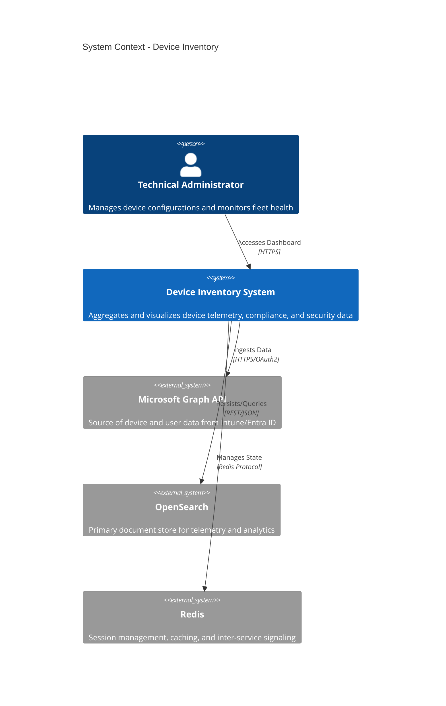

# Document 01: System Overview

## 1. System Description
The "Device Inventory" system is a distributed, containerized platform designed to aggregate, normalize, and visualize device telemetry and identity data. It serves as a central repository for an organization's hardware assets, compliance states, and user associations, integrating directly with Microsoft Graph (Intune and Entra ID).

## 2. Core Capabilities
*   **Data Aggregation:** Ingests raw telemetry from Microsoft Intune (Managed Devices) and Entra ID (Users).
*   **Normalization:** Transforms disparate API responses into a unified, queryable schema (`UnifiedDeviceDocument`).
*   **Compliance Analysis:** Tracks device compliance against defined policies and granular setting states.
*   **Identity Correlation:** Links devices to primary users and tracks software license assignments.
*   **Secure Provisioning:** Automated infrastructure setup using Microsoft Graph APIs.

## 3. High-Level Architecture (C4 Context)

## 4. Component Summary
*   **Proxy (Caddy):** Provides TLS termination and reverse proxying for the application layer.
*   **Frontend (Next.js):** Delivers the user interface for inventory management and dashboards.
*   **Backend API (Bun/Express):** Handles business logic, data normalization, and external API orchestration.
*   **Fetcher (Bun/TypeScript):** Executes background synchronization tasks with Microsoft Graph.
*   **Data Store (OpenSearch):** Stores normalized JSON documents for devices, users, and logs.
*   **State Store (Redis):** Manages user sessions, configuration secrets, and reload signals.
