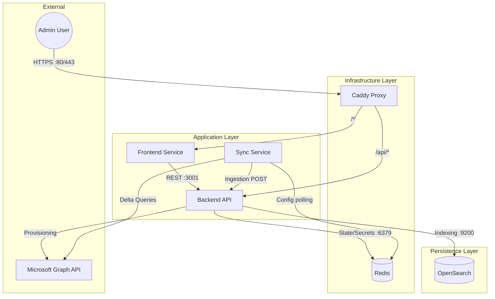

# Document 02: Architecture Map

## 1. Container Topology
The system architecture consists of six interconnected services orchestrated via Docker Compose.

## 2. Infrastructure Layer
*   **Caddy:** 
    *   Acts as the unified ingress point.
    *   Routes traffic based on path prefixes (`/api` vs root).
    *   Manages TLS certificates for secure communication.
*   **Redis:**
    *   **Session Management:** Stores session data for the `session-auth.middleware.ts`.
    *   **Signal Bus:** Facilitates inter-container communication (e.g., triggering configuration reloads).
    *   **Credential Storage:** Holds encrypted ephemeral credentials for the Fetcher service.

## 3. Application Layer
*   **Backend API (`api-ts`):**
    *   Built with Express.js on the Bun runtime.
    *   Exposes REST endpoints for the frontend (`/v2/devices`, `/v2/users`).
    *   Exposes ingestion endpoints for the fetcher (`/v2/ingest`).
    *   Contains the `DeviceNormalizer` and `AutoProvisioningService` logic.
*   **Frontend (`frontend-next`):**
    *   Next.js application serving the UI.
    *   Consumes the Backend API via server-side and client-side calls.
*   **Fetcher (`fetcher`):**
    *   Background service executed on a schedule (Cron).
    *   Responsible for authenticated data retrieval from Microsoft Graph.
    *   Separates extraction logic from the core API.

## 4. Data Flow: Ingestion Pipeline
1.  **Extraction:** The Fetcher service wakes up via schedule and requests changed data (Delta Query) from Microsoft Graph.
2.  **Transmission:** Raw JSON payloads are transmitted to the Backend API via the internal Docker network.
3.  **Normalization:** The Backend API processes the raw data, flattening nested structures and calculating compliance states.
4.  **Storage:** Normalized documents are upserted into OpenSearch indices (`devices_v2`, `users_v1`).
